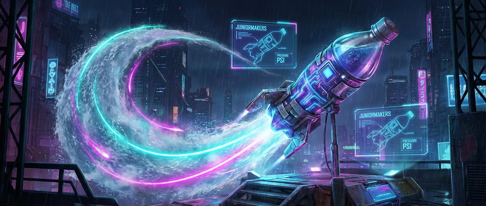

# 🚀 3, 2, 1, Lift-Off: Die Wasserrakete

> **S T E A M - P R O F I L**
> [ ✅ ] 🧪 **S**cience (Wissenschaft)
> [ ❌ ] 💻 **T**echnology (Technologie)
> [ ✅ ] ⚙️ **E**ngineering (Ingenieurswesen)
> [ ❌ ] 🎨 **A**rts (Kunst)
> [ ✅ ] 📐 **M**ath (Mathematik)

**📋 Metadaten**
* **Autor:** ZWEIFEL Mike (mike.zweifel@zigerschlitzmakers.ch)
* **Version:** v1.0.0
* **Erstellt am:** 2026-03-13
* **Letzte Änderung:** 2026-03-13
* **Zielgruppe:** 9-12 Jahre
* **Format:** 🛠️ 100% Offline
* **Kursstatus:** In Entwicklung
* **Schwierigkeit:** Mittel
* **Sicherheitsstufe:** Rot (Hoher Druck in Flaschen, Gefahr durch platzende Flaschen oder unkontrolliert fliegende Raketen. Betreuung im Außenbereich zwingend!)

---

## 📖 Kurzbeschreibung
Raketenwissenschaft für den Hinterhof! Durch die geschickte Nutzung von Wasser, komprimierter Luft und Aerodynamik jagen wir recycelte PET-Flaschen meterweit in den Himmel. Die Kinder konstruieren Stabilisierungsflossen, experimentieren mit dem perfekten Wasser-Luft-Gemisch und lernen das Rückstoßprinzip kennen.

## ❓ Leitfragen (Essential Questions)
* Warum fliegt die Rakete mit Wasser weiter als nur mit Luft?
* Was macht eine Rakete in der Luft stabil, sodass sie nicht trudelt?

## 🎯 Lernziele (Was nehmen die Kids mit?)
* **Fachlich:** Das Dritte Newtonsche Gesetz (Actio und Reactio). Aerodynamische Stabilisierung (Schwerpunkt vs. Druckpunkt).
* **Methodisch:** Variablen kontrollieren (Wassermenge, Pumpstöße) und Flughöhe schätzen/vergleichen.
* **Sozial/Persönlich:** Sicherheitsregeln strikt einhalten, als Team beim Launch-Prozess zusammenarbeiten.

## 🤝 Inklusion & Differenzierung
* **Für schwächere Kids / Motorische Einschränkungen:** Stabile, breitere Flossen verwenden. Beim Pumpen helfen lassen.
* **Für Fortgeschrittene / Hochbegabte:** Bau eines einfachen Fallschirm-Systems in der Nasenspitze. Flugbahnen und Parabeln diskutieren (Winkel beim Start).

## 🏢 Anforderungen an Räumlichkeiten
- **ZWINGEND OUTDOOR!** Ein großes, freies Feld (z.B. Sportplatz, leere Wiese).
- Weit weg von Straßen, Autos und Bäumen.
- Bereich zum Basteln (drinnen oder draußen).

## 🛠️ Anforderungen ans Material vor Ort
**Pro Teilnehmer/Team (2er Teams):**
- 1-2 leere, unbeschädigte PET-Flaschen (idealerweise kohlensäurehaltige Getränke, da diese druckstabiler sind, z.B. Cola 1L oder 1.5L)
- Pappe / Plastikbögen (für die Flossen)
- Starkes Klebeband (Duct-Tape / Panzertape)
- Modelliermasse oder Tennisball (für die beschwerte Nasenspitze)

**Für den Mentor (Allgemein):**
- 1 professionelle oder selbstgebaute Startrampe für Wasserraketen (mit Auslösemechanismus)
- 1 Fahrrad-Standpumpe (mit Manometer, um den Druck zu kontrollieren)
- Eimer mit Wasser (für die Betankung auf dem Feld)
- Schutzbrillen für den Auslöser und Mentor

## ⏱️ Zeitaufwand
- **Vorbereitungszeit (Mentor):** 30 Minuten (Startrampe prüfen, Wassereimer füllen).
- **Nachbereitungszeit (Aufräumen):** 15 Minuten (Flaschen einsammeln, Pumpe verstauen).
- **Kursdauer:** 100 Minuten

---

## 🚀 Detaillierter Ablauf (100 Minuten)

| Zeit | Phase | Beschreibung | Fokus / Mentor-Tipps |
|------|-------|--------------|----------------------|
| **16:40 - 16:50** | Einleitung | Drinnen: Erklärung des Rückstoßprinzips anhand eines aufgeblasenen (aber nicht zugeknöteten) Luftballons, den man loslässt. | Sicherheitsbriefing: Niemals über eine unter Druck stehende Flasche beugen! |
| **16:50 - 17:30** | Praxis Level 1 | Konstruktion der Rakete: Flossen im 120-Grad-Winkel ankleben, Spitze aerodynamisch formen und etwas beschweren (für einen stabilen Flug). | Flossen müssen extrem fest sitzen (Duct-Tape!), sonst reißen sie beim Start ab. |
| **17:30 - 17:40** | Pause & Transfer | Hände waschen, Raketen schnappen und gemeinsam zum Launchpad (Wiese) wandern. | Alle nehmen ihre Raketen und eine Flasche Wasser mit. |
| **17:40 - 18:05** | Experten-Level | Launches! Jedes Team testet das perfekte Verhältnis: 1/3 Wasser, 2/3 Luft. Wer pumpt am schnellsten? Wer erreicht die größte Höhe? | Mentor bedient die Pumpe oder überwacht streng das Manometer (max. 4-6 Bar, je nach Flasche). Countdown für alle! |
| **18:05 - 18:20** | Reflexion | Zurück im Raum: Warum sind manche Raketen getrudelt? (Schwerpunkt falsch, Flossen krumm). Kurzes Aufräumen. | Betonen, dass auch echte SpaceX-Raketen oft bei den ersten Tests explodieren oder trudeln. |

---

## 💡 Weitere nützliche Informationen
* **Mögliche Fehlerquellen:** Zu viel Wasser (Rakete ist zu schwer, hebt kaum ab). Zu wenig Wasser (Druck entweicht sofort, kurzer Flug). Undichte Startrampe.
* **Alltagsbezug:** Jede Raumfahrtmission, aber auch der Rückstoß eines Wasserschlauchs, wenn man ihn voll aufdreht.
* **Links & Quellen:** Keine.