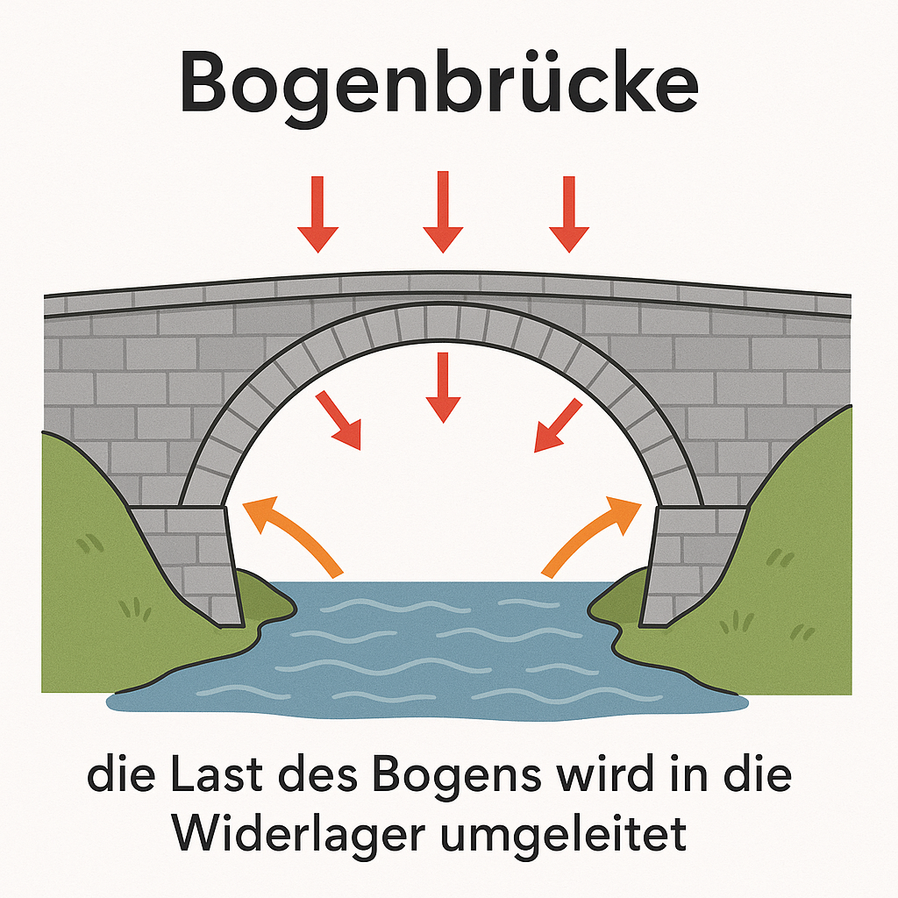
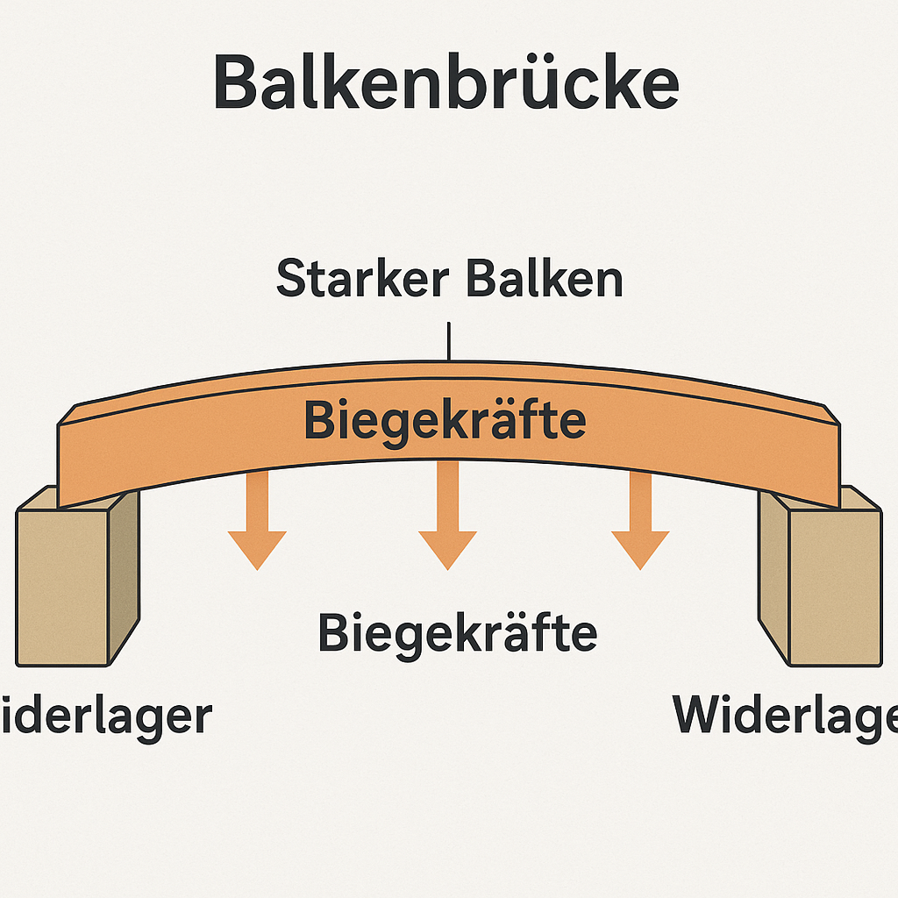
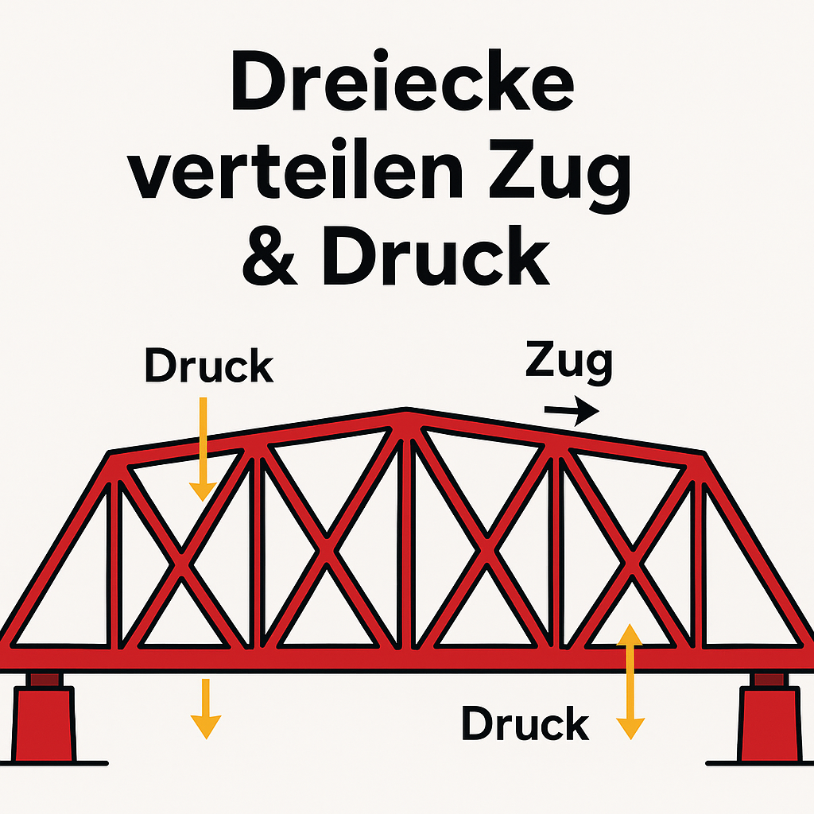
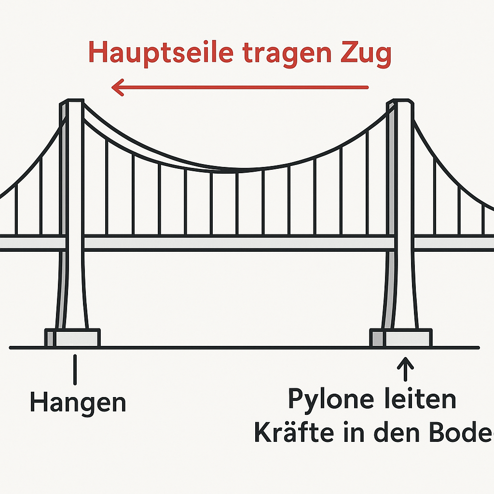
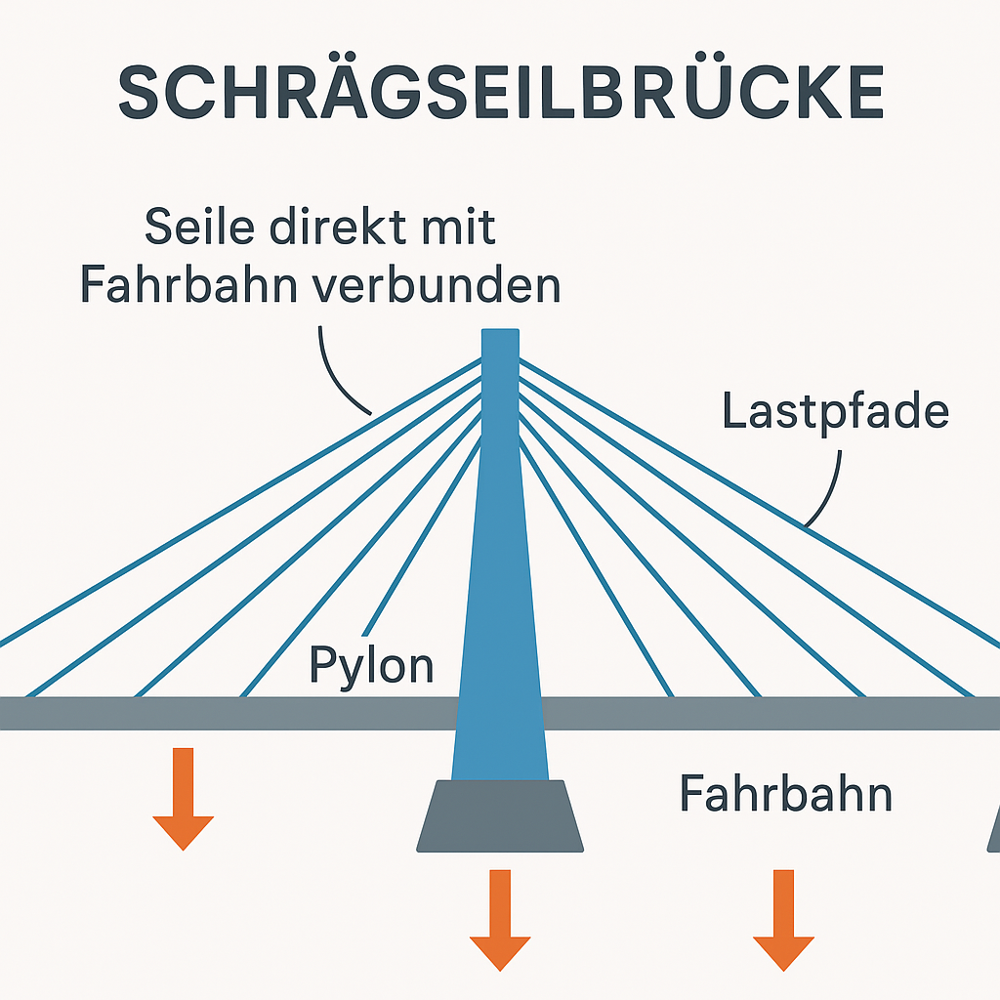
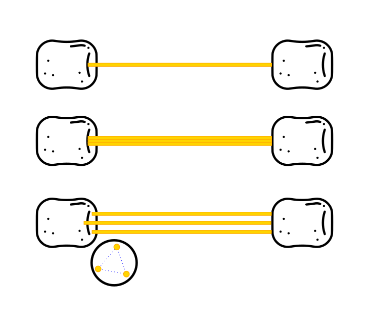
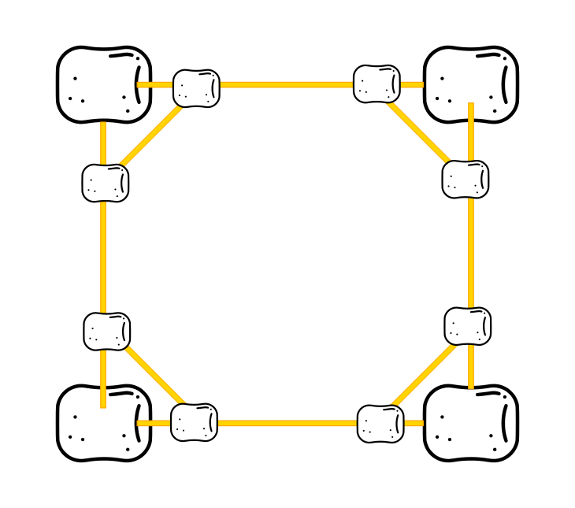

# Die unzerstörbare Brücke: Spaghetti & Marshmallows

> **S T E A M - P R O F I L**
> [ ✅ ] 🧪 **S**cience (Wissenschaft)
> [ ❌ ] 💻 **T**echnology (Technologie)
> [ ✅ ] ⚙️ **E**ngineering (Ingenieurswesen)
> [ ❌ ] 🎨 **A**rts (Kunst)
> [ ❌ ] 📐 **M**ath (Mathematik)

**📋 Metadaten**
* **Autor:** ZWEIFEL Mike (mike.zweifel@zigerschlitzmakers.ch)
* **Version:** v0.1.2
* **Erstellt am:** 2026-03-13
* **Letzte Änderung:** 2026-04-03
* **Zielgruppe:** 9-12 Jahre
* **Format:** 🛠️ 100% Offline
* **Kursstatus:** Durchgeführt
* **Schwierigkeit:** Mittel
* **Sicherheitsstufe:** Grün (Normale Bastelmaterialien, unbedenklich)

---

## 📖 Kurzbeschreibung
Wer baut die stabilste Brücke aus Spaghetti und Marshmallows? In diesem Kurs lernen die Kinder die Grundlagen der Baustatik kennen. Sie konstruieren eigene Brückenmodelle und testen diese abschliessend auf ihre Tragfähigkeit – bis die Brücke bricht!

## ❓ Leitfragen (Essential Questions)
* Warum sind viele Brücken und Kräne aus Dreiecken aufgebaut?
* Wie verteilt sich Gewicht auf einer Konstruktion?

## 🎯 Lernziele (Was nehmen die Kids mit?)
* **Fachlich:** Verstehen von Zug- und Druckkräften sowie der Stabilität von Dreiecksstrukturen (Fachwerk).
* **Methodisch:** Konstruieren nach Trial-and-Error, iterative Verbesserung des Designs.
* **Sozial/Persönlich:** Teamwork beim Bauen, Umgang mit dem "Einsturz" (Frustrationstoleranz).

## 🤝 Inklusion & Differenzierung
* **Für schwächere Kids / Motorische Einschränkungen:** Kürzere Spaghetti-Stücke vorbereiten oder grössere Marshmallows verwenden, die leichter zu greifen und zu stecken sind.
* **Für Fortgeschrittene / Hochbegabte:** Begrenzte Anzahl an Baumaterial vorgeben (z.B. genau 20 Spaghetti und 10 Marshmallows) und die Traglast maximieren.

## 🏢 Anforderungen an Räumlichkeiten
- Große Tische zum Arbeiten.
- Boden, der sich nach dem Zerstörungstest leicht wischen oder saugen lässt.

## 🛠️ Anforderungen ans Material vor Ort
**Für 12-15 Teilnehmer/innen:**
- 3× Packung Holzstäbchen à 50 Stück (Migros <https://www.migros.ch/de/product/728112800000>)
- 3× Packung Holzwäscheklammern à 40 Stück (Migros <https://www.migros.ch/de/product/702696000000>)
- 2x 500g Packungen rohe Spaghetti mittleren Durchmessers (Migros <https://www.migros.ch/de/product/104135100000>)
- 3-4x 300g Packungen grosse Marshmallows (Migros <https://www.migros.ch/de/product/101036600000>)
- Kleine Gewichte zum Testen (z.B. Schwamm (Eignet sich auch gut als simulierter Lastwagen), Münzen, Bücher oder Wasserflaschen)

- Besen, Kehrschaufeln, Staubsauger, Waschlappen mit Wasser und Seife

## ⏱️ Zeitaufwand
- **Vorbereitungszeit (Mentor):** 10 Minuten (Material aufteilen).
- **Nachbereitungszeit (Aufräumen):** 15 Minuten (Zerbochene Spaghetti und klebrige Reste aufwischen).
- **Kursdauer:** 100 Minuten

---

## 🚀 Detaillierter Ablauf (100 Minuten)

| Zeit | Phase | Beschreibung | Fokus / Mentor-Tipps |
|------|-------|--------------|----------------------|
| **10min** | Intro: Brückentypen | Bildkarten zu Bogen-, Balken-, Fachwerk-, Hänge- und Schrägseilbrücke zeigen, Formen diskutieren. | Jede Brücke kurz erklären; klar machen, dass wir heute Fachwerk vertiefen. |
| **20min** | Grundlagen mit Holzstäbchen & Klammern | Material auslegen (3×50 Holzstäbchen, 3×40 Holzwäscheklammern für 10 Kids). Aufgabenreihe siehe unten. | Darauf achten, dass wirklich jede Gruppe jede Variante baut. |
| **5min** | Aufräumen & Reset | Holzmaterial sortieren, Tische für Marshmallow-Bau frei machen. | Gemeinsame Aufräum-Challenge starten. |
| **40min** | Spaghetti-/Marshmallow-Brücke | Freies Bauen über der „Schlucht“ (2 Kisten). Inputs in Micro-Dosen geben (siehe Liste). | Fail-fast fördern: immer wieder auf Dreiecke, Zug/Druck und Seitenstabilität hinweisen. |
| **10min** | Belastungstest + Forces-Diagnose | Lastwagen-Test + Gewichte, danach Dreiecks-Check-Worksheet ausfüllen. | Fotos/Videos machen, rote/blau Marker bereit. |
| **15min** | Abschluss & Aufräumen | Fotos der Teams + Feedbackrunde (Was war stark, wo kann man optimieren?). Danach Marshmallow-/Spaghetti-Cleanup laut Checkliste. | Fokus auf positives Feedback, dann strukturiertes Putzen (siehe Abschnitt „Aufräumen“). |

### Intro: Brückentypen
| Brückentyp | Bild | Warum diese Form funktioniert |
| --- | --- | --- |
| Bogenbrücke |  | Der Bogen leitet Kräfte in die Widerlager und arbeitet fast nur auf Druck. Gut für Stein/Beton. |
| Balkenbrücke |  | Gerade Träger, die auf Biegung/Zug arbeiten. Einfach zu bauen, aber nur für kurze Spannweiten. |
| Fachwerkbrücke |  | Dreiecke teilen Zug/Druck sauber auf. wenig Material, hohe Steifigkeit. |
| Hängebrücke |  | Hauptseile tragen Zug, Pylone leiten Last in den Boden. Eignet sich für sehr lange Spannweiten. |
| Schrägseilbrücke |  | Seile greifen direkt an der Fahrbahn an, Kräfte gehen sofort in die Pylone. Benötigt weniger Kabel als Hängebrücke. |

### Grundlagen – Schritt-für-Schritt (Holzstäbchen & Klammern)
1. **Freies Gelenk:** Zwei Stäbchen + 1 Klammer – zeigt freie Beweglichkeit.
2. **Quadrat:** Vier Stäbchen + 4 Klammern – kippt leicht in ein Parallelogramm, nur axial belastbar.
3. **Pentagon:** Fünf Stäbchen + 5 Klammern – extrem instabil; Würde mit noch mehr Stäbchen und Klammern zum Kreis - ungeeignet für Fachwerkbrücke. Beim Eindrücken des Pentagons entstehen automatisch stabilere Dreiecke.
4. **Dreieck:** Drei Stäbchen + 3 Klammern – Winkel fix, jede Druckkraft erzeugt Zug auf einer anderen Seite.
5. **Materialgespräch:** Liste Beispiele: Beton (Druck), Stahl (Zug/Druck), Holz (gut für Druck quer zur Faser), Carbonfaser (Zug). Kids sollen entscheiden, wo welches Material eingesetzt wird.

MentorInnen können das Experiment anleiten oder als Schnell-Station aufbauen. Es liefert die perfekte Brücke (😉) zur Dreiecks-Theorie und sorgt für einen spürbaren Aha-Moment, bevor die Kids Spaghetti und Marshmallows verwenden.

### Inputs für die Spaghetti-/Marshmallow-Phase
- Baut so viele **Dreiecke** wie möglich, Quadrate unbedingt mit einer Diagonale versehen (siehe Grafik unten).
- Beobachtet aktiv, wo **Zug** (Spaghetti werden aus Marshmallows gezogen) und **Druck** (Spaghetti knicken) entstehen.
- Sichert eure Brücke gegen **Seitwärtskippen** (z. B. Streben nach außen).
- Haltet die Brücke relativ **flach**, hohe Konstruktionen schwingen stärker.
- Mehrere Spaghetti pro Verbindung = mehr Stabilität, aber weniger Flexibilität. Dreiecksanordnung im Marshmallow siehe Grafik.
- „Fahrbahn“ freilassen: Ein imaginärer LKW muss durchfahren können, Stabilität außen herum aufbauen.
- Nutzt Eckverstärkungen: Quadrat + Diagonale ergibt zwei Dreiecke.

 

### Laufende Tests & Fotodokumentation
- Jede fertiggestellte Brücke wird auf der Modellschlucht getestet und fotografiert (Team + Brücke).
- Kleine Gewichte (oder Spielzeug-LKW) nutzen, um Schritt für Schritt die Tragkraft zu erhöhen.
- Nach jedem Test eine Mini-Diskussion: Welche Elemente funktionieren gut? Welche Verbesserungen können andere Teams übernehmen?

### Mini-Experiment mit Holzstäbchen & Ordnerklammern
1. Verbinde zwei Holzstäbchen mit einer Klammer als Gelenk. Spiele mit dem Winkel – was fällt dir auf?
2. Baue ein Quadrat nur mit Gelenken. Drücke von oben: Das Quadrat verformt sich leicht zum Parallelogramm.
3. Baue andere Vielecke (Pentagon/Hexagon) und beobachte, wie sie einknicken.
4. Füge nun eine Diagonale (ein weiteres Holzstäbchen) hinzu – du erhältst zwei Dreiecke. Das Gebilde wird plötzlich starr.
5. Diskutiere mit deinem Team, warum das Dreieck nicht „schieben“ kann, ohne dass seine Seiten länger oder kürzer werden.

---
## 🧼 Aufräum-Checkliste (15 min)
1. Marshmallows essen, Rest zusammen mit verklebten Spaghetti-Resten in einen Abfallsack – keine Essensreste offen lassen.
2. Alle Tischflächen mit Wasser + Seife abwischen (Marshmallowzucker klebt).
3. Spaghetti-Bruchstücke von Tisch/Boden aufheben, danach mit Besen und Staubsauger nacharbeiten.
4. Holzstäbchen & Klammern sortiert zurück in die Box legen.
5. Schlucht-Kisten, Waage und Gewichte wieder an ihren Lagerplatz bringen.

## 🕹️ Digitale Erweiterung: Bridge Builder (Optional)
- Spiele-Link: <https://www.crazygames.com/game/bridge-builder-eoi>

## 💡 Weitere nützliche Informationen
* **Mögliche Fehlerquellen:** Spaghetti brechen beim Einstecken, Marshmallows trocknen aus und werden hart.
* **Alltagsbezug:** Fachwerkhäuser, Kräne auf Baustellen, Dachstühle und echte Brücken.
* **Links & Quellen:** siehe Abschnitt „Referenzen“ unten.

## 📎 Materialien zum Download
Keines nötig.

## 🔗 Referenzen für die Kursrecherche
1. [Technische Einteilung von Brücken – Wikipedia](https://de.wikipedia.org/wiki/Technische_Einteilung_von_Br%C3%BCcken)
2. [Fachwerkbrücke – Wikipedia](https://de.wikipedia.org/wiki/Fachwerkbr%C3%BCcke)
3. [BLS Inside: Brückenstories](https://www.bls.ch/de/bls-inside/infrastruktur-und-mobilitaet/2025/006-bruecken)
4. [PHBern Ideenset „Faszinierende Brücken“](https://www.phbern.ch/dienstleistungen/unterrichtsmedien/ideenset-dossier-4-bis-8-erstaunliche-bauwerke/baustein-3-faszinierende-bruecken)
5. [YouTube: "How Bridges Work" – Video 1](https://www.youtube.com/watch?v=Wv4X7YRaoh0)
6. [YouTube: "Triangle Power" – Video 2](https://www.youtube.com/watch?v=wLzGWo4gOm8)
7. [WDR Maus – Brückenspezial](https://www.wdrmaus.de/extras/mausthemen/bauwerke/bruecken.php5)

