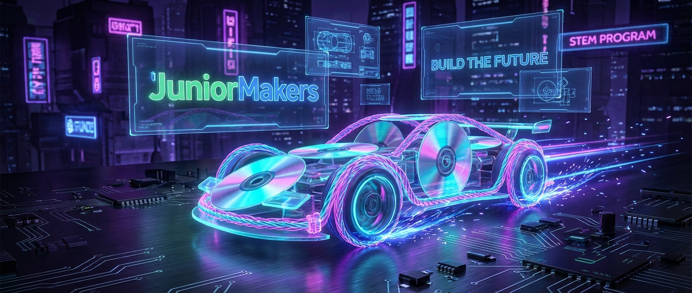

# 🏎️ Gummi-GTI: Das schnellste CD-Auto der Welt

> **S T E A M - P R O F I L**
> [ ✅ ] 🧪 **S**cience (Wissenschaft)
> [ ❌ ] 💻 **T**echnology (Technologie)
> [ ✅ ] ⚙️ **E**ngineering (Ingenieurswesen)
> [ ❌ ] 🎨 **A**rts (Kunst)
> [ ❌ ] 📐 **M**ath (Mathematik)

**📋 Metadaten**
* **Autor:** ZWEIFEL Mike (mike.zweifel@zigerschlitzmakers.ch)
* **Version:** v1.0.0
* **Erstellt am:** 2026-03-13
* **Letzte Änderung:** 2026-03-13
* **Zielgruppe:** 9-12 Jahre
* **Format:** 🛠️ 100% Offline
* **Kursstatus:** In Entwicklung
* **Schwierigkeit:** Mittel
* **Sicherheitsstufe:** Grün (Unbedenklich, Bastelmaterialien)

---

## 📖 Kurzbeschreibung
Aus alten CDs, Pappe und ein paar Gummibändern entstehen echte Rennmaschinen! Die Kinder lernen die Grundlagen der Mechanik und Antriebstechnik, indem sie Gummimotor-Racer bauen, tunen und im großen Finale gegeneinander antreten lassen.

## ❓ Leitfragen (Essential Questions)
* Wie kann man die Energie in einem simplen Gummiband speichern?
* Was ist Reibung und warum kann sie sowohl unser Freund als auch unser Feind sein?

## 🎯 Lernziele (Was nehmen die Kids mit?)
* **Fachlich:** Elastische potentielle Energie in Bewegungsenergie (kinetische Energie) umwandeln.
* **Methodisch:** Prototyping und iteratives Tuning (Achsenreibung minimieren, Grip erhöhen).
* **Sozial/Persönlich:** Fairness beim Wettbewerb, Wissenstransfer ("Wie hast du deins so schnell gemacht?").

## 🤝 Inklusion & Differenzierung
* **Für schwächere Kids / Motorische Einschränkungen:** Vorgebohrte Chassis-Schablonen verwenden, Räder mit etwas Klebstoff als Stopper sichern.
* **Für Fortgeschrittene / Hochbegabte:** Getriebe-Konzepte andeuten: Wie verhält sich die Kraft bei dickeren Achsen? Luftwiderstand durch Aerodynamik (Papierkarosserie) senken.

## 🏢 Anforderungen an Räumlichkeiten
- Glatter, ebener Fußboden für die Rennstrecke (kein Teppich).
- Start- und Ziellinie mit Klebeband markierbar.

## 🛠️ Anforderungen ans Material vor Ort
**Pro Teilnehmer/Team (Einzelarbeit):**
- 4 alte CDs (als Räder)
- 2 Holzschaschlikspieße (als Achsen)
- 1 stabiler Pappkarton (für das Chassis)
- 4 Gummibänder (verschiedene Stärken)
- 1 Heißklebestick (als Achsenführung zerschnitten oder Strohhalme)
- Ein paar Unterlegscheiben (zur Reibungsminderung)

**Für den Mentor (Allgemein):**
- Heißklebepistolen
- Cutter (nur vom Mentor bedient!)
- Stoppuhr

## ⏱️ Zeitaufwand
- **Vorbereitungszeit (Mentor):** 15 Minuten.
- **Nachbereitungszeit (Aufräumen):** 10 Minuten.
- **Kursdauer:** 100 Minuten

---

## 🚀 Detaillierter Ablauf (100 Minuten)

| Zeit | Phase | Beschreibung | Fokus / Mentor-Tipps |
|------|-------|--------------|----------------------|
| **16:40 - 16:50** | Einleitung | Kurze Demo eines fertigen CD-Autos. "Wer baut heute den Gummi-GTI?" Erklärung von potenzieller Energie im Gummi. | Fokus auf Reibung: Warum drehen die CD-Räder manchmal durch? (Grip) |
| **16:50 - 17:30** | Praxis Level 1 | Chassis aus Pappe schneiden, Strohhalme/Führungen aufkleben, Achsen und CD-Räder montieren. Erstes Gummiband spannen und Testfahrt. | Mentor prüft: Laufen die Achsen frei? Wenn sie klemmen, fährt das Auto nicht. |
| **17:30 - 17:40** | Pause | Hände waschen, Lüften | Rennstrecke auf dem Boden abkleben. |
| **17:40 - 18:05** | Experten-Level | Tuning-Phase! Grip-Erhöhung durch Luftballons über den CDs oder Klebeband auf den Rändern. Aerodynamik-Karosserie basteln. | Die Kids sollen sich gegenseitig Tipps geben. |
| **18:05 - 18:20** | Reflexion | Das große Rennen! Welches Auto fährt am weitesten? Welches am schnellsten? Siegerehrung und gemeinsames Aufräumen. | Besprechen: Warum hat das Siegerauto gewonnen? (Weniger Reibung auf der Achse, mehr Grip auf dem Rad). |

---

## 💡 Weitere nützliche Informationen
* **Mögliche Fehlerquellen:** Das Gummiband wird falsch herum aufgewickelt (Auto fährt rückwärts). Zu viel Heißkleber blockiert die Achsen.
* **Alltagsbezug:** Aufzieh-Spielzeuge, aber auch grundlegende Getriebelehre in echten Autos.
* **Links & Quellen:** Keine.
