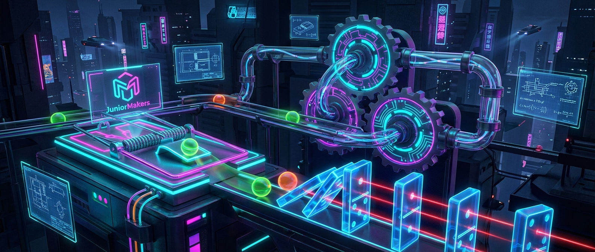

# 🐭 Kettenreaktion extrem: Die Mausefallen-Maschine

> **S T E A M - P R O F I L**
> [ ✅ ] 🧪 **S**cience (Wissenschaft)
> [ ❌ ] 💻 **T**echnology (Technologie)
> [ ✅ ] ⚙️ **E**ngineering (Ingenieurswesen)
> [ ❌ ] 🎨 **A**rts (Kunst)
> [ ❌ ] 📐 **M**ath (Mathematik)

**📋 Metadaten**
* **Autor:** ZWEIFEL Mike (mike.zweifel@zigerschlitzmakers.ch)
* **Version:** v1.0.0
* **Erstellt am:** 2026-03-13
* **Letzte Änderung:** 2026-03-13
* **Zielgruppe:** 9-12 Jahre
* **Format:** 🛠️ 100% Offline
* **Kursstatus:** In Entwicklung
* **Schwierigkeit:** Schwer
* **Sicherheitsstufe:** Gelb (Verletzungsgefahr durch schnappende Mausefallen, Aufsicht erforderlich)

---

## 📖 Kurzbeschreibung
Aus wildem Chaos entsteht geniale Ordnung! Die Kids bauen eine gigantische Rube-Goldberg-Maschine, bei der eine Mausefalle das nächste spektakuläre Ereignis auslöst. Dominosteine, Murmeln und Pendel greifen nahtlos ineinander, um am Ende eine scheinbar simple Aufgabe auf absurd komplizierte Weise zu lösen.

## ❓ Leitfragen (Essential Questions)
* Wie überträgt man Energie von einem Objekt auf ein anderes?
* Warum ist das Bauen einer Rube-Goldberg-Maschine oft schwieriger, als eine Aufgabe direkt zu lösen?

## 🎯 Lernziele (Was nehmen die Kids mit?)
* **Fachlich:** Kinetische und potentielle Energie, Hebelwirkung und Impulserhaltung verstehen.
* **Methodisch:** Iteratives Testen und Fehlerbehebung von mechanischen Abläufen.
* **Sozial/Persönlich:** Extreme Frustrationstoleranz beim Einstürzen der Bahn und Teamwork für das "große Ganze".

## 🤝 Inklusion & Differenzierung
* **Für schwächere Kids / Motorische Einschränkungen:** Größere, stabilere Dominosteine nutzen und Strecken mit weniger kritischen Verbindungen bauen.
* **Für Fortgeschrittene / Hochbegabte:** Integrieren von komplexen Triggern, z.B. Flaschenzügen oder Zeitverzögerungen (z.B. durch tröpfelndes Wasser).

## 🏢 Anforderungen an Räumlichkeiten
- Großer, freier Boden oder lange zusammenhängende Tische.
- Keine starken Luftzüge.
- Ungestörter Bereich (damit niemand versehentlich die Bahn auslöst).

## 🛠️ Anforderungen ans Material vor Ort
**Pro Teilnehmer/Team (2-3er Teams):**
- 3 Mausefallen (als Auslöser modifiziert)
- 1 Schachtel Dominosteine
- Diverse Murmeln (Glas und Stahl)
- Pappröhren, Karton, Klebeband, Schnur
- Kleine Spielzeugautos

**Für den Mentor (Allgemein):**
- Schutzbrillen (während des Spannens der Fallen)
- Heißklebepistolen
- Eine Kamera/Handy, um den finalen Run zu filmen

## ⏱️ Zeitaufwand
- **Vorbereitungszeit (Mentor):** 30 Minuten (Raum freiräumen, Materialinseln aufbauen).
- **Nachbereitungszeit (Aufräumen):** 20 Minuten (Sortieren der Millionen Einzelteile).
- **Kursdauer:** 100 Minuten

---

## 🚀 Detaillierter Ablauf (100 Minuten)

| Zeit | Phase | Beschreibung | Fokus / Mentor-Tipps |
|------|-------|--------------|----------------------|
| **16:40 - 16:50** | Einleitung | Kurzes Rube-Goldberg-Video (z.B. OK Go) zeigen. "Heute bauen wir unsere eigene Kettenreaktion!" Erklärung, wie eine Mausefalle als Impulsgeber funktioniert. | Klare Sicherheitsunterweisung beim Spannen der Mausefallen. Immer von hinten anpacken! |
| **16:50 - 17:30** | Praxis Level 1 | Jedes Team baut ein eigenes 1-Meter-Modul, das mit einer Mausefalle startet und am Ende einen Dominostein umwirft. Tests, Tests, Tests. | Frustration ist hier normal. Mentor muss ermutigen: "Jeder Fehler zeigt euch, wie es *nicht* geht!" |
| **17:30 - 17:40** | Pause | Hände waschen, Lüften | Nerven beruhigen, Bahn nicht anfassen! |
| **17:40 - 18:05** | Experten-Level | Die "Große Verbindung": Alle Team-Module werden zu einer gigantischen Kettenreaktion im Raum zusammengebaut. Die Übergänge zwischen den Tischen müssen konstruiert werden. | Hier ist Koordination gefragt. Welches Modul passt mechanisch am besten an das nächste? |
| **18:05 - 18:20** | Reflexion | Der "Final Run": Die Bahn wird (hoffentlich) einmal komplett am Stück ausgelöst (auf Video aufnehmen!). Danach Diskussion, wo am meisten Energie verloren ging. Gemeinsames Aufräumen. | Auch wenn es nicht 100% klappt: Den Einsatz feiern. |

---

## 💡 Weitere nützliche Informationen
* **Mögliche Fehlerquellen:** Eine Mausefalle schnappt zu früh zu. Ein Dominostein fällt vorzeitig. Klebeband löst sich.
* **Alltagsbezug:** Jedes automatisierte Fließband in der Industrie basiert auf präzisen Abfolgen und Impulsübertragungen.
* **Links & Quellen:** 
  - Keine aktuellen Links.