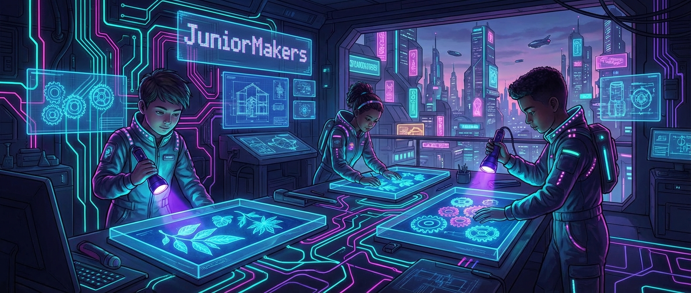

# ☀️ Cyanotypie: Fotografieren mit der Sonne

> **S T E A M - P R O F I L**
> [ ✅ ] 🧪 **S**cience (Wissenschaft)
> [ ❌ ] 💻 **T**echnology (Technologie)
> [ ❌ ] ⚙️ **E**ngineering (Ingenieurswesen)
> [ ✅ ] 🎨 **A**rts (Kunst)
> [ ❌ ] 📐 **M**ath (Mathematik)

**📋 Metadaten**
* **Autor:** ZWEIFEL Mike (mike.zweifel@zigerschlitzmakers.ch)
* **Version:** v1.0.0
* **Erstellt am:** 2026-03-13
* **Letzte Änderung:** 2026-03-13
* **Zielgruppe:** 9-12 Jahre
* **Format:** 🛠️ 100% Offline
* **Kursstatus:** In Entwicklung
* **Schwierigkeit:** Leicht
* **Sicherheitsstufe:** Gelb (Umgang mit Cyanotypie-Lösungen: rote Blutlaugensalz/Ammoniumeisen(III)-citrat. Handschuhe tragen!)

---

## 📖 Kurzbeschreibung
Magie mit Sonnenlicht! Die Kinder entdecken eines der ältesten fotografischen Verfahren: den Blaudruck (Cyanotypie). Sie beschichten Papier mit einer lichtempfindlichen Lösung, arrangieren Objekte (Blätter, Federn, kleine Maker-Teile wie Zahnräder) darauf und lassen die UV-Strahlung der Sonne ein tiefblaues, detailreiches Bild "entwickeln".

## ❓ Leitfragen (Essential Questions)
* Wie kann Licht ein Bild auf Papier "drucken"?
* Warum wird das Papier blau und nicht schwarz oder rot?

## 🎯 Lernziele (Was nehmen die Kids mit?)
* **Fachlich:** Verstehen chemischer Reaktionen durch UV-Licht. Kennenlernen des Konzepts von Positiv/Negativ und Schattenwurf.
* **Methodisch:** Präzises Arbeiten beim Beschichten, Komposition von Motiven.
* **Sozial/Persönlich:** Staunen über Naturphänomene, kreativer Ausdruck durch das Arrangieren von Gegenständen.

## 🤝 Inklusion & Differenzierung
* **Für schwächere Kids / Motorische Einschränkungen:** Bereits vorbeschichtetes (getrocknetes) Papier verwenden. Große, gut greifbare Objekte zum Auflegen anbieten.
* **Für Fortgeschrittene / Hochbegabte:** Mit Belichtungsreihen experimentieren (verschieden lange in der Sonne lassen) oder durchsichtige Folien mit aufgemalten Mustern/Negativen verwenden.

## 🏢 Anforderungen an Räumlichkeiten
- Ein abgedunkelter Raum (ohne direktes Sonnen- oder starkes UV-Licht) zum Beschichten und Arrangieren.
- Zugang nach draußen ins direkte Sonnenlicht (oder starke UV-Lampen bei Regenwetter).
- Waschbecken oder große Wannen mit Wasser zum Auswaschen (Entwickeln).

## 🛠️ Anforderungen ans Material vor Ort
**Pro Teilnehmer/Team:**
- 2-3 Blatt Aquarellpapier (oder festes Papier)
- Schwammpinsel zum Auftragen
- Objekte zum Belichten (Naturmaterialien, Zahnräder, Schablonen)
- 1 Glasplatte oder Acrylglas-Scheibe (zum Beschweren der Objekte, damit sie plan aufliegen)

**Für den Mentor (Allgemein):**
- Cyanotypie-Chemie (Komponente A und B, frisch gemischt)
- Einweghandschuhe, Schürzen
- Wasserwannen zum Spülen
- Wäscheleine und Klammern zum Trocknen

## ⏱️ Zeitaufwand
- **Vorbereitungszeit (Mentor):** 20 Minuten (Chemie mischen, Abdunkeln, Wannen vorbereiten).
- **Nachbereitungszeit (Aufräumen):** 15 Minuten.
- **Kursdauer:** 100 Minuten

---

## 🚀 Detaillierter Ablauf (100 Minuten)

| Zeit | Phase | Beschreibung | Fokus / Mentor-Tipps |
|------|-------|--------------|----------------------|
| **16:40 - 16:50** | Einleitung | Kurze Geschichte des Blaudrucks. Erklärung: UV-Licht verwandelt die gelbe Chemie in unlösliches "Berliner Blau". | Betonen: Das Papier ist jetzt wie ein Kamerasensor – Lichtscheu! |
| **16:50 - 17:30** | Praxis Level 1 | Im abgedunkelten Raum: Papier beschichten, kurz anföhnen (oder vorbeschichtetes nehmen). Objekte arrangieren, Glasscheibe drauflegen. | Aufpassen, dass nichts verrutscht. Handschuhe tragen beim Beschichten! |
| **17:30 - 17:40** | Pause | Raus in die Sonne! Die Bilder werden belichtet. Währenddessen Pause. | Belichtungszeit variiert (5-15 Min) je nach Sonne. Das Papier sollte grau-bronze werden. |
| **17:40 - 18:05** | Experten-Level | Entwickeln: Papier in die Wasserwanne tauchen. Die Magie passiert: Das Blau wird intensiv, die unbelichteten Stellen werden weiß. | Ausgiebig spülen (ca. 5 Min), bis das Wasser ganz klar ist. Sonst blutet es nach. |
| **18:05 - 18:20** | Reflexion | Bilder an der Leine aufhängen. Betrachten der Ergebnisse: Welche Objekte haben die schärfsten Ränder gemacht? Warum? | Staunen genießen! Die Bilder dunkeln beim Trocknen noch etwas nach. |

---

## 💡 Weitere nützliche Informationen
* **Mögliche Fehlerquellen:** Zu kurz belichtet (Blau wäscht sich aus), Objekte nicht plan aufgelegen (unscharfe Ränder), Chemie alt oder in der Sonne gemischt.
* **Alltagsbezug:** Blaupausen (Blueprints) in der Architektur wurden früher genau so hergestellt!
