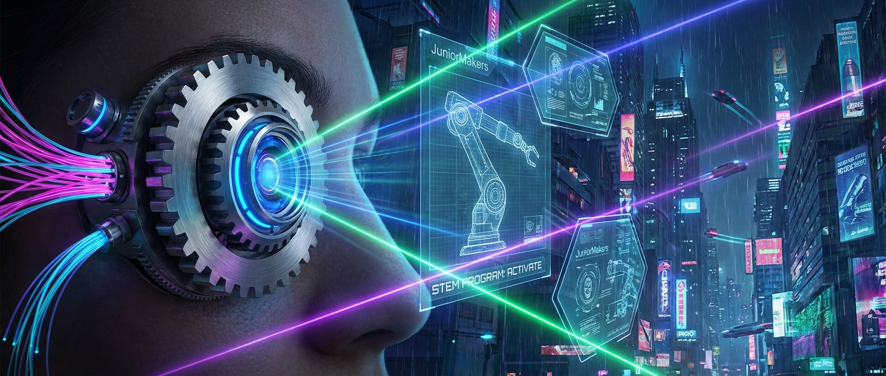

# 👁️ Optik-Hacker: Die Kamera im Kopf

> **S T E A M - P R O F I L**
> [ ✅ ] 🧪 **S**cience (Wissenschaft)
> [ ❌ ] 💻 **T**echnology (Technologie)
> [ ❌ ] ⚙️ **E**ngineering (Ingenieurswesen)
> [ ❌ ] 🎨 **A**rts (Kunst)
> [ ❌ ] 📐 **M**ath (Mathematik)

**📋 Metadaten**
* **Autor:** ZWEIFEL Mike (mike.zweifel@zigerschlitzmakers.ch)
* **Version:** v1.0.0
* **Erstellt am:** 2026-03-13
* **Letzte Änderung:** 2026-03-13
* **Zielgruppe:** 10-14 Jahre
* **Format:** 🖥️ 100% PC
* **Kursstatus:** In Entwicklung
* **Schwierigkeit:** Mittel
* **Sicherheitsstufe:** 🟢 Grün (Vollständig digital)

---

## 📖 Kurzbeschreibung
Hast du dich jemals gefragt, wie das Bild der Welt in dein Gehirn gelangt? Unser Auge ist ein hochkomplexes optisches Instrument! Mit interaktiven Linsen-Simulatoren brechen wir Lichtstrahlen am PC, verstehen, warum wir blinzeln und wie Brillen oder Kontaktlinsen Fehlsichtigkeiten korrigieren.

## ❓ Leitfragen (Essential Questions)
* Wieso steht das Bild in unserem Auge eigentlich auf dem Kopf?
* Wie fokussieren wir, wenn wir in die Nähe oder Ferne schauen (Akkommodation)?

## 🎯 Lernziele (Was nehmen die Kids mit?)
* **Fachlich:** Aufbau des menschlichen Auges (Hornhaut, Linse, Netzhaut). Verständnis von Brechung (Refraktion) und Brennweite (Fokus).
* **Methodisch:** Verändern der Krümmung von Linsen in einer Simulation (PhET Geometric Optics) und Beobachtung des Brennpunkts.
* **Sozial/Persönlich:** Empathie für Menschen mit Sehschwächen, Verstehen von Brillenkorrekturen.

## 🤝 Inklusion & Differenzierung
* **Für schwächere Kids / Motorische Einschränkungen:** Die Simulatoren sind sehr visuell. Mentor nutzt einfache Begriffe (Sammellinse = Lupe).
* **Für Fortgeschrittene / Hochbegabte:** Challenge: Nutze den Simulator, um eine Kurzsichtigkeit und Weitsichtigkeit zu konstruieren und dann mit einer zweiten Linse (Brille) auszugleichen.

## 🏢 Anforderungen an Räumlichkeiten
- PC-Raum oder Laptops für alle Teilnehmer.
- Gute Internetverbindung.
- Großer Monitor/Beamer.
- Raum sollte abdunkelbar sein.

## 🛠️ Anforderungen ans Material vor Ort
**Pro Teilnehmer/Team (1-2er Teams):**
- 1 PC / Laptop mit Maus.
- Webbrowser mit Zugang zu PhET Interactive Simulations (Geometric Optics).

**Für den Mentor (Allgemein):**
- Laptop, Beamer.

## ⏱️ Zeitaufwand
- **Vorbereitungszeit (Mentor):** 10 Minuten.
- **Nachbereitungszeit (Aufräumen):** 5 Minuten.
- **Kursdauer:** 100 Minuten

---

## 🚀 Detaillierter Ablauf (100 Minuten)

| Zeit | Phase | Beschreibung | Fokus / Mentor-Tipps |
|------|-------|--------------|----------------------|
| **16:40 - 16:50** | Einleitung | Hook: Optische Täuschung zeigen! "Unser Gehirn wird ausgetrickst, weil das Auge nur Daten liefert." Erklärung des Aufbaus: Linse und Netzhaut. | Betonen: Wir sehen nicht mit dem Auge, sondern mit dem Gehirn! |
| **16:50 - 17:30** | Praxis Level 1 | PhET Simulator: Die Kids ziehen eine Kerze vor eine Sammellinse. Sie beobachten, wie die Lichtstrahlen gebrochen werden und auf der "Netzhaut" ein scharfes, kopfüberstehendes Bild erzeugen. | Erstaunen bei der Feststellung: Alles in unserem Auge steht auf dem Kopf! Das Gehirn dreht es um. |
| **17:30 - 17:40** | Pause | Bildschirmpause. Aufstehen, "Augen-Yoga" (nah und fern fokussieren). | Simulation für Level 2 vorbereiten. |
| **17:40 - 18:05** | Experten-Level | Die Kids simulieren Kurzsichtigkeit: Der Augapfel ist zu lang, der Brennpunkt liegt *vor* der Netzhaut. Sie müssen im Simulator eine Zerstreuungslinse davorsetzen, um das Bild zu schärfen. | Fortgeschrittene können berechnen (oder grob abschätzen), welche Brechkraft die Brille braucht. |
| **18:05 - 18:20** | Reflexion | Wie funktionieren Kameras im Vergleich zum Auge? Welches ist das "Gehirn" der Kamera? | Fazit: Das Auge ist eine lebende Kamera mit einer Linse aus Eiweiß statt Glas. |

---

## 💡 Weitere nützliche Informationen
* **Mögliche Fehlerquellen:** Kids verstehen das Konzept des "Brennpunkts" nicht sofort. Nutze die Analogie einer brennenden Lupe in der Sonne.
* **Alltagsbezug:** Brillen, Kameras, Kontaktlinsen, Lupen, Ferngläser.
* **Links & Quellen:** 
  - [PhET Geometric Optics (Deutsch)](https://phet.colorado.edu/de/simulations/geometric-optics)
