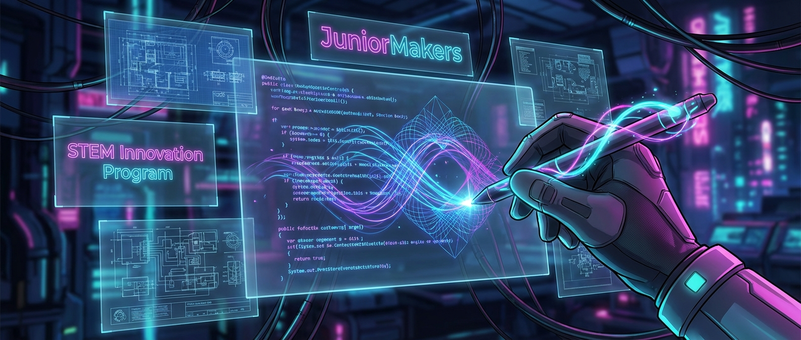

# 🖌️ Code als Pinsel: Generative Kunst programmieren

> **S T E A M - P R O F I L**
> [ ❌ ] 🧪 **S**cience (Wissenschaft)
> [ ✅ ] 💻 **T**echnology (Technologie)
> [ ❌ ] ⚙️ **E**ngineering (Ingenieurswesen)
> [ ✅ ] 🎨 **A**rts (Kunst)
> [ ❌ ] 📐 **M**ath (Mathematik)

**📋 Metadaten**
* **Autor:** ZWEIFEL Mike (mike.zweifel@zigerschlitzmakers.ch)
* **Version:** v1.0.0
* **Erstellt am:** 2026-03-13
* **Letzte Änderung:** 2026-03-13
* **Zielgruppe:** 9-12 Jahre
* **Format:** 🖥️ 100% PC
* **Kursstatus:** In Entwicklung
* **Schwierigkeit:** Mittel
* **Sicherheitsstufe:** Grün (Reine Bildschirmarbeit, keine Verletzungsgefahr)

---

## 📖 Kurzbeschreibung
Warum mit der Hand zeichnen, wenn der Computer das für uns tun kann? In diesem Kurs verschmelzen Programmieren und Kunst. Mit "Scratch" lernen die Kinder, wie Algorithmen, Schleifen und Variablen genutzt werden können, um faszinierende, algorithmische Muster und digitale Mandalas zu zeichnen. 

## ❓ Leitfragen (Essential Questions)
* Kann ein Computer kreativ sein, oder macht er nur das, was wir ihm sagen?
* Wie helfen uns Wiederholungen (Schleifen) im Code, komplexe Muster zu erzeugen?

## 🎯 Lernziele (Was nehmen die Kids mit?)
* **Fachlich:** Logisches Denken, Verstehen von Schleifen (Loops), Variablen und Winkeln in der Programmierung.
* **Methodisch:** Nutzung von Scratch und der "Malstift"-Erweiterung (Pen Extension).
* **Sozial/Persönlich:** Experimentierfreude, iteratives Ausprobieren und Anpassen von Code (Trial & Error).

## 🤝 Inklusion & Differenzierung
* **Für schwächere Kids / Motorische Einschränkungen:** Basis-Skript (ein Quadrat zeichnen) gemeinsam Schritt für Schritt aufbauen. Winkel vorgeben (z.B. 90, 60, 120 Grad).
* **Für Fortgeschrittene / Hochbegabte:** Variablen für Farben, Stiftdicke und Längen einbauen. Zufallszahlen (Random) nutzen, um das Kunstwerk jedes Mal anders aussehen zu lassen.

## 🏢 Anforderungen an Räumlichkeiten
- PC-Raum oder Tische mit Laptops.
- Beamer/Bildschirm für Live-Coding-Demos.

## 🛠️ Anforderungen ans Material vor Ort
**Pro Teilnehmer/Team:**
- 1 PC oder Laptop mit Internetzugang.
- Maus (erleichtert Drag & Drop der Blöcke in Scratch).

**Für den Mentor (Allgemein):**
- Scratch-Website auf dem Mentor-PC geöffnet.
- Ein vorbereitetes, beeindruckendes "Mandalascript" als Teaser.

## ⏱️ Zeitaufwand
- **Vorbereitungszeit (Mentor):** 10 Minuten (PCs starten, Scratch öffnen).
- **Nachbereitungszeit (Aufräumen):** 5 Minuten (PCs herunterfahren).
- **Kursdauer:** 100 Minuten

---

## 🚀 Detaillierter Ablauf (100 Minuten)

| Zeit | Phase | Beschreibung | Fokus / Mentor-Tipps |
|------|-------|--------------|----------------------|
| **16:40 - 16:50** | Einleitung | Live-Demo eines generativen Kunstwerks in Scratch. Einbinden der "Malstift"-Erweiterung zeigen. | Die Kids sollen sehen: Ein kurzes Skript = Ein riesiges, schickes Bild. Das motiviert! |
| **16:50 - 17:30** | Praxis Level 1 | Grundformen programmieren: Ein Quadrat, ein Dreieck. Dann: Das Ganze in eine Schleife packen und nach jeder Form um 10 Grad drehen. | Darauf hinweisen: Stift absenken nicht vergessen! Ohne "Stift ab" zeichnet die Figur nicht. |
| **17:30 - 17:40** | Pause | Bildschirmpause, Augen entspannen, lüften. | Projekte speichern lassen (online oder herunterladen). |
| **17:40 - 18:05** | Experten-Level | Variablen und Zufall. Farben nach jedem Schritt ändern lassen. "Spirale" programmieren, bei der die Linie immer länger wird. | Die Kids zum wilden Experimentieren ermutigen. "Was passiert, wenn wir hier eine 1000 eintragen?" |
| **18:05 - 18:20** | Reflexion | Screenshots der Kunstwerke ansehen. Wer hat das verrückteste Muster? Gemeinsames Herunterfahren. | Code austauschen: "Dein Muster ist cool, wie hast du das gemacht?" |

---

## 💡 Weitere nützliche Informationen
* **Mögliche Fehlerquellen:** Figur verlässt den Bildschirm (Rand-Blöcke nutzen). "Stift ab" vergessen. Bildschirm ist voller Farbe und die Kids wissen nicht, wie sie ihn leeren ("Alles löschen"-Block bereitlegen).
* **Alltagsbezug:** Digitale Spezialeffekte in Filmen, prozedurale Generierung in Videospielen (z.B. Minecraft-Welten), Datenvisualisierung.
* **Links & Quellen:** 
  - Tool: [Scratch](https://scratch.mit.edu/)
  - Anleitung Malstift: Nach dem Login unten links auf "Erweiterungen hinzufügen" und "Malstift" wählen.
