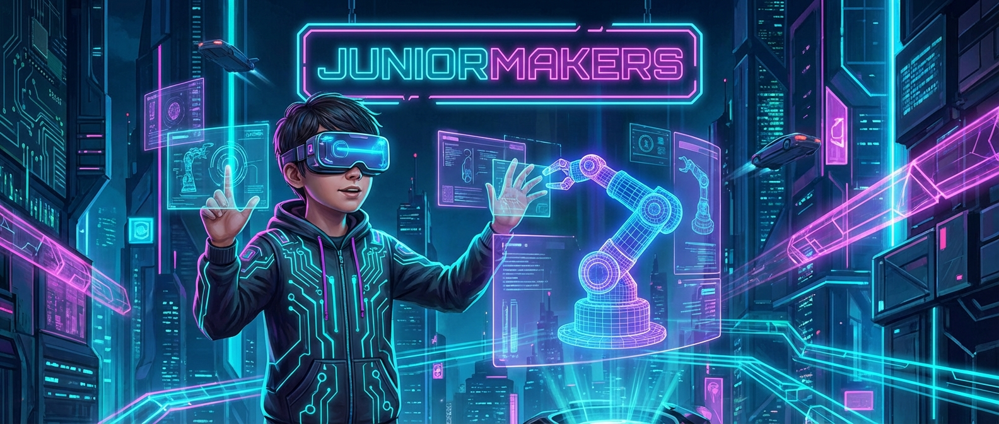

# 🗿 Pixel-Ton und Cyber-Knete: 3D-Modelle formen am PC

> **S T E A M - P R O F I L**
> [ ❌ ] 🧪 **S**cience (Wissenschaft)
> [ ✅ ] 💻 **T**echnology (Technologie)
> [ ❌ ] ⚙️ **E**ngineering (Ingenieurswesen)
> [ ✅ ] 🎨 **A**rts (Kunst)
> [ ❌ ] 📐 **M**ath (Mathematik)

**📋 Metadaten**
* **Autor:** ZWEIFEL Mike (mike.zweifel@zigerschlitzmakers.ch)
* **Version:** v1.0.0
* **Erstellt am:** 2026-03-13
* **Letzte Änderung:** 2026-03-13
* **Zielgruppe:** 9-12 Jahre
* **Format:** 🖥️ 100% PC
* **Kursstatus:** In Entwicklung
* **Schwierigkeit:** Mittel
* **Sicherheitsstufe:** Grün (Keine Verletzungsgefahr am PC)

---

## 📖 Kurzbeschreibung
Mit dem Tool SculptGL formen die Kinder virtuelle 3D-Modelle wie mit echter Knete, nur eben am Computer. Sie erschaffen eigene Skulpturen, Monster oder Charaktere und lernen dabei den Umgang mit digitalen Bildhauer-Werkzeugen (Brushes, Symmetrie, Glätten).

## ❓ Leitfragen (Essential Questions)
* Wie kann man aus einem einfachen digitalen Ball ein detailreiches Gesicht formen?
* Was ist der Unterschied zwischen 2D-Zeichnungen und 3D-Modellen?

## 🎯 Lernziele (Was nehmen die Kids mit?)
* **Fachlich:** Navigation im 3D-Raum (Pan, Zoom, Orbit) und Anwendung von Sculpting-Werkzeugen.
* **Methodisch:** Räumliches Vorstellungsvermögen und strukturiertes Arbeiten von groben zu feinen Details.
* **Sozial/Persönlich:** Kreative Entfaltung und Ausdauer beim Detaillieren der eigenen Figur.

## 🤝 Inklusion & Differenzierung
* **Für schwächere Kids / Motorische Einschränkungen:** Die Symmetrie-Funktion durchgehend aktivieren, damit die Figur automatisch auf beiden Seiten gleich wird. Maussteuerung vereinfachen.
* **Für Fortgeschrittene / Hochbegabte:** Texturieren und Bemalen des Modells in SculptGL hinzufügen.

## 🏢 Anforderungen an Räumlichkeiten
- PC-Raum oder Laptops für jedes Kind mit einer externen Maus (wichtig für die Navigation).
- Stabile Internetverbindung für das Browser-Tool SculptGL.

## 🛠️ Anforderungen ans Material vor Ort
**Pro Teilnehmer/Team:**
- 1 PC oder Laptop
- 1 Maus mit Mausrad
- Optional: Grafiktablett für präziseres Sculpting

**Für den Mentor (Allgemein):**
- Beamer für Vorführungen

## ⏱️ Zeitaufwand
- **Vorbereitungszeit (Mentor):** 10 Minuten (Geräte prüfen).
- **Nachbereitungszeit (Aufräumen):** 5 Minuten.
- **Kursdauer:** 100 Minuten

---

## 🚀 Detaillierter Ablauf (100 Minuten)

| Zeit | Phase | Beschreibung | Fokus / Mentor-Tipps |
|------|-------|--------------|----------------------|
| **16:40 - 16:50** | Einleitung | Was ist 3D-Sculpting? Kurzer Vergleich: Echte Knete vs. digitale Knete. | Demonstriere die Grundfunktionen von SculptGL am Beamer (Orbit, Zoom). |
| **16:50 - 17:30** | Praxis Level 1 | Die Kids starten mit einer Kugel und formen ein einfaches Alien- oder Monster-Gesicht. | Navigation im 3D-Raum bereitet oft Mühe. Hier besonders helfen! |
| **17:30 - 17:40** | Pause | Bildschirmpause, Augen entspannen, Hände ausschütteln. | Modelle zwischenspeichern (.obj oder .stl) nicht vergessen. |
| **17:40 - 18:05** | Experten-Level | Die Figuren werden mit Details verziert (Hörner, Augen, Texturen). | Hochbegabte können versuchen, zwei unterschiedliche Objekte (z.B. Kopf und Hut) zu kombinieren. |
| **18:05 - 18:20** | Reflexion | Virtuelle Galerie: Jeder zeigt sein Monster. Wie hat sich das Arbeiten im 3D-Raum angefühlt? | Positives Feedback für die kreativen Ergebnisse geben. |

---

## 💡 Weitere nützliche Informationen
* **Mögliche Fehlerquellen:** Kinder verlieren die Orientierung im 3D-Raum. Die Symmetrie-Achse wird aus Versehen deaktiviert.
* **Alltagsbezug:** Animationen in Filmen (Pixar) und 3D-Druck basieren auf genau solchen 3D-Modellen.
* **Links & Quellen:** 
  - Tool: [SculptGL](https://stephaneginier.com/sculptgl/)