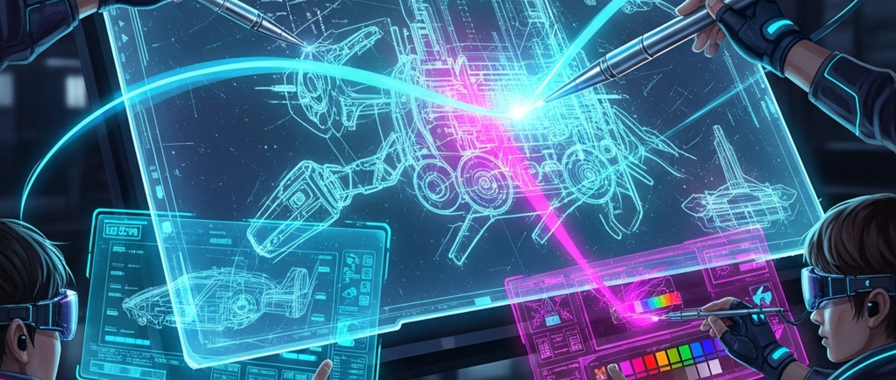

# 🤖 KI-Kunst-Labor: Malen mit Algorithmen

> **S T E A M - P R O F I L**
> [ ❌ ] 🧪 **S**cience (Wissenschaft)
> [ ✅ ] 💻 **T**echnology (Technologie)
> [ ❌ ] ⚙️ **E**ngineering (Ingenieurswesen)
> [ ✅ ] 🎨 **A**rts (Kunst)
> [ ❌ ] 📐 **M**ath (Mathematik)

**📋 Metadaten**
* **Autor:** Fridli (KI-Assistent der JuniorMakers)
* **Version:** v1.0.0
* **Erstellt am:** 2026-03-17
* **Letzte Änderung:** 2026-03-17
* **Zielgruppe:** 9-12 Jahre
* **Format:** 🖥️ 100% PC
* **Kursstatus:** In Entwicklung
* **Schwierigkeit:** Leicht
* **Sicherheitsstufe:** Grün (Reine Bildschirmarbeit, völlig unbedenklich)

---

## 📖 Kurzbeschreibung
In diesem Kurs werden die Kids zu digitalen Künstlern der Zukunft! Sie lernen, wie Bild-KIs funktionieren und wie man mit dem richtigen "Prompt" (Regieanweisung) beeindruckende Cyberpunk-Charaktere, futuristische Raumschiffe oder witzige Monster erschaffen kann. Zum Abschluss drucken wir das coolste Bild als echtes Poster aus.

## ❓ Leitfragen (Essential Questions)
* Kann ein Computer eigentlich "kreativ" sein?
* Wie erkläre ich einer Maschine genau, welches Bild sie in meinem Kopf malen soll?

## 🎯 Lernziele (Was nehmen die Kids mit?)
* **Fachlich:** Grundverständnis davon, was eine KI (Künstliche Intelligenz) ist und wie Bildgeneratoren (Diffusion Models) arbeiten. Aufbau eines guten Prompts (Motiv, Stil, Details).
* **Methodisch:** Präzises Formulieren von Text-Prompts und iteratives Verbessern von Ergebnissen.
* **Sozial/Persönlich:** Reflexion über Urheberrecht ("Gehört das Bild jetzt mir oder dem Computer?") und die Trennung von realen und künstlichen Bildern.

## 🤝 Inklusion & Differenzierung
* **Für schwächere Kids / Motorische Einschränkungen:** Die Texteingabe kann auch über Spracheingabe/Diktierfunktion am PC erfolgen. 
* **Für Fortgeschrittene / Hochbegabte:** Einsatz von komplexeren Parametern (z.B. Negativ-Prompts oder Beleuchtungs-Keywords) und Kombination mit anderen Tools wie NVIDIA Canvas (sofern vorhanden).

## 🏢 Anforderungen an Räumlichkeiten
- PC-Raum oder Laptops für alle Kids (Internetverbindung zwingend notwendig).
- Ein Beamer / großer Monitor für den Mentor zur Demo.
- Ein Farbdrucker im Raum (für die Poster am Ende).

## 🛠️ Anforderungen ans Material vor Ort
**Pro Teilnehmer/Team (Einzelarbeit oder 2er-Teams):**
- 1 PC/Laptop mit Browser
- Zugang zu einem sicheren, kostenlosen KI-Bildgenerator (z.B. Bing Image Creator / Microsoft Designer oder lokales Stable Diffusion).

**Für den Mentor (Allgemein):**
- 1 PC am Beamer
- Farbdrucker & ausreichend Fotopapier (A4)
- Klebepads/Pins, um die Galerie am Ende aufzuhängen.

## ⏱️ Zeitaufwand
- **Vorbereitungszeit (Mentor):** 15 Minuten (PCs hochfahren, Generator-Accounts bereithalten).
- **Nachbereitungszeit (Aufräumen):** 10 Minuten (Ausloggen, PCs runterfahren).
- **Kursdauer:** 100 Minuten

---

## 🚀 Detaillierter Ablauf (100 Minuten)

| Zeit | Phase | Beschreibung | Fokus / Mentor-Tipps |
|------|-------|--------------|----------------------|
| **16:40 - 16:50** | Einleitung | Was ist KI? Wie "lernt" ein Computer Bilder? Analogie: Die KI hat Millionen Bilder gesehen und mischt daraus nun neue. | Keine Mathe-Formeln! Erklären: "Prompting ist wie eine Bestellung im magischen Restaurant aufgeben." |
| **16:50 - 17:30** | Praxis Level 1 | Die Kids schreiben erste einfache Prompts (z.B. "Ein Roboterhund"). Dann erweitern sie den Prompt um Adjektive, Farben und Stile ("Ein leuchtend blauer Roboterhund im Cyberpunk-Stil bei Regen"). | Aufpassen, dass keine unangemessenen Wörter eingegeben werden (die meisten Generatoren filtern das, aber Mentoren-Aufsicht ist wichtig). |
| **17:30 - 17:40** | Pause | Augen weg vom Bildschirm, kurz lüften. | Der Mentor sucht schon mal ein paar Highlights auf den Bildschirmen der Kids. |
| **17:40 - 18:05** | Experten-Level | Die "Cyberpunk-Makerspace-Challenge": Generiere das epischste Labor/Werkzeug der Zukunft. Nutzung von Licht-Wörtern ("glowing neon, cinematic lighting"). | Hochbegabte können versuchen, exakt dasselbe Bild mehrfach nur durch kleine Prompt-Anpassungen zu verändern. |
| **18:05 - 18:20** | Reflexion | **Vernissage!** Jeder wählt sein Lieblingsbild. Wir drucken es aus und hängen es an die Wand. Kurze Diskussion: Woran erkennt man KI-Bilder (Hände, Fehler)? | Betonen: KI ist ein Werkzeug wie ein Pinsel, DU bist der Regisseur! |

---

## 💡 Weitere nützliche Informationen
* **Mögliche Fehlerquellen:** Kids sind frustriert, wenn die KI nicht exakt das macht, was sie wollen. Hier hilft iteratives Arbeiten: "Probier ein anderes Adjektiv!"
* **Alltagsbezug:** Konzept-Kunst für Videospiele und Filme wird heute oft mit KI-Unterstützung entworfen. Fake-News im Internet erkennen (wie entlarve ich ein KI-Bild?).
* **Prompt-Inspiration für Mentoren:** Nutze den JuniorMakers-Cyberpunk-Prompt aus der Mastervorlage als Demo auf dem Beamer!
