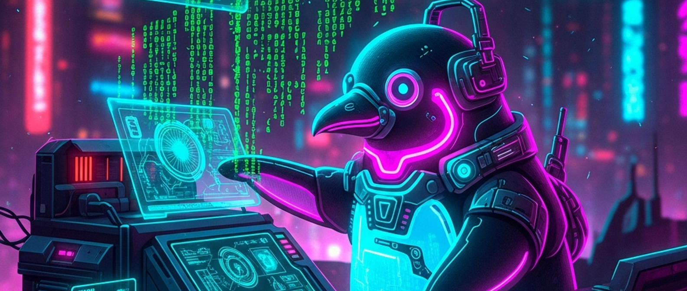

# 🐧 Pinguin-Hacker: Mein erstes Linux

> **S T E A M - P R O F I L**
> [ ❌ ] 🧪 **S**cience (Wissenschaft)
> [ ✅ ] 💻 **T**echnology (Technologie)
> [ ❌ ] ⚙️ **E**ngineering (Ingenieurswesen)
> [ ❌ ] 🎨 **A**rts (Kunst)
> [ ✅ ] 📐 **M**ath (Mathematik)

**📋 Metadaten**
* **Autor:** Fridli (KI-Assistent der JuniorMakers)
* **Version:** v1.0.0
* **Erstellt am:** 2026-03-17
* **Letzte Änderung:** 2026-03-17
* **Zielgruppe:** 9-12 Jahre (und NextMakers)
* **Format:** 🖥️ 100% PC
* **Kursstatus:** In Entwicklung
* **Schwierigkeit:** Mittel
* **Sicherheitsstufe:** Grün (Reine Softwarearbeit, keine physische Gefahr)

---

## 📖 Kurzbeschreibung
Wie arbeiten echte Hacker im Film? Mit schwarzen Bildschirmen und grüner Schrift! In diesem Kurs schauen wir "unter die Motorhaube" eines Computers. Die Kids lernen das Betriebssystem Linux kennen, bewegen sich durch Ordnerstrukturen, verstecken Dateien vor ihren Freunden und bringen den Computer über reine Textbefehle in der Kommandozeile dazu, witzige Dinge zu tun.

## ❓ Leitfragen (Essential Questions)
* Was passiert eigentlich im Computer, wenn ich mit der Maus auf einen Ordner klicke?
* Wie redet man mit einem Computer, wenn man keine Maus benutzen darf?

## 🎯 Lernziele (Was nehmen die Kids mit?)
* **Fachlich:** Was ist ein Betriebssystem? Grundlagen des Linux-Dateisystems. Nutzung der Bash (Kommandozeile) für Dateioperationen (`ls`, `cd`, `mkdir`, `rm`).
* **Methodisch:** Tastatur-Shortcuts, systematisches Suchen von Pfaden und Dateien.
* **Sozial/Persönlich:** Abbau von Ängsten vor "kompliziert" aussehenden Text-Interfaces. Hacker-Ethik (Wir brechen nirgends ein!).

## 🤝 Inklusion & Differenzierung
* **Für schwächere Kids / Motorische Einschränkungen:** Einen Spickzettel mit den 5 wichtigsten Befehlen auf dem Tisch legen (`cd`, `ls`, etc.). 
* **Für Fortgeschrittene / Hochbegabte:** Kleine Bash-Skripte schreiben lassen oder Befehle wie `grep` und `find` verwenden, um geheime Passwörter in Tausenden von Fake-Dateien zu finden.

## 🏢 Anforderungen an Räumlichkeiten
- PC-Raum oder Laptops für alle Kids.
- Beamer für den Mentor zur Demo der Terminal-Fenster.

## 🛠️ Anforderungen ans Material vor Ort
**Pro Teilnehmer/Team (1er oder 2er Teams):**
- 1 Raspberry Pi mit Bildschirm/Tastatur ODER ein PC/Laptop mit installierter Linux-Umgebung (z.B. WSL auf Windows, oder bootbarer Linux-USB-Stick).
- (Optional) "Spickzettel" mit Linux-Befehlen ausdrucken.

**Für den Mentor (Allgemein):**
- 1 PC am Beamer (Terminal sollte groß gezoomt und ggf. mit grünem Text auf schwarzem Grund formatiert sein für den "Hacker-Effekt").
- Ein vorbereitetes "Geheimverzeichnis" auf jedem Rechner.

## ⏱️ Zeitaufwand
- **Vorbereitungszeit (Mentor):** 20 Minuten (Prüfen, ob alle Terminals starten und Rechte stimmen).
- **Nachbereitungszeit (Aufräumen):** 10 Minuten (Rechner ausschalten, erstellte Ordner löschen).
- **Kursdauer:** 100 Minuten

---

## 🚀 Detaillierter Ablauf (100 Minuten)

| Zeit | Phase | Beschreibung | Fokus / Mentor-Tipps |
|------|-------|--------------|----------------------|
| **16:40 - 16:50** | Einleitung | Die Maus ist kaputt! Was nun? Wir klären, was ein Betriebssystem ist (Windows vs. macOS vs. Linux). Mentor macht eine kleine "Hacker"-Demo am Beamer. | Den Kids den Mythos vom bösen Hacker nehmen. Wir sind White Hats (die Guten)! |
| **16:50 - 17:30** | Praxis Level 1 | Das schwarze Fenster: Die Terminal-Grundlagen. Wo bin ich (`pwd`)? Was ist hier drin (`ls`)? Wir gehen in Ordner rein und raus (`cd`). Jeder legt einen eigenen Agenten-Ordner an (`mkdir Geheimagent`). | Die Kids werden anfangs viele Tippfehler (Typos) machen. Geduld! "Terminal verzeiht keine Leerzeichen." |
| **17:30 - 17:40** | Pause | Aufstehen, recken und strecken. | Mentor platziert (falls nicht schon geschehen) eine versteckte Datei (`.geheim.txt`) in den Userverzeichnissen. |
| **17:40 - 18:05** | Experten-Level | Die Schnitzeljagd! Wer findet die versteckte Datei auf seinem PC? (Tipp: `ls -a`). In der Datei steht ein Passwort. Wer es findet, lernt den Computer sprechen zu lassen (z.B. mit `espeak "Hallo Hacker"` oder ASCII-Art `cowsay`). | Hochbegabte können versuchen, die Datei umzubenennen, zu verschieben oder den Text darin anzupassen (`nano` oder `echo`). |
| **18:05 - 18:20** | Reflexion | Wir fassen die 5 wichtigsten Befehle zusammen. Wer fühlt sich jetzt wie ein Profi-Programmierer? | Betonen: Fast alle Server und Supercomputer der Welt, sogar Android-Handys, nutzen Linux! Das ist echtes Profi-Wissen. |

---

## 💡 Weitere nützliche Informationen
* **Mögliche Fehlerquellen:** Groß- und Kleinschreibung! Linux nimmt das todernst (`Geheim` ist nicht `geheim`). Kids löschen versehentlich wichtige Sachen (Daher keine root-Rechte vergeben!).
* **Alltagsbezug:** Serververwaltung, Cloud-Computing, Raspberry Pi-Projekte für Smart Homes laufen alle über Linux-Terminals.
* **Tipp für Mentoren:** Terminal-Optik zwingend auf "Retro-Hacker" stellen (Schrift grün, Hintergrund schwarz). Das steigert die Motivation der Kids enorm!
