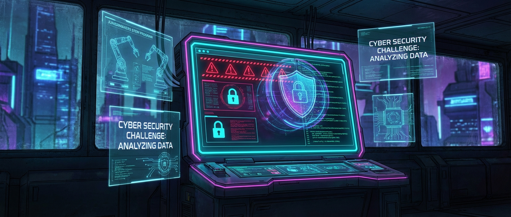

# 🛡️ Cyber-Detectives: Scam & Fake-Check

> **S T E A M - P R O F I L**
> [ ❌ ] 🧪 **S**cience (Wissenschaft)
> [ ✅ ] 💻 **T**echnology (Technologie)
> [ ❌ ] ⚙️ **E**ngineering (Ingenieurswesen)
> [ ❌ ] 🎨 **A**rts (Kunst)
> [ ❌ ] 📐 **M**ath (Mathematik)

**📋 Metadaten**
* **Autor:** ZWEIFEL Mike (mike.zweifel@zigerschlitzmakers.ch)
* **Version:** v1.0.0
* **Erstellt am:** 2026-03-13
* **Letzte Änderung:** 2026-03-13
* **Zielgruppe:** 10-14 Jahre
* **Format:** 🖥️ 100% PC
* **Kursstatus:** In Entwicklung
* **Schwierigkeit:** Leicht
* **Sicherheitsstufe:** 🟢 Grün (Vollständig digital)

---

## 📖 Kurzbeschreibung
Hast du ein iPhone gewonnen? Nein, hast du nicht! Die Kinder werden zu digitalen Detektiven ausgebildet, die Phishing, Fake-News und Scam erkennen. Mit interaktiven Quizzes und Simulatoren lernen sie, wie Hacker versuchen, uns im Netz auszutricksen.

## ❓ Leitfragen (Essential Questions)
* Woran erkenne ich, dass eine Website oder E-Mail gefährlich ist?
* Warum wollen Betrüger an unsere Daten und was passiert damit?

## 🎯 Lernziele (Was nehmen die Kids mit?)
* **Fachlich:** Wissen über Phishing, Fake-URLs, gefälschte Profile und grundlegende Cybersicherheit.
* **Methodisch:** URL-Analyse, Absenderprüfung und Erkennung von Social-Engineering-Taktiken.
* **Sozial/Persönlich:** Kritisches Denken gegenüber Informationen im Internet. Selbstbewusstsein im Umgang mit digitalen Gefahren.

## 🤝 Inklusion & Differenzierung
* **Für schwächere Kids / Motorische Einschränkungen:** Die Aufgaben sind visuell und lesebasiert. Mentor kann Vorlesen unterstützen.
* **Für Fortgeschrittene / Hochbegabte:** Challenge: Untersuchung von Header-Informationen in E-Mails oder Analyse echter (entschärfter) Spam-Beispiele.

## 🏢 Anforderungen an Räumlichkeiten
- PC-Raum oder Laptops.
- Gute Internetverbindung.
- Großer Monitor/Beamer.

## 🛠️ Anforderungen ans Material vor Ort
**Pro Teilnehmer/Team (1er Teams ideal):**
- 1 PC / Laptop.
- Zugang zu SWR Fakefinder / Google Phishing Quiz.

**Für den Mentor (Allgemein):**
- Laptop, Beamer.

## ⏱️ Zeitaufwand
- **Vorbereitungszeit (Mentor):** 10 Minuten (PCs vorbereiten, Links in Bookmarks legen).
- **Nachbereitungszeit (Aufräumen):** 5 Minuten.
- **Kursdauer:** 100 Minuten

---

## 🚀 Detaillierter Ablauf (100 Minuten)

| Zeit | Phase | Beschreibung | Fokus / Mentor-Tipps |
|------|-------|--------------|----------------------|
| **16:40 - 16:50** | Einleitung | "Herzlichen Glückwunsch, Sie haben gewonnen!" - Mentor spielt einen Scam vor. Erklärung, wie Phishing funktioniert. | Die Kids sollen verstehen, dass Scam auf Emotionen (Angst, Gier) abzielt. |
| **16:50 - 17:30** | Praxis Level 1 | Die Kids spielen am PC das Google Phishing Quiz (auf Deutsch). Der Simulator testet ihr Auge für Details in URLs und Absendern. | Aktiv herumlaufen, bei Fehlern sofort erklären, warum die URL gefälscht war. |
| **17:30 - 17:40** | Pause | Bildschirmpause. Strecken und Lüften. | Vorbereitung des SWR Fakefinders. |
| **17:40 - 18:05** | Experten-Level | Fake News & Deepfakes: Einsatz des SWR Fakefinder Simulators. Kids müssen echte von falschen Nachrichten unterscheiden. | Fortgeschrittene können probieren, wie man Bilder per Reverse Image Search (Google Lens) überprüft. |
| **18:05 - 18:20** | Reflexion | Welche Fakes waren am schwersten zu erkennen? Erstellen einer "Top 3 Regeln"-Liste für sicheres Surfen. | Betonen: Auch Erwachsene fallen darauf rein, es ist keine Schande, aber Vorsicht schützt! |

---

## 💡 Weitere nützliche Informationen
* **Mögliche Fehlerquellen:** Kids klicken unabsichtlich echte Malware-Links in der Pause (deshalb auf dedizierten Lernplattformen bleiben).
* **Alltagsbezug:** E-Mails, WhatsApp-Kettenbriefe, dubiose TikTok-Gewinnspiele, Roblox-V-Bucks-Scams.
* **Links & Quellen:** 
  - [Google Phishing Quiz](https://phishingquiz.withgoogle.com/?hl=de)
  - [SWR Fakefinder](https://swrfakefinder.de/)
