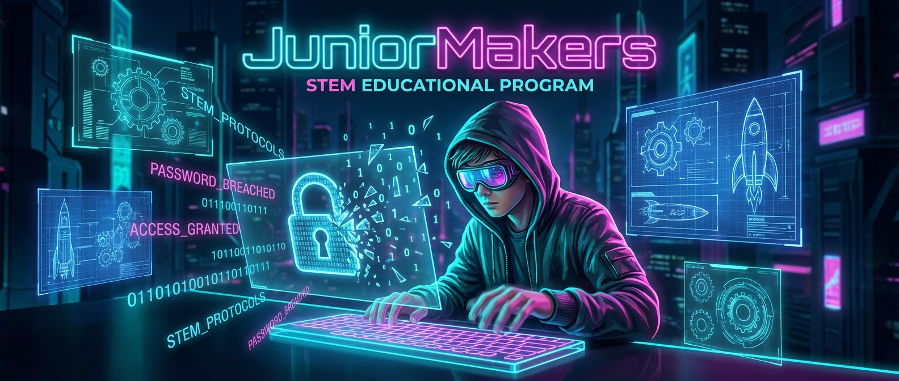

# Code-Knacker: Die Geheimsprache der Computer (Passwörter & Accounts)

> **S T E A M - P R O F I L**
> [ ❌ ] 🧪 **S**cience (Wissenschaft)
> [ ✅ ] 💻 **T**echnology (Technologie)
> [ ❌ ] ⚙️ **E**ngineering (Ingenieurswesen)
> [ ❌ ] 🎨 **A**rts (Kunst)
> [ ❌ ] 📐 **M**ath (Mathematik)

**📋 Metadaten**
* **Autor:** ZWEIFEL Mike (mike.zweifel@zigerschlitzmakers.ch)
* **Version:** v1.0.0
* **Erstellt am:** 2023-09-14
* **Letzte Änderung:** 2026-03-12
* **Zielgruppe:** 9-12 Jahre (Fokus: Neueinsteiger / Onboarding)
* **Format:** 🖥️ 100% PC
* **Kursstatus:** In Entwicklung
* **Schwierigkeit:** Leicht
* **Sicherheitsstufe:** Grün (Unbedenklich)

---

## 📖 Kurzbeschreibung
Dieser Kurs ist das "digitale Eintrittsticket" in die Welt der JuniorMakers. Die Kids lernen, wie Hacker Passwörter knacken und warum `passwort123` eine schlechte Idee ist. Sie testen ihre eigenen Passwörter auf Sicherheit, lernen den Unterschied zu Passphrasen kennen und richten am Ende ihr eigenes, sicheres Benutzerkonto an der MakerStation ein.

## ❓ Leitfragen (Essential Questions)
* Was passiert, wenn jemand mein Passwort stiehlt?
* Warum ist ein langer, witziger Satz sicherer als ein kurzes, kompliziertes Wort?

## 🎯 Lernziele (Was nehmen die Kids mit?)
* **Fachlich:** Den Unterschied zwischen Passwort und Passphrase verstehen. Wissen, wie man die Komplexität erhöht.
* **Methodisch:** Selbstständige Online-Recherche zu Sicherheitslücken. Erstellen eines sicheren, einprägsamen Zugangs.
* **Sozial/Persönlich:** Verantwortung für die eigenen digitalen Daten übernehmen. Verständnis für die Regeln des Makerspaces.

## 🤝 Inklusion & Differenzierung
* **Für schwächere Kids:** Das Passwort-Spiel als geführte Gruppenaktivität spielen. Hilfe beim Aufschreiben der Passphrase leisten (Legasthenie).
* **Für Fortgeschrittene / Hochbegabte:** Diskussion über Passwort-Manager anregen. Wie funktioniert 2-Faktor-Authentifizierung (2FA)?

## 🏢 Anforderungen an Räumlichkeiten
- PC-Raum (MakerStation) mit Internetzugang.

## 🛠️ Anforderungen ans Material vor Ort
**Pro Teilnehmer/Team:**
- 1 PC / Laptop mit Internetzugang.
- Zettel und Stift (im Mehrzweckraum-Schrank).

**Für den Mentor (Allgemein):**
- Ausgedruckte Exemplare der JuniorMakers Hausregeln und Vereinsstatuten.
- Admin-Rechte auf dem System, um die neuen Konten für die Kinder anzulegen.

## ⏱️ Zeitaufwand
- **Vorbereitungszeit (Mentor):** 10 Minuten (Regeln ausdrucken, PCs starten).
- **Nachbereitungszeit (Aufräumen):** 10 Minuten (Konten final prüfen).
- **Kursdauer:** 100 Minuten (angepasst an das Standard-Format).

---

## 🚀 Detaillierter Ablauf (100 Minuten)

| Zeit | Phase | Beschreibung | Fokus / Mentor-Tipps |
|------|-------|--------------|----------------------|
| **16:40 - 17:00** | Einleitung | **Willkommen im Club:** Was sind die Zigerschlitzmakers? Gemeinsames Lesen der Hausregeln und Vereinsstatuten. Kurze Intro, warum Usernamen wichtig sind. | Auf Augenhöhe kommunizieren. Die Regeln sind kein Gesetzbuch, sondern eine Vereinbarung unter Hackern und Makern. |
| **17:00 - 17:30** | Praxis Level 1 | **Passwort-Analyse:** Die Kids spielen "The Password Game" (`neal.fun/password-game`). Danach Recherche: Was ist eine Passphrase? Sie checken auf `wiesicheristmeinpasswort.de`, wie lange ein Hack dauern würde. | Die Kids sollen realisieren, dass Länge (Passphrase) oft wichtiger ist als wilde Sonderzeichen! |
| **17:30 - 17:40** | Pause | Augen weg vom Bildschirm! | Zeit nutzen, um Fragen zu den Regeln zu klären. |
| **17:40 - 18:00** | Experten-Level | **Hacker-Check:** Auf `haveibeenpwned.com` die E-Mail-Adressen der Eltern testen (mit Erlaubnis!). Diskussion: Sollte man Passwörter mehrfach verwenden? | Sensibles Thema: Keine Panik machen, wenn eine Mail geleakt wurde, sondern sachlich erklären (Passwort ändern!). |
| **18:00 - 18:20** | Reflexion | **Account-Creation:** Die Kids denken sich ein sicheres MakerStation-Passwort aus (aufschreiben!). Der Mentor erstellt das Konto (`[Vorname].[Nachname]`). Abschlusstest: Ein- und Ausloggen am PC (`Win + L`). | Sobald das Passwort auswendig gelernt wurde, muss der Spickzettel vernichtet werden (z.B. im Schredder – macht Spaß!). |

---

## 💡 Weitere nützliche Informationen
* **Mögliche Fehlerquellen:** Kinder vergessen ihr neues Passwort sofort nach dem Eintippen. *Lösung:* Unbedingt den temporären Spickzettel erlauben.
* **Alltagsbezug:** Identitätsdiebstahl beim Gaming (z.B. Roblox/Minecraft-Accounts gehackt) ist bei 9-12-Jährigen ein riesiges Thema. Darauf Bezug nehmen!
* **Links & Quellen:** 
  - [The Password Game](https://neal.fun/password-game/)
  - [Wie sicher ist mein Passwort?](https://wiesicheristmeinpasswort.de/)
  - [Have I been pwned?](https://haveibeenpwned.com/)
