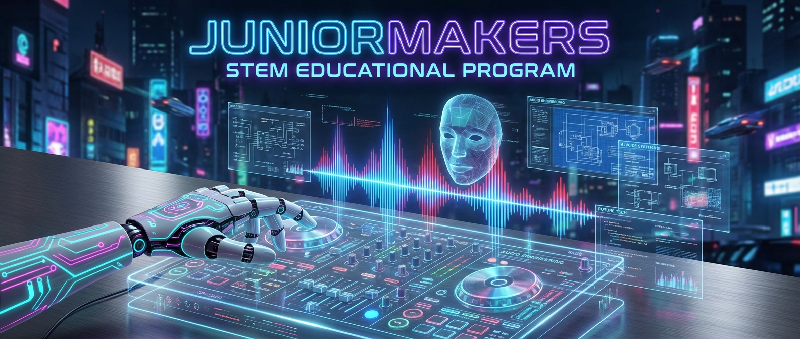

# Stimmenklau: Die Gefahr von KI-Deepfakes

> **S T E A M - P R O F I L**
> [ ❌ ] 🧪 **S**cience (Wissenschaft)
> [ ✅ ] 💻 **T**echnology (Technologie)
> [ ❌ ] ⚙️ **E**ngineering (Ingenieurswesen)
> [ ❌ ] 🎨 **A**rts (Kunst)
> [ ❌ ] 📐 **M**ath (Mathematik)

**📋 Metadaten**
* **Autor:** ZWEIFEL Mike (mike.zweifel@zigerschlitzmakers.ch)
* **Version:** v1.0.0
* **Erstellt am:** 2026-03-13
* **Letzte Änderung:** 2026-03-13
* **Zielgruppe:** 10-12 Jahre (Ethik & Security)
* **Format:** 🖥️ 100% PC
* **Kursstatus:** In Entwicklung
* **Schwierigkeit:** Schwer (Umgang mit KI-Tools, Account-Erstellung, hohes Abstraktionsvermögen)
* **Sicherheitsstufe:** Grün (Unbedenklich - reiner PC-Kurs, ABER: Ethik-Diskussion zwingend erforderlich!)

---

## 📖 Kurzbeschreibung
Glaube nicht alles, was du hörst! In diesem anspruchsvollen Kurs lernen die Kids, wie erschreckend einfach es heute ist, Stimmen zu klonen. Wir nutzen das Tool "ElevenLabs" (Voice Cloning), um aus einer kurzen Sprachaufnahme (z.B. vom Mentor) eine künstliche Stimme zu erschaffen, die plötzlich absurde Dinge sagt. Das Ziel: Aufklärung über Enkeltricks, Fake-News und die Wichtigkeit kritischen Denkens.

## ❓ Leitfragen (Essential Questions)
* Wie viel Audio-Material braucht eine KI, um eine Stimme perfekt nachzumachen?
* Woran kann ich erkennen, ob ein Anruf echt oder ein Deepfake ist?
* Was ist das "Sicherheits-Codewort" für Familien?

## 🎯 Lernziele (Was nehmen die Kids mit?)
* **Fachlich:** Verstehen, wie Voice-Cloning und generatorische KI funktionieren (Training mit Samples).
* **Methodisch:** Audio am PC aufnehmen, schneiden (z.B. Audacity oder Onlinetools) und einer KI als Trainingsdaten füttern.
* **Sozial/Persönlich:** Medienkompetenz und "Zero Trust"-Mentalität: "Wenn jemand am Telefon Geld will, muss ich doppelt prüfen, wer dran ist."

## 🤝 Inklusion & Differenzierung
* **Für schwächere Kids:** Das Schneiden der Audiodaten überspringen. Der Mentor stellt ein fertiges, sauberes MP3-File seiner Stimme zur Verfügung, das die Kids nur noch in ElevenLabs hochladen müssen.
* **Für Fortgeschrittene / Hochbegabte:** Prompt-Engineering für TTS (Text-to-Speech). Wie muss ich den Text schreiben (mit Pausen, Ausrufezeichen), damit die geklonte Stimme realistisch lacht oder weint?

## 🏢 Anforderungen an Räumlichkeiten
- PC-Raum (MakerStation). 
- Absolut ruhig für die Aufnahme-Phase!

## 🛠️ Anforderungen ans Material vor Ort
**Pro Teilnehmer/Team:**
- 1 PC / Laptop mit Browser und Internet.
- 1 Mikrofon (Headset reicht aus).
- Zugang zu einem kostenlosen ElevenLabs-Account (oder ähnlichem Voice-Cloning-Dienst). **WICHTIG:** Da die Kids meist zu jung für eigene Accounts sind, müssen Dummy-Accounts vom Mentor vorbereitet werden!

**Für den Mentor (Allgemein):**
- Beamer/Lautsprecher.

## ⏱️ Zeitaufwand
- **Vorbereitungszeit (Mentor):** 30 Minuten (Dummy-Accounts bei ElevenLabs erstellen, Mikrofone testen).
- **Nachbereitungszeit (Aufräumen):** 15 Minuten (Geklonte Stimmen aus den Accounts löschen aus Datenschutzgründen!).
- **Kursdauer:** 100 Minuten

---

## 🚀 Detaillierter Ablauf (100 Minuten)

| Zeit | Phase | Beschreibung | Fokus / Mentor-Tipps |
|------|-------|--------------|----------------------|
| **16:40 - 16:55** | Einleitung | **Der Schock-Anruf:** Der Kurs beginnt damit, dass der Mentor ein Audio abspielt. Darauf ist die Stimme des Mentors zu hören, wie er etwas völlig Absurdes sagt (z.B. "Hausaufgaben sind toll, ich verschenke heute alle meine Computer"). | Diskussions-Kickoff: "War ich das? Nein? Warum klingt es so?" |
| **16:55 - 17:35** | Praxis Level 1 | **Die Aufnahme:** Die Kids nehmen gegenseitig 60 Sekunden Sprache von sich auf. (Sie lesen einen Text vor). Sie laden das Audio als "Instant Voice Clone" bei ElevenLabs hoch. | Lärm vermeiden! Wenn Hintergrundgeräusche da sind, wird die Klon-Qualität extrem schlecht. |
| **17:35 - 17:45** | Pause | Durchatmen & Lüften. | Mentor prüft, ob bei allen Teams das Klonen geklappt hat. |
| **17:45 - 18:05** | Experten-Level | **Der Deepfake-Test:** Die Teams schreiben Texte, die die geklonte Stimme vorlesen soll. Die anderen Teams müssen mit geschlossenen Augen raten: Ist das live ins Mikro gesprochen, oder ist es die KI? | Auf Betonung achten. Die Kids sollen lernen, wo die KI noch schwächelt (Atemgeräusche, Emotionen). |
| **18:05 - 18:20** | Reflexion & Ethik | **Die Gefahren:** Wie nutzen Hacker das für den "Enkeltrick 2.0"? Vereinbarung eines "Familien-Codeworts" als Hausaufgabe (Wenn jemand anruft und Geld braucht, muss er das Codewort kennen!). | **WICHTIG:** Alle hochgeladenen Audio-Samples werden gemeinsam gelöscht! |

---

## 💡 Weitere nützliche Informationen
* **Mögliche Fehlerquellen:** Das Mikrofon ist stummgeschaltet. Die Kids sprechen zu undeutlich/leise beim Einlesen der Trainingsdaten. 
* **Alltagsbezug:** Schockanrufe ("Dein Sohn hatte einen Unfall, wir brauchen Kaution") sind leider Realität. Voice Cloning wird heute aktiv von Betrügern eingesetzt.
* **Ethik-Regel:** Die wichtigste Regel für die Kids: Wir klonen NIE die Stimme von Lehrern, Rektoren oder Politikern, um ihnen schädliche Dinge in den Mund zu legen. Wir nutzen das Wissen nur zur Verteidigung!
* **Links & Quellen:** 
  - [ElevenLabs - Voice Cloning](https://elevenlabs.io/)
  - [Polizeiliche Kriminalprävention: Enkeltrick & Schockanrufe](https://www.polizei-beratung.de/)