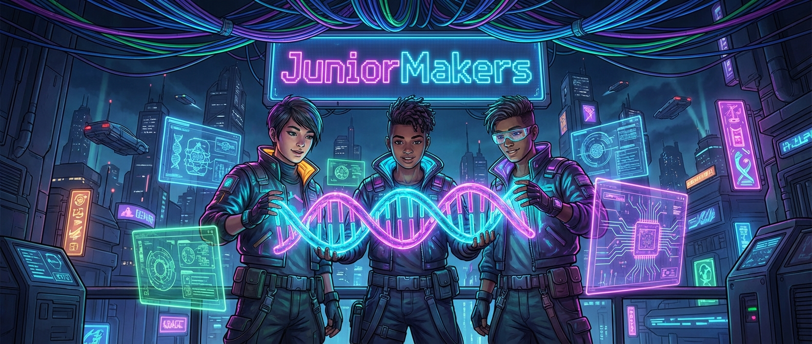

# 🚀 JuniorMakers: Das große Kurs-Archiv

Willkommen im Maschinenraum der JuniorMakers! Hier sammeln wir alle ausgearbeiteten Kurse, Projekte und Experimente. Egal ob du einen schnellen Lückenfüller suchst oder eine mehrwöchige Robotik-Kampagne planst – hier wirst du fündig.

> 💡 **Mentor-Tipp:** Alle neuen Kurse MÜSSEN mit der [Mastervorlage](00_Mastervorlage_und_Richtlinien.md) erstellt werden!

---

## 🧭 Kurs-Katalog nach STEAM-Disziplinen

In der Tabelle siehst du auf einen Blick, welche Kerndisziplinen abgedeckt werden, wie hoch der Schwierigkeitsgrad ist und wie gefährlich (oder unbedenklich) das Material ist.

| Kurs & Link | S | T | E | A | M | Format | Niveau | Risiko | Kurzbeschreibung |
| :--- | :---: | :---: | :---: | :---: | :---: | :---: | :---: | :---: | :--- |
| **[🔐 Code-Knacker: Die Geheimsprache der Computer](%5BsTeAM%5D_Passwort_Agenten/Kursplan.md)** | | 💻 | | | | 🖥️ PC | 🟢 Leicht | 🟢 Grün | Onboarding, Passwörter hacken und Account-Security. |
| **[⚡ Strom aus dem Bleistift](%5BSTEam%5D_Strom_aus_dem_Bleistift/Kursplan.md)** | 🧪 | 💻 | ⚙️ | | | 🛠️ Off | 🟡 Mittel | 🟢 Grün | Graphit-Leiterbahnen malen und LEDs zum Leuchten bringen. |
| **[🌻 Fibonacci und der Code der Natur](%5BSteaM%5D_Fibonacci_und_die_Natur/Kursplan.md)** | 🧪 | | | | 📐 | 🛠️ Off | 🟡 Mittel | 🟢 Grün | Feldstudie in der Natur: Den $137,5^\circ$ Winkel der Pflanzen entschlüsseln. |
| **[🪫 Heisser Draht Digital: Vom Draht zum Code](%5BsTEam%5D_Heisser_Draht_Digital/Kursplan.md)** | | 💻 | ⚙️ | | | 🔄 Mix | 🟡 Mittel | 🟡 Gelb | Einen Jahrmarkt-Klassiker biegen und mit Calliope programmieren. |
| **[🕵️‍♂️ Geheimbotschaften: Verschlüsselung von Caesar bis zur Enigma](%5BsTeAM%5D_Kryptographie_Geheimcodes/Kursplan.md)** | | 💻 | | | 📐 | 🛠️ Off | 🟡 Mittel | 🟢 Grün | Grundlagen der Kryptographie, Caesar-Scheiben basteln und Geheimcodes knacken. |
| **[✒️ Magie der Vektorgrafiken: Malen mit Mathematik](%5BsTeAM%5D_Magie_der_Vektorgrafiken/Kursplan.md)** | | 💻 | | 🎨 | 📐 | 🖥️ PC | 🟡 Mittel | 🟢 Grün | Pixel vs. Vektor. Digitale Kunst mit Inkscape erschaffen. |
| **[📻 Geheime Signale: Die Kunst des Morse-Codes](%5BsTEam%5D_Geheime_Signale_Morse_Code/Kursplan.md)** | | 💻 | ⚙️ | | | 🛠️ Off | 🟡 Mittel | 🟡 Gelb | Mechanischen Telegrafen bauen und binäre Nachrichten verschicken. |
| **[🌐 Das Internet verstehen: Wir bauen Computernetzwerke](%5BsTeAM%5D_Das_Internet_verstehen_Netzwerke/Kursplan.md)** | | 💻 | | | 📐 | 🖥️ PC | 🟡 Mittel | 🟢 Grün | Mit webnetsim.de Router, Switches und Server konfigurieren. |
| **[🎢 Achterbahn der Physik: Potenzielle und Kinetische Energie](%5BStEaM%5D_Achterbahn_der_Physik_Energie/Kursplan.md)** | 🧪 | | ⚙️ | | 📐 | 🛠️ Off | 🟡 Mittel | 🟢 Grün | Murmelbahnen und Loopings aus Rohrisolationen an Wände bauen. |
| **[✈️ Sturmreiter: Das Geheimnis des Fliegens](%5BSTeam%5D_Flugzeugtragflaechen_verstehen/Kursplan.md)** | 🧪 | 💻 | ⚙️ | | | 🖥️ PC | 🟡 Mittel | 🟢 Grün | Geheimnis der Aerodynamik und Auftrieb am PC (NASA FoilSim). |
| **[🛡️ Cyber-Detectives: Scam & Fake-Check](%5BsTeam%5D_Internetbetrug_erkennen/Kursplan.md)** | | 💻 | | | | 🖥️ PC | 🟢 Leicht | 🟢 Grün | Phishing, Fake-News und Scam erkennen mit interaktiven Quizzes. |
| **[🗣️ Stimmenklau: Die Gefahr von KI-Deepfakes](%5BsTeam%5D_Stimmenklau_KI_Deepfakes/Kursplan.md)** | | 💻 | | | | 🖥️ PC | 🔴 Schwer | 🟡 Gelb | Voice-Cloning verstehen, anwenden und Ethik/Enkeltricks diskutieren. |
| **[🌈 Licht & Magie: Farbcode-Labor](%5BSteAm%5D_Farbenmischen/Kursplan.md)** | 🧪 | | | 🎨 | | 🖥️ PC | 🟢 Leicht | 🟢 Grün | Additive (RGB) und subtraktive (CMY) Farbmischung digital erforschen. |
| **[🗺️ Geometrie-Gamer: Der X-Y-Code](%5BsTeaM%5D_Koordinaten_rechnen/Kursplan.md)** | | 💻 | | | 📐 | 🖥️ PC | 🟡 Mittel | 🟢 Grün | Das kartesische Koordinatensystem in GeoGebra und Scratch anwenden. |
| **[👁️ Optik-Hacker: Die Kamera im Kopf](%5BSteam%5D_Das_menschliche_Auge/Kursplan.md)** | 🧪 | | | | | 🖥️ PC | 🟡 Mittel | 🟢 Grün | Linsen, Brechung und Brennweite mit PhET Geometric Optics verstehen. |
| **[🎧 Sound-Ingenieure: Die Wellen im Kopf](%5BSteam%5D_Das_menschliche_Ohr/Kursplan.md)** | 🧪 | | | | | 🖥️ PC | 🟡 Mittel | 🟢 Grün | Schallwellen, Frequenzen und Amplituden am PC simulieren. |
| **[🌀 Optische Illusionen: Trägheit des Auges](%5BSteAm%5D_Persistence_of_Vision/Kursplan.md)** | 🧪 | | | 🎨 | | 🛠️ Off | 🟢 Leicht | 🟢 Grün | Trägheit des Auges (Persistence of Vision): Thaumatrope und Daumenkinos basteln. |
| **[🐭 Kettenreaktion extrem: Die Mausefallen-Maschine](%5BStEam%5D_Mausefallen_Kettenreaktion/Kursplan.md)** | 🧪 | | ⚙️ | | | 🛠️ Off | 🔴 Schwer | 🟡 Gelb | Aus wildem Chaos entsteht geniale Ordnung! Rube-Goldberg-Maschinen bauen. |
| **[🏎️ Gummi-GTI: Das schnellste CD-Auto der Welt](%5BstEam%5D_Gummimotor_Racer/Kursplan.md)** | 🧪 | | ⚙️ | | | 🛠️ Off | 🟡 Mittel | 🟢 Grün | Gummimotor-Racer aus alten CDs und Pappe bauen und tunen. |
| **[🤖 Zappel-Roboter: Wir bauen Bürsten-Bots](%5BsTEam%5D_Buersten_Bots/Kursplan.md)** | 🧪 | 💻 | ⚙️ | | | 🛠️ Off | 🟢 Leicht | 🟡 Gelb | Wigglebots aus Spülbürsten, Vibrationsmotoren und Batterien konstruieren. |
| **[🌬️ Sturm-Kraftwerke: Energie aus dem Nichts](%5BStEaM%5D_Windkraftanlagen/Kursplan.md)** | 🧪 | 💻 | ⚙️ | | 📐 | 🛠️ Off | 🟡 Mittel | 🟡 Gelb | Rotorblätter designen und Strom mit Mini-Windkraftanlagen generieren. |
| **[🚀 3, 2, 1, Lift-Off: Die Wasserrakete](%5BStEam%5D_Wasserraketen/Kursplan.md)** | 🧪 | | ⚙️ | | 📐 | 🛠️ Off | 🟡 Mittel | 🔴 Rot | PET-Wasserraketen bauen und mit Druckluft outdoor in den Himmel schießen. |
| **[🌉 Die unzerstörbare Brücke: Spaghetti & Marshmallows](%5BStEam%5D_Die_unzerstoerbare_Bruecke/Kursplan.md)** | 🧪 | | ⚙️ | | | 🛠️ Off | 🟡 Mittel | 🟢 Grün | Baustatik-Grundlagen: Brücken aus Spaghetti bauen und belasten. |
| **[🏢 Erdbebensichere Wolkenkratzer: Bauen für den Ernstfall](%5BStEam%5D_Erdbebensichere_Wolkenkratzer/Kursplan.md)** | 🧪 | | ⚙️ | | | 🛠️ Off | 🟡 Mittel | 🟢 Grün | Schwingungsdämpfung und Schwerpunkt mit einem Erdbeben-Simulator testen. |
| **[🥚 Der Eier-Crashtest: Fallschirm & Knautschzone](%5BStEam%5D_Eier_Crashtest/Kursplan.md)** | 🧪 | | ⚙️ | | | 🛠️ Off | 🟡 Mittel | 🟡 Gelb | Fallschirme und Knautschzonen aus Recyclingmaterial für ein rohes Ei bauen. |
| **[🦾 Pneumatik-Greifarm aus Pappe und Spritzen](%5BStEam%5D_Pneumatik_Greifarm/Kursplan.md)** | 🧪 | | ⚙️ | | | 🛠️ Off | 🔴 Schwer | 🟡 Gelb | Hydraulik/Pneumatik-Greifer mit Spritzen und Schläuchen konstruieren. |
| **[🛸 Hovercrafts aus CDs und Luftballons](%5BStEam%5D_Hovercrafts/Kursplan.md)** | 🧪 | | ⚙️ | | | 🛠️ Off | 🟢 Leicht | 🟡 Gelb | Reibung aufheben mit selbstgebauten Luftkissenbooten. |
| **[👾 Pixel-Helden: Dein erstes eigenes Game-Design](%5BsTeAm%5D_Pixel_Art_und_Game_Design/Kursplan.md)** | | 💻 | | 🎨 | | 🖥️ PC | 🟢 Leicht | 🟢 Grün | 2D-Helden und Feinde im Retro-Look mit Piskel animieren. |
| **[🖌️ Code als Pinsel: Generative Kunst programmieren](%5BsTeAm%5D_Code_als_Pinsel/Kursplan.md)** | | 💻 | | 🎨 | | 🖥️ PC | 🟡 Mittel | 🟢 Grün | Mit Scratch Algorithmen und Schleifen für digitale Kunstwerke nutzen. |
| **[🗿 Pixel-Ton und Cyber-Knete: 3D-Modelle formen am PC](%5BsTeAm%5D_Digitale_Bildhauerei/Kursplan.md)** | | 💻 | | 🎨 | | 🖥️ PC | 🟡 Mittel | 🟢 Grün | Mit SculptGL eigene 3D-Modelle am PC wie mit echter Knete formen. |
| **[🥁 Neon-Sounds: Eigene Beats programmieren wie ein DJ](%5BsTeAm%5D_Eigene_Beats_programmieren/Kursplan.md)** | | 💻 | | 🎨 | | 🖥️ PC | 🟡 Mittel | 🟢 Grün | Elektronische Beats und Melodien mit Code und Loops produzieren. |
| **[⚡ Leuchtende Mode: E-Textiles & Wearables](%5BstEAm%5D_Leuchtende_Mode_E_Textiles/Kursplan.md)** | | | ⚙️ | 🎨 | | 🛠️ Off | 🟡 Mittel | 🟡 Gelb | Mit leitfähigem Garn LEDs in Kleidung nähen und Wearables erschaffen. |
| **[☀️ Cyanotypie: Fotografieren mit der Sonne](%5BSteAm%5D_Cyanotypie_Blaudruck/Kursplan.md)** | 🧪 | | | 🎨 | | 🛠️ Off | 🟢 Leicht | 🟡 Gelb | Blaudruck-Verfahren (Cyanotypie) mit UV-Licht der Sonne auf Papier entwickeln. |
| **[🛰️ Origami-Ingenieure: Falten für den Weltraum](%5BstEAm%5D_Origami_Ingenieure/Kursplan.md)** | | | ⚙️ | 🎨 | | 🛠️ Off | 🟡 Mittel | 🟢 Grün | Das Miura-Faltmuster verstehen und entfaltbare Satellitenstrukturen aus Papier bauen. |
| **[✨ Malen mit Licht: Leuchtende Kunstwerke](%5BSTeAm%5D_Malen_mit_Licht/Kursplan.md)** | 🧪 | 💻 | | 🎨 | | 🛠️ Off | 🟡 Mittel | 🟢 Grün | Mit LEDs und Langzeitbelichtung (Kamera) faszinierende leuchtende Kunstwerke in der Luft erschaffen. |
| **[🌪️ Wetter-Hacker: Wolken, Wind und Tornados](%5BStEam%5D_Wetter_Hacker/Kursplan.md)** | 🧪 | | ⚙️ | | | 🛠️ Off | 🟡 Mittel | 🟡 Gelb | Wolke in der Flasche, Mini-Tornados und Anemometer bauen. |

*(S = Science, T = Technology, E = Engineering, A = Arts, M = Math)*

---

*Index zuletzt aktualisiert: 13. März 2026*