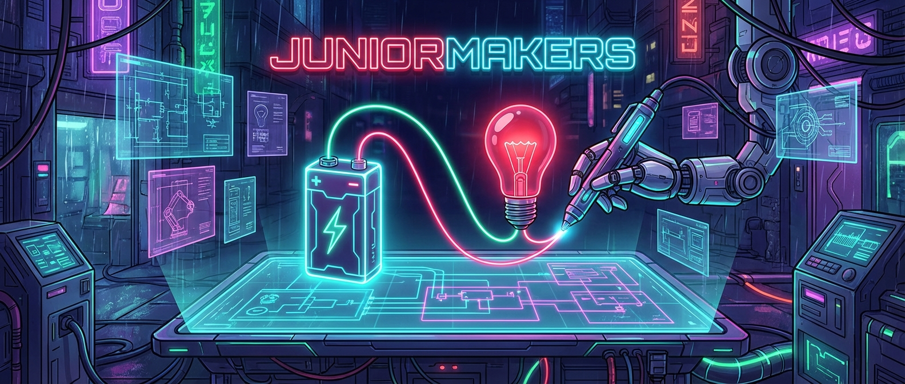
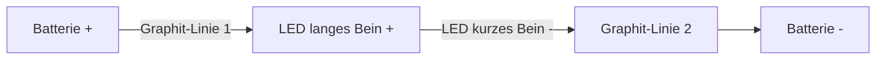
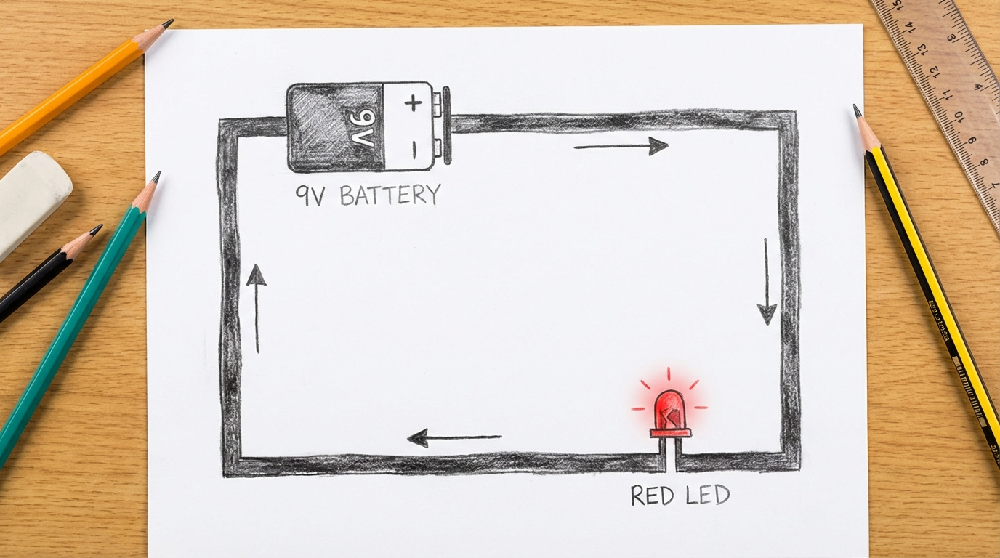
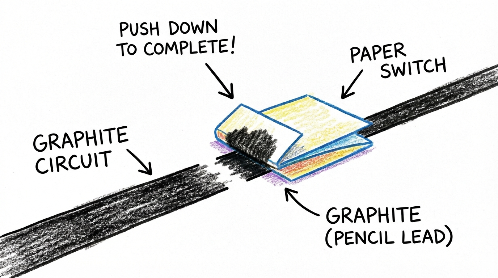
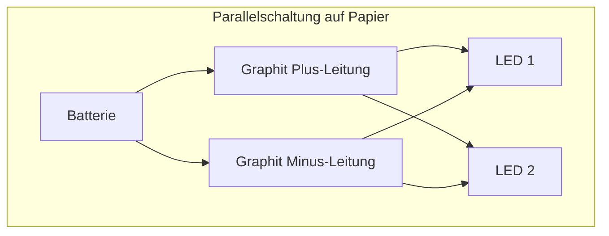
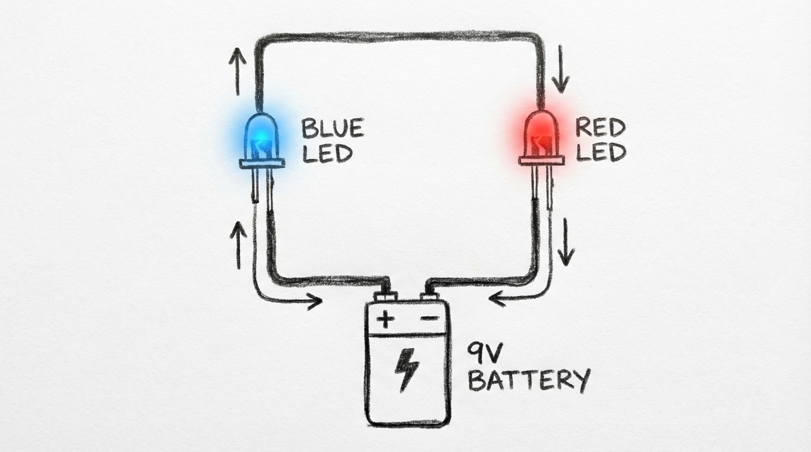

# Strom aus dem Bleistift

> **S T E A M - P R O F I L**
> [ ❌ ] 🧪 **S**cience (Wissenschaft)
> [ ✅ ] 💻 **T**echnology (Technologie)
> [ ✅ ] ⚙️ **E**ngineering (Ingenieurswesen)
> [ ❌ ] 🎨 **A**rts (Kunst)
> [ ❌ ] 📐 **M**ath (Mathematik)

**📋 Metadaten**
* **Autor:** ZWEIFEL Mike (mike.zweifel@zigerschlitzmakers.ch)
* **Version:** v1.0.0
* **Erstellt am:** 2026-03-12
* **Letzte Änderung:** 2026-03-12
* **Zielgruppe:** 9-12 Jahre
* **Format:** 🛠️ 100% Offline
* **Schwierigkeit:** Leicht
* **Sicherheitsstufe:** Grün (Unbedenklich)

---

## 📖 Kurzbeschreibung
Strom fließt nicht nur durch Kupferkabel! In diesem Kurs lernen die Kids, dass sie mit einem ganz normalen Bleistift funktionierende Schaltkreise direkt auf Papier malen können. Sie bringen LEDs zum Leuchten und entwerfen kleine leuchtende Kunstwerke.

## ❓ Leitfragen (Essential Questions)
* Warum leitet Bleistift Strom, aber das Papier darunter nicht?
* Wie muss eine Straße für Elektronen aussehen, damit das Licht angeht?

## 🎯 Lernziele (Was nehmen die Kids mit?)
* **Fachlich:** Verstehen eines geschlossenen Stromkreises. Polung einer LED (Anode/Kathode) erkennen. Graphit als Leiter begreifen.
* **Methodisch:** Einfache Fehlersuche (Debugging) in einem physikalischen System (Warum leuchtet es nicht?).
* **Sozial/Persönlich:** Geduld und Genauigkeit beim Zeichnen der Leitungen.

## 🤝 Inklusion & Differenzierung
* **Für schwächere Kids:** Fertige Schablonen zum Ausmalen bereitstellen, um den Frust bei zu dünnen Linien zu minimieren.
* **Für Fortgeschrittene / Hochbegabte:** Parallelschaltungen zeichnen oder den Widerstand der Bleistiftlinien mit einem Multimeter messen.

## 🏢 Anforderungen an Räumlichkeiten
- Normale Arbeitsplätze/Tische.
- Möglichkeit, die Hände zu waschen (Graphit färbt stark ab!).

## 🛠️ Anforderungen ans Material vor Ort
**Pro Teilnehmer/Team:**
- 2-3 sehr weiche Bleistifte (mindestens 6B, besser 8B oder Graphit-Vollminen)
- Normales Kopierpapier
- 1 Knopfzelle (3V, Typ CR2032)
- 2 LEDs (5mm)
- 1 Radiergummi

**Für den Mentor (Allgemein):**
- Spitzer
- Klebeband (um die Batterien auf dem Papier zu fixieren)
- Multimeter

## ⏱️ Zeitaufwand
- **Vorbereitungszeit (Mentor):** 10 Minuten (Materialpakete richten).
- **Nachbereitungszeit (Aufräumen):** 5 Minuten.
- **Kursdauer:** 100 Minuten

---

## 🚀 Detaillierter Ablauf (100 Minuten)

| Zeit | Phase | Beschreibung | Fokus / Mentor-Tipps |
|------|-------|--------------|----------------------|
| **16:40 - 16:50** | Einleitung | **Das Autobahn-Beispiel:** Graphit ist wie eine holprige Landstraße für Elektronen. Ein Kabel ist die Autobahn. Vorführung: Der Mentor bringt live auf Papier eine LED zum Leuchten. | Die Kids sollen die "Magie" direkt zu Beginn sehen, das fesselt sie sofort. |

### 16:50 - 17:25 | 2. Praxis Level 1: Die erste leuchtende Zeichnung (35 Min)
* **Aufgabe:** Jeder Teilnehmer bekommt Papier, einen weichen Bleistift (4B-8B), eine 9V-Blockbatterie (oder Knopfzelle) und eine LED.
* **Anleitung:**
  1. Zeichnet zwei dicke, stark ausgemalte Balken nebeneinander (sie dürfen sich nicht berühren! Kurzschluss-Gefahr!).
  2. Achtet auf die Polung der LED: Das lange Bein ist Plus (+), das kurze ist Minus (-).
  3. Setzt die Batterie auf das eine Ende der Balken und die LED auf das andere.
* **Prozess-Fokus:** "Drückt den Stift fest auf, die Straße für die Elektronen muss lückenlos sein!"

### 17:25 - 17:35 | ☕ Pause (10 Min)
Zeit zum Händewaschen (Graphit färbt ab!) und Durchlüften.

### 17:35 - 18:05 | 3. Level 2 & Experten-Herausforderung (30 Min)

**Level 2: Schalter und Kreativität**
* **Aufgabe:** Integriert einen Schalter in eure Zeichnung.
* **Wie?** Eine Lücke in der Linie lassen. Ein kleines Stück Papier mit Graphit bemalen und als "Brücke" (Schalter) über die Lücke klappen.
* **Künstlerische Komponente:** Malt einen Roboter oder ein Haus, bei dem die Augen/Fenster leuchten, wenn man den Papier-Schalter drückt.

**Experten-Herausforderung (für schnelle/hochbegabte Kids):**
* **Aufgabe A (Reihen- vs. Parallelschaltung):** Was passiert, wenn ihr ZWEI LEDs in die Linien einbaut? Leuchten sie gleich hell, wenn sie hintereinander (Reihe) oder nebeneinander (Parallel) liegen? (Erwartung: Parallel funktioniert besser, bei Reihe reicht der Strom durch den hohen Graphit-Widerstand oft nicht).
* **Aufgabe B (Messung des Widerstands):** Nutzt ein Multimeter (Ohm-Einstellung). Messt den Widerstand einer 5 cm langen Linie und einer 10 cm langen Linie.
* **Forschungsfrage:** "Wenn die Leitung doppelt so lang ist, ist dann auch der Widerstand doppelt so hoch?"

### 18:05 - 18:20 | 4. Abschluss & Reflexion (15 Min)
* **Zusammenkommen:** Jedes Kind darf sein leuchtendes Kunstwerk kurz vorführen.
* **Offene Fragen:** "Was war das größte Problem, als das Licht nicht anging?" (Meistens: Linien nicht dick genug, Polung falsch).
* **Feedback:** Lob für Hartnäckigkeit ("Toll, wie du nicht aufgegeben hast und die Linie dreimal nachgemalt hast, bis der Strom fließen konnte!").
* **Ausblick:** "Nächste Woche bauen wir etwas, das sich bewegt..."

---

## 🛠️ Materialliste
- Weiche Bleistifte (mind. 4B, am besten 6B oder 8B oder pure Graphitstifte)
- Normales Druckerpapier und etwas dickeres Tonpapier
- LEDs (verschiedene Farben, am besten 3V oder 5V LEDs, da 9V an Graphit oft auf 3V abfällt)
- 9V-Blockbatterien (oder 3V Knopfzellen CR2032 mit Klebeband)
- Radiergummis und Spitzer
- 1-2 einfache Multimeter für die Experten-Aufgabe

---

## 💡 Mentor-Tipps
- **Fehlerkultur:** Wenn eine LED nicht leuchtet, löse das Problem nicht sofort für das Kind. Frage stattdessen: *"Lass uns den Weg des Stroms mit dem Finger nachfahren. Ist die Straße irgendwo kaputt? Oder steht die Schranke (LED) falsch herum?"*
- **Sicherheit:** 9V-Batterien sind ungefährlich für den Körper, aber wenn die beiden Pole direkt durch Graphit oder Metall verbunden werden (Kurzschluss), kann die Batterie warm werden. Darauf achten, dass Plus- und Minus-Spur sich nicht kreuzen!
