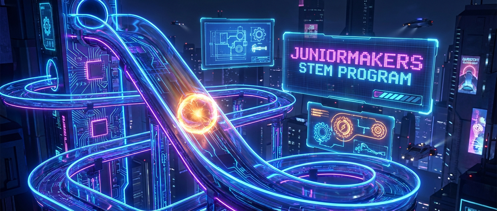

# Achterbahn der Physik: Potenzielle und Kinetische Energie

> **S T E A M - P R O F I L**
> [ ✅ ] 🧪 **S**cience (Wissenschaft)
> [ ❌ ] 💻 **T**echnology (Technologie)
> [ ✅ ] ⚙️ **E**ngineering (Ingenieurswesen)
> [ ❌ ] 🎨 **A**rts (Kunst)
> [ ✅ ] 📐 **M**ath (Mathematik)

**📋 Metadaten**
* **Autor:** ZWEIFEL Mike (mike.zweifel@zigerschlitzmakers.ch)
* **Version:** v1.0.0
* **Erstellt am:** 2026-03-13
* **Letzte Änderung:** 2026-03-13
* **Zielgruppe:** 9-12 Jahre
* **Format:** 🛠️ 100% Offline
* **Schwierigkeit:** Mittel
* **Sicherheitsstufe:** Grün (Unbedenklich - 100% Offline-Kurs mit Karton und Murmeln)

---

## 📖 Kurzbeschreibung
Warum fällt der Looping einer Achterbahn nie in sich zusammen? Die Kinder lernen die fundamentalen Prinzipien der Energieerhaltung kennen: Potenzielle Energie (Lageenergie) und kinetische Energie (Bewegungsenergie). Aus Rohrisolation und Klebeband bauen sie in Teams gigantische Murmelbahnen an den Wänden des MakerSpaces und versuchen, einen Looping zu konstruieren.

## ❓ Leitfragen (Essential Questions)
* Kann Energie verloren gehen? (Nein, sie wird nur umgewandelt oder entweicht als Reibung/Wärme).
* Warum muss der Startpunkt eines Loopings immer höher sein als der Looping selbst?

## 🎯 Lernziele (Was nehmen die Kids mit?)
* **Fachlich:** Den Unterschied zwischen potenzieller und kinetischer Energie kennen. Das Konzept von Reibungsverlusten verstehen.
* **Methodisch:** Planung und Konstruktion einer mechanischen Bahn (Engineering Design Process).
* **Sozial/Persönlich:** Teamwork! Eine 3-Meter-Bahn lässt sich nicht mit zwei Händen an die Wand kleben.

## 🤝 Inklusion & Differenzierung
* **Für schwächere Kids:** Keine Berechnungen fordern. Fokus auf Trial-and-Error beim Ankleben der Bahnen.
* **Für Fortgeschrittene / Hochbegabte:** Messen der Starthöhe und der Looping-Höhe. Wie viel Prozent der Höhe "verlieren" wir durch Reibung? Die Formeln für Energie (m*g*h) vereinfacht erklären.

## 🏢 Anforderungen an Räumlichkeiten
- VIEL Platz. Freie Wände, Schränke oder Tische, an denen Malercrepe angebracht werden darf.
- 100% Offline-Kurs (Keine PCs nötig).

## 🛠️ Anforderungen ans Material vor Ort
**Pro Teilnehmer/Team (3-4er Teams):**
- 3-4 längs halbierte Rohrisolationen (aus dem Baumarkt, sehr günstig und perfekt als Murmel-Schienen)
- 1 Rolle Malercrepe (Kreppband, geht leicht von Wänden ab)
- 3 Glasmurmeln

**Für den Mentor (Allgemein):**
- Ein Maßband (Zollstock)
- Scheren/Cutter (nur durch Mentor benutzt, um Rohre ggf. zu kürzen)

## ⏱️ Zeitaufwand
- **Vorbereitungszeit (Mentor):** 10 Minuten (Rohrisolationen bereitlegen).
- **Nachbereitungszeit (Aufräumen):** 15 Minuten (Klebebandreste entfernen).
- **Kursdauer:** 100 Minuten

---

## 🚀 Detaillierter Ablauf (100 Minuten)

| Zeit | Phase | Beschreibung | Fokus / Mentor-Tipps |
|------|-------|--------------|----------------------|
| **16:40 - 16:50** | Einleitung | **Das Pendel:** Der Mentor hält ein Pendel (oder einen Schlüssel am Lanyard) vor die eigene Nase, lässt los (nicht schubsen!) und vertraut darauf, dass es ihn beim Zurückschwingen nicht im Gesicht trifft (Energieerhaltung!). Erklären von Potenzieller Energie (oben) und Kinetischer Energie (unten, in Bewegung). | Reibung nicht vergessen: Das Pendel wird mit jedem Schwung langsamer. |
| **16:50 - 17:35** | Praxis Level 1 | **Die Murmelbahn-Challenge:** Baut in Teams die längste Murmelbahn, bei der die Kugel das Ende erreicht. Erlaubt sind Wände, Tische und Stühle. | Wichtig: Die Bahn muss stetig abfallen, sonst reicht die Energie nicht. |
| **17:35 - 17:45** | Pause | Durchatmen, Hände waschen. | Mentor schaut, ob bei Teams Frust aufkommt, weil das Band nicht hält. |
| **17:45 - 18:05** | Experten-Level | **Der Looping:** Die Teams müssen einen Looping in ihre Bahn einbauen. Das erfordert sehr viel kinetische Energie, der Start muss also drastisch erhöht werden. | Die Fliehkraft (Zentripetalkraft) hält die Murmel im Rohr. Die Röhren im Looping fest verkleben, da dort große Kräfte wirken! |
| **18:05 - 18:20** | Reflexion | **Der große Bahn-Test:** Alle Teams testen die Bahnen der anderen. Diskussion: Warum hat der Looping beim ersten Mal nicht geklappt? (Start war zu niedrig -> zu wenig potenzielle Energie). | Gemeinsames Aufräumen: Alles Kreppband restlos entfernen! |

---

## 💡 Weitere nützliche Informationen
* **Mögliche Fehlerquellen:** Die Murmel fliegt aus der Kurve (zu viel kinetische Energie!). Abhilfe: Kurven überhöhen (wie beim Motorsport) oder geschlossene Rohre für die Kurven verwenden.
* **Alltagsbezug:** Skateparks, Achterbahnen, Wasserrutschen und sogar Staudämme (Potenzielle Energie des Wassers wird zu Kinetischer Energie in den Turbinen) funktionieren genau so.
* **Links & Quellen:** 
  - (Keine spezifischen Online-Simulatoren, da reiner Offline-Maker-Kurs)