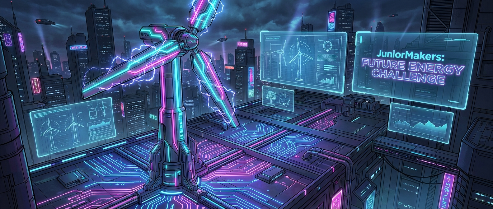

# 🌬️ Sturm-Kraftwerke: Energie aus dem Nichts

> **S T E A M - P R O F I L**
> [ ✅ ] 🧪 **S**cience (Wissenschaft)
> [ ✅ ] 💻 **T**echnology (Technologie)
> [ ✅ ] ⚙️ **E**ngineering (Ingenieurswesen)
> [ ❌ ] 🎨 **A**rts (Kunst)
> [ ✅ ] 📐 **M**ath (Mathematik)

**📋 Metadaten**
* **Autor:** ZWEIFEL Mike (mike.zweifel@zigerschlitzmakers.ch)
* **Version:** v1.0.0
* **Erstellt am:** 2026-03-13
* **Letzte Änderung:** 2026-03-13
* **Zielgruppe:** 9-12 Jahre
* **Format:** 🛠️ 100% Offline
* **Schwierigkeit:** Mittel
* **Sicherheitsstufe:** Gelb (Scheren, Heißkleber, Messen von geringer Spannung)

---

## 📖 Kurzbeschreibung
Wie wird aus Luft plötzlich Strom? In diesem Kurs dreht sich alles um erneuerbare Energien. Die Kinder entwerfen eigene Rotorblätter, bauen funktionierende Mini-Windkraftanlagen und messen mit einem Multimeter, welches Design die meiste Energie erzeugt, wenn der Sturm (ein Ventilator) aufzieht!

## ❓ Leitfragen (Essential Questions)
* Wie kann man die unsichtbare Kraft des Windes in sichtbare elektrische Energie umwandeln?
* Warum haben moderne Windräder meist genau drei schmale Rotorblätter und nicht zehn breite?

## 🎯 Lernziele (Was nehmen die Kids mit?)
* **Fachlich:** Prinzip eines Generators (Bewegung + Magnetismus = Strom). Aerodynamik von Rotorblättern.
* **Methodisch:** Systematisches Messen von elektrischer Spannung in Millivolt (mV) oder Volt (V).
* **Sozial/Persönlich:** Iterativer Entwicklungsprozess (Bauen, Testen, Verbessern).

## 🤝 Inklusion & Differenzierung
* **Für schwächere Kids / Motorische Einschränkungen:** Vorgefertigte Papp-Rotoren verwenden, die nur noch aufgesteckt werden müssen. Multimeter vom Mentor vorab auf den richtigen Messbereich einstellen.
* **Für Fortgeschrittene / Hochbegabte:** Anstellwinkel der Rotorblätter systematisch verändern (z.B. in 10-Grad-Schritten) und eine Messreihe in einer Tabelle notieren, um das absolute Optimum zu finden.

## 🏢 Anforderungen an Räumlichkeiten
- Ausreichend Platz für die Teststation (Ventilator).
- Tische zum Basteln der Rotoren.
- Steckdose für den Ventilator.

## 🛠️ Anforderungen ans Material vor Ort
**Pro Teilnehmer/Team (2er Teams):**
- 1 kleiner DC-Motor (fungiert hier rückwärts als Generator!)
- 1 Rotor-Nabe (z.B. Korken oder 3D-gedruckte Halterung für die Motorwelle)
- Pappkarton, dünnes Plastik (z.B. alte Schnellhefter) oder Holzspatel für die Blätter
- 1 Holzblock oder Stativ als Turm
- Krokodilklemmen

**Für den Mentor (Allgemein):**
- 1 starker Tischventilator (mit 3 Stufen)
- 2-3 Multimeter
- Heißklebepistolen
- Cutter (nur vom Mentor bedient!)

## ⏱️ Zeitaufwand
- **Vorbereitungszeit (Mentor):** 15 Minuten (Teststation / Ventilator aufbauen).
- **Nachbereitungszeit (Aufräumen):** 10 Minuten (Pappschnipsel entsorgen).
- **Kursdauer:** 100 Minuten

---

## 🚀 Detaillierter Ablauf (100 Minuten)

| Zeit | Phase | Beschreibung | Fokus / Mentor-Tipps |
|------|-------|--------------|----------------------|
| **16:40 - 16:50** | Einleitung | Kurze Erklärung, dass Motoren und Generatoren im Grunde dasselbe sind (nur umgekehrt). Zeigen eines echten kleinen Windrads. | Fragen stellen: "Warum drehen sich echte Windräder so langsam, produzieren aber viel Strom?" |
| **16:50 - 17:30** | Praxis Level 1 | Basis-Design bauen. Den Generator an den Turm kleben, eine Nabe aufstecken und die ersten (einfachen) Rotorblätter aus Pappe ausschneiden und befestigen. Erster Test am Ventilator. | Oft dreht sich nichts, weil die Rotorblätter keinen Anstellwinkel haben (sie schneiden nur durch die Luft). |
| **17:30 - 17:40** | Pause | Hände waschen | Teststation für das große Messen freiräumen. |
| **17:40 - 18:05** | Experten-Level | Design-Iterationen: Form, Größe, Anzahl und Anstellwinkel der Blätter verändern. Multimeter anklemmen und die höchste Spannung (mV) jagen! | Darauf hinweisen: Weniger Material bedeutet oft weniger Gewicht und Reibung, was den Rotor schneller drehen lässt. |
| **18:05 - 18:20** | Reflexion | Welches Team hat die meiste Energie erzeugt? Analyse der siegreichen Rotorblatt-Form. Gemeinsames Aufräumen. | "Warum können wir nicht das ganze Jahr unseren eigenen Strom damit erzeugen?" (Wind ist nicht konstant). |

---

## 💡 Weitere nützliche Informationen
* **Mögliche Fehlerquellen:** Rotorblätter kollidieren mit dem Turm. Nabe dreht durch (Motorwelle greift nicht). Multimeter falsch eingestellt.
* **Alltagsbezug:** Echte Windkraftanlagen, Dynamos am Fahrrad, Lichtmaschinen in Autos.
* **Links & Quellen:** Keine.