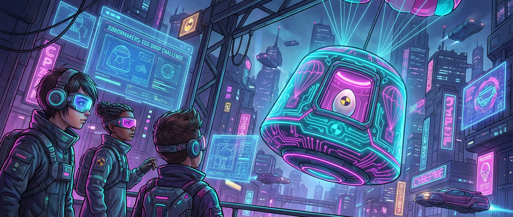

# Der Eier-Crashtest: Fallschirm & Knautschzone

> **S T E A M - P R O F I L**
> [ ✅ ] 🧪 **S**cience (Wissenschaft)
> [ ❌ ] 💻 **T**echnology (Technologie)
> [ ✅ ] ⚙️ **E**ngineering (Ingenieurswesen)
> [ ❌ ] 🎨 **A**rts (Kunst)
> [ ❌ ] 📐 **M**ath (Mathematik)

**📋 Metadaten**
* **Autor:** ZWEIFEL Mike (mike.zweifel@zigerschlitzmakers.ch)
* **Version:** v1.0.0
* **Erstellt am:** 2026-03-13
* **Letzte Änderung:** 2026-03-13
* **Zielgruppe:** 9-12 Jahre
* **Format:** 🛠️ 100% Offline
* **Schwierigkeit:** Mittel
* **Sicherheitsstufe:** Gelb (Rohe Eier, mögliche Salmonellengefahr bei Bruch, Wisch-Bedarf)

---

## 📖 Kurzbeschreibung
Wie bringt man einen Astronauten sicher auf die Erde zurück? Wir simulieren die Landung einer Weltraumkapsel. Die Kids bauen aus Recyclingmaterialien ein Landemodul mit Fallschirm und Knautschzone. Der Passagier: Ein rohes Ei! Überlebt das Ei den Sturz aus 2 Metern Höhe?

## ❓ Leitfragen (Essential Questions)
* Wie bremst Luftwiderstand einen fallenden Körper?
* Was ist eine Knautschzone und wie schützt sie den Inhalt?

## 🎯 Lernziele (Was nehmen die Kids mit?)
* **Fachlich:** Verständnis von Luftwiderstand (Fallschirm) und Impulserhaltung/Energieumwandlung (Knautschzone).
* **Methodisch:** Prototyping mit limitiertem Materialangebot.
* **Sozial/Persönlich:** Vorsichtiger Umgang mit zerbrechlichen Dingen, Mut zum Experimentieren.

## 🤝 Inklusion & Differenzierung
* **Für schwächere Kids / Motorische Einschränkungen:** Größere Kartons als Kapsel anbieten, viel Luftpolsterfolie bereitstellen.
* **Für Fortgeschrittene / Hochbegabte:** Material einschränken (z.B. nur 3 Blatt Papier, 5 Strohhalme und 1m Klebeband).

## 🏢 Anforderungen an Räumlichkeiten
- Hoher Abwurfpunkt (z.B. eine Treppe, ein sicherer Stuhl oder Balkon).
- Boden, der sehr leicht zu reinigen ist (Glatte Böden, KEIN Teppich!).

## 🛠️ Anforderungen ans Material vor Ort
**Pro Teilnehmer/Team (2er Teams):**
- 1 Rohes Ei (plus 1-2 als Reserve)
- 1 Plastiksack (für den Fallschirm)
- Bindfaden
- Diverse Recyclingmaterialien (Pappbecher, Strohhalme, Zeitungspapier, Watte, Luftpolsterfolie, Gummibänder)
- Klebeband

**Für den Mentor (Allgemein):**
- Putzeimer, Lappen, Reinigungsmittel
- Müllsäcke (auch als Unterlage für den Drop-Zone)

## ⏱️ Zeitaufwand
- **Vorbereitungszeit (Mentor):** 10 Minuten (Drop-Zone abkleben).
- **Nachbereitungszeit (Aufräumen):** 20 Minuten (Eier-Schweinerei aufwischen).
- **Kursdauer:** 100 Minuten

---

## 🚀 Detaillierter Ablauf (100 Minuten)

| Zeit | Phase | Beschreibung | Fokus / Mentor-Tipps |
|------|-------|--------------|----------------------|
| **16:40 - 16:50** | Einleitung | Video der Mars-Rover-Landung oder Apollo-Kapseln. Prinzip von Fallschirm und Dämpfung erklären. | Ei als "Zerbrechlichen Astronaut" einführen. |
| **16:50 - 17:30** | Praxis Level 1 | Konstruktion der Kapsel und des Fallschirms. Das Ei muss am Ende sicher verpackt werden. | Ei erst ganz am Schluss austeilen, damit es beim Bauen nicht kaputt geht! |
| **17:30 - 17:40** | Pause | Hände waschen. Drop-Zone präparieren (Müllsack auf den Boden legen). | Leitern/Stühle für den Abwurf sichern. |
| **17:40 - 18:05** | Experten-Level | Der Drop-Test! Jedes Team wirft seine Kapsel aus ca. 2-3 Metern Höhe. Danach: Auspacken! Wer hat überlebt? | Viel Spannung beim Auspacken erzeugen. Trommelwirbel! |
| **18:05 - 18:20** | Reflexion | Wieso hat Ei X überlebt und Ei Y nicht? Lag es am Fallschirm oder an der Knautschzone? Gründliches Händewaschen! | Auf Salmonellen-Hygiene hinweisen, gründlich putzen lassen. |

---

## 💡 Weitere nützliche Informationen
* **Mögliche Fehlerquellen:** Eier brechen schon beim Einpacken. Fallschirme verheddern sich.
* **Alltagsbezug:** Airbags im Auto, Helm beim Fahrradfahren, Fallschirmspringer.
* **Links & Quellen:** NASA Videos zur Mars-Landung (Curiosity "7 Minutes of Terror").
