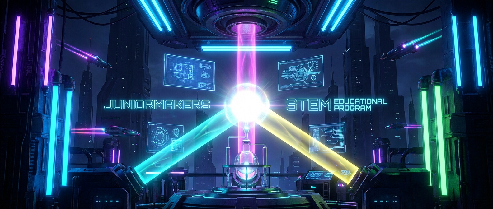

# 🌈 Licht & Magie: Farbcode-Labor

> **S T E A M - P R O F I L**
> [ ✅ ] 🧪 **S**cience (Wissenschaft)
> [ ❌ ] 💻 **T**echnology (Technologie)
> [ ❌ ] ⚙️ **E**ngineering (Ingenieurswesen)
> [ ✅ ] 🎨 **A**rts (Kunst)
> [ ❌ ] 📐 **M**ath (Mathematik)

**📋 Metadaten**
* **Autor:** ZWEIFEL Mike (mike.zweifel@zigerschlitzmakers.ch)
* **Version:** v1.0.0
* **Erstellt am:** 2026-03-13
* **Letzte Änderung:** 2026-03-13
* **Zielgruppe:** 8-12 Jahre
* **Format:** 🖥️ 100% PC
* **Schwierigkeit:** Leicht
* **Sicherheitsstufe:** 🟢 Grün (Vollständig digital)

---

## 📖 Kurzbeschreibung
Wie entsteht eigentlich "Weiß", wenn man alle Farben mischt... oder wird es doch Schwarz? Wir entdecken das Geheimnis hinter RGB-Monitoren und CMYK-Druckern! Mit interaktiven Farb-Simulatoren mischen die Kids digitales Licht und digitale Farbe und lernen den Unterschied zwischen additiver und subtraktiver Farbmischung.

## ❓ Leitfragen (Essential Questions)
* Warum wird unser Bildschirm weiß, wenn alle Pixel leuchten, aber der Tuschkasten schwarz, wenn wir alle Farben mischen?
* Aus welchen Farben bestehen die Bilder auf unserem Smartphone?

## 🎯 Lernziele (Was nehmen die Kids mit?)
* **Fachlich:** Unterscheidung von additiver (Licht, RGB) und subtraktiver (Körperfarbe, CMY) Farbmischung.
* **Methodisch:** Selbstständiges Einstellen von RGB-Werten und Farbfiltern in der Simulation (PhET Color Vision).
* **Sozial/Persönlich:** Kombination von künstlerischem Empfinden mit physikalischem Verständnis.

## 🤝 Inklusion & Differenzierung
* **Für schwächere Kids / Motorische Einschränkungen:** Die Simulatoren sind sehr intuitiv mit großen Schiebereglern bedienbar. Mentor hilft beim Verständnis "Licht vs. Farbe".
* **Für Fortgeschrittene / Hochbegabte:** Challenge: Finde den exakten RGB-Code für "Neonpink" oder "Mintgrün" durch Ausprobieren der prozentualen Mischverhältnisse.

## 🏢 Anforderungen an Räumlichkeiten
- PC-Raum oder Laptops für alle Teilnehmer.
- Großer Monitor/Beamer.
- Räumlichkeit etwas abdunkelbar (für den Effekt des Monitorlichts).

## 🛠️ Anforderungen ans Material vor Ort
**Pro Teilnehmer/Team (1-2er Teams):**
- 1 PC / Laptop mit Maus.
- Webbrowser mit Zugang zu PhET Interactive Simulations (Color Vision).

**Für den Mentor (Allgemein):**
- Laptop, Beamer, eventuell eine echte Lupe, um die RGB-Pixel auf dem Monitor zu betrachten.

## ⏱️ Zeitaufwand
- **Vorbereitungszeit (Mentor):** 10 Minuten.
- **Nachbereitungszeit (Aufräumen):** 5 Minuten.
- **Kursdauer:** 100 Minuten

---

## 🚀 Detaillierter Ablauf (100 Minuten)

| Zeit | Phase | Beschreibung | Fokus / Mentor-Tipps |
|------|-------|--------------|----------------------|
| **16:40 - 16:50** | Einleitung | Hook: Eine starke weiße Taschenlampe, deren Licht durch ein Prisma oder eine CD gebrochen wird. "Woher kommen die Farben?" Erklärung: Monitor vs. Papier. | Analogie nutzen: Taschenlampe baut Licht auf (additiv), Farbe auf Papier frisst Licht (subtraktiv). |
| **16:50 - 17:30** | Praxis Level 1 | Additive Farbmischung! PhET-Simulator öffnen. Die Kids mischen Rot, Grün und Blau, um Gelb, Cyan und Magenta zu erzeugen. | Erstaunen zulassen: "Rot und Grün gibt Gelb!?" Das ist oft kontraintuitiv für Kids, die nur den Tuschkasten kennen. |
| **17:30 - 17:40** | Pause | Bildschirmpause. Strecken, aus dem Fenster schauen (Weitsicht!). | Simulation für Level 2 auf "Filter" oder subtraktive Mischung umschalten. |
| **17:40 - 18:05** | Experten-Level | Subtraktive Farbmischung! Wir drehen den Spieß um. Die Kids arbeiten mit Farbfiltern in der Simulation und sehen, welche Farben absorbiert werden. | Fortgeschrittene können versuchen, aus CMY (Cyan, Magenta, Yellow) in der Simulation ein tiefes Schwarz zu mischen. |
| **18:05 - 18:20** | Reflexion | Kurzes Quiz: Ist ein Monitor RGB oder CMYK? Ist ein Buch RGB oder CMYK? | Betonen: Drucker brauchen Schwarz (K) extra, weil gemischtes CMY meist nur dreckig-braun wird. |

---

## 💡 Weitere nützliche Informationen
* **Mögliche Fehlerquellen:** Kids verwechseln Rot-Blau-Gelb (Schule/Kunst) mit RGB (Monitor) oder CMYK (Drucker). Kläre diesen Unterschied deutlich!
* **Alltagsbezug:** Handydisplay, Fernseher, Tintenstrahldrucker, Theaterbeleuchtung.
* **Links & Quellen:** 
  - [PhET Color Vision (Deutsch)](https://phet.colorado.edu/de/simulations/color-vision)
