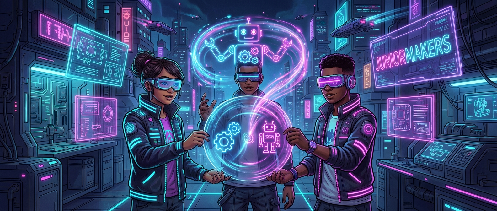

# 🌀 Optische Illusionen: Trägheit des Auges (Persistence of Vision)

> **S T E A M - P R O F I L**
> [ ✅ ] 🧪 **S**cience (Wissenschaft)
> [ ❌ ] 💻 **T**echnology (Technologie)
> [ ❌ ] ⚙️ **E**ngineering (Ingenieurswesen)
> [ ✅ ] 🎨 **A**rts (Kunst)
> [ ❌ ] 📐 **M**ath (Mathematik)

**📋 Metadaten**
* **Autor:** ZWEIFEL Mike (mike.zweifel@zigerschlitzmakers.ch)
* **Version:** v1.0.0
* **Erstellt am:** 2026-03-13
* **Letzte Änderung:** 2026-03-13
* **Zielgruppe:** 9-12 Jahre
* **Format:** 🛠️ 100% Offline
* **Schwierigkeit:** Leicht
* **Sicherheitsstufe:** Grün (Unbedenklich, Bastelmaterial)

---

## 📖 Kurzbeschreibung
100% Offline-Kurs! Die Kinder entdecken das Phänomen der "Trägheit des Auges" (Persistence of Vision), das die magische Grundlage jedes Films und Cartoons ist. Durch das Basteln von Thaumatropen (Wunderscheiben) und einfachen Daumenkinos kreieren sie ihre eigenen, analogen Animationen und überlisten ihr eigenes Gehirn.

## ❓ Leitfragen (Essential Questions)
* Warum sehen wir in einem Film fließende Bewegungen, obwohl es eigentlich nur tausende Einzelbilder sind?
* Wie können wir zwei verschiedene Bilder so schnell überlagern, dass sie für unser Gehirn zu einem einzigen Bild verschmelzen?

## 🎯 Lernziele (Was nehmen die Kids mit?)
* **Fachlich:** Verstehen des optischen Prinzips der Trägheit des Auges (Nachbildwirkung) und der Framerate.
* **Methodisch:** Exaktes Schneiden, Kleben und räumliches Denken beim Positionieren von zweiseitigen Motiven.
* **Sozial/Persönlich:** Geduld beim iterativen Zeichnen der Einzelbilder für das Daumenkino und Freude am Teilen eigener kleiner Kunstwerke.

## 🤝 Inklusion & Differenzierung
* **Für schwächere Kids / Motorische Einschränkungen:** Vorgedruckte Thaumatrop-Vorlagen (z.B. Vogel und Käfig, Fisch und Goldfischglas) nutzen, statt selbst zu zeichnen. Vorgefertigte, bereits gelochte Kartonscheiben ausgeben.
* **Für Fortgeschrittene / Hochbegabte:** Komplexe Daumenkinos (Flipbooks) mit durchgängiger kleiner Story (z.B. wachsender Baum, der Äpfel verliert) zeichnen oder ein Thaumatrop mit asymmetrischen Motiven designen, das erst bei schneller Drehung Sinn ergibt.

## 🏢 Anforderungen an Räumlichkeiten
- Großzügige Tischflächen zum Zeichnen und Basteln.
- Gutes, helles Licht zum Ausmalen und für das perfekte Betrachten der optischen Illusionen.

## 🛠️ Anforderungen ans Material vor Ort
**Pro Teilnehmer/Team (Einzelarbeit, aber am Gruppentisch):**
- 4-5 runde Kartonscheiben (ca. 8 cm Durchmesser, an gegenüberliegenden Seiten gelocht)
- Ein Bündel Gummibänder (ca. 4 pro Kind) oder stabile Schnur (z.B. Paketschnur/Zwirn)
- 1 Daumenkino-Rohling (kleiner Block aus weißem Papier oder starker Post-it-Block)
- Filzstifte, Buntstifte, weiche Bleistifte (HB/B)
- Schere, Klebestift (Leim)

**Für den Mentor (Allgemein):**
- Genügend vorgedruckte Vorlagen-Sets für Thaumatrope als Backup.
- Lochzange (falls Rohlinge während des Kurses nachgestanzt werden müssen).
- Ein großes "Profi"-Thaumatrop zur initialen Demonstration (oder ein fertiges, eindrucksvolles Daumenkino).

## ⏱️ Zeitaufwand
- **Vorbereitungszeit (Mentor):** 15 Minuten (Schablonen drucken, Schnüre vorschneiden).
- **Nachbereitungszeit (Aufräumen):** 10 Minuten (Papierschnipsel zusammenkehren).
- **Kursdauer:** 100 Minuten

---

## 🚀 Detaillierter Ablauf (100 Minuten)

| Zeit | Phase | Beschreibung | Fokus / Mentor-Tipps |
|------|-------|--------------|----------------------|
| **16:40 - 16:50** | Einleitung | Spannender Hook: "Habt ihr euch schon mal gefragt, warum ein Film im Kino nicht wie eine ruckelnde Diashow aussieht? Euer Auge ist schuld!" Mentor dreht ein Thaumatrop als Demo vor. Begriff "Persistence of Vision" kindgerecht klären. | Thaumatrop-Trick erst in Zeitlupe zeigen, dann schnell drehen, bis der "Wow"-Effekt einsetzt. |
| **16:50 - 17:30** | Praxis Level 1 | Basteln der Wunderscheiben (Thaumatrope). Erst eine Vorlage (z.B. Vogel in den Käfig) ausprobieren. Scheiben aufeinanderkleben, lochen und Gummibänder anbringen. Danach eigenes Motiv kreieren (z.B. leeres Gesicht + lustiger Schnurrbart). | WICHTIG: Erklären, dass bei Gummibändern links und rechts ein Bild auf dem Kopf stehen muss, damit es bei der Drehung richtig herum erscheint. |
| **17:30 - 17:40** | Pause | Kurze Verschnaufpause, Hände waschen, Lüften. | Material für Daumenkinos (Blöcke, Stifte) in der Zeit auf den Tischen verteilen. |
| **17:40 - 18:05** | Experten-Level | Das Daumenkino (Flipbook). Auf einen kleinen Block wird eine einfache Animation gezeichnet (z.B. hüpfender Ball). Kinder blättern es durch, um die Bewegung zu sehen. | Tipp fürs Zeichnen: Immer von hinten nach vorne arbeiten (letztes Bild zuerst) oder gegen das Licht das vorherige Bild durchpausen lassen. Eher am rechten Rand zeichnen! |
| **18:05 - 18:20** | Reflexion | Die Kids präsentieren ihre Thaumatrop-Motive und Daumenkinos. Abschlussrunde: "Was passiert in unserem Gehirn, wenn wir die Bilder schnell abspielen?" Danach gemeinsames Aufräumen. | Betonen, dass dies exakt die Technik ist, mit der auch große Hollywood-Animationsfilme begonnen haben. |

---

## 💡 Weitere nützliche Informationen
* **Mögliche Fehlerquellen:** Bei Thaumatropen wird oft vergessen, das Rückseiten-Bild um 180 Grad gedreht aufzukleben. Die Schnüre sind zu lang oder zu locker. Beim Daumenkino wird oft zu nah an die Bindung gezeichnet, sodass man die Bilder beim Abrollen mit dem Daumen nicht sieht.
* **Alltagsbezug:** Jeder Cartoon auf Netflix oder YouTube, jedes Videospiel und jeder Kinofilm basiert auf dieser Framerate-Technik (Einzelbilder pro Sekunde/FPS).
* **Links & Quellen:** 
  - (Hier können später Vorlagen-PDFs verlinkt werden, z.B. `[Thaumatrop-Vorlagen](media/docs/vorlagen_thaumatrop.pdf)`)
