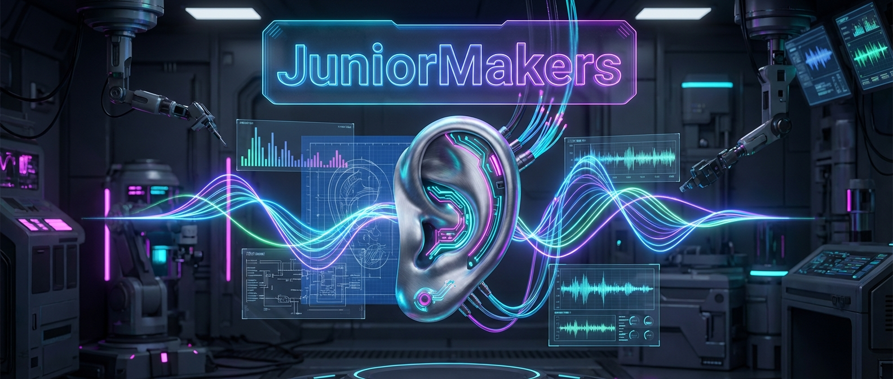

# 🎧 Sound-Ingenieure: Die Wellen im Kopf

> **S T E A M - P R O F I L**
> [ ✅ ] 🧪 **S**cience (Wissenschaft)
> [ ❌ ] 💻 **T**echnology (Technologie)
> [ ❌ ] ⚙️ **E**ngineering (Ingenieurswesen)
> [ ❌ ] 🎨 **A**rts (Kunst)
> [ ❌ ] 📐 **M**ath (Mathematik)

**📋 Metadaten**
* **Autor:** ZWEIFEL Mike (mike.zweifel@zigerschlitzmakers.ch)
* **Version:** v1.0.0
* **Erstellt am:** 2026-03-13
* **Letzte Änderung:** 2026-03-13
* **Zielgruppe:** 10-14 Jahre
* **Format:** 🖥️ 100% PC
* **Schwierigkeit:** Mittel
* **Sicherheitsstufe:** 🟢 Grün (Vollständig digital)

---

## 📖 Kurzbeschreibung
Wie wird aus wackelnder Luft eigentlich Musik? In diesem Kurs hacken wir das menschliche Gehör! Mit interaktiven Schallwellen-Simulatoren erforschen wir am PC Frequenzen, Amplituden und das Trommelfell. Wir machen unsichtbare Töne sichtbar und lernen, wie winzige Knöchelchen im Ohr einen Sturm entfachen.

## ❓ Leitfragen (Essential Questions)
* Was ist "Schall" eigentlich genau und warum braucht er Luft, um sich zu bewegen?
* Wie funktioniert unser Trommelfell wie eine Trommel, die umgekehrt gespielt wird?

## 🎯 Lernziele (Was nehmen die Kids mit?)
* **Fachlich:** Unterscheidung von Lautstärke (Amplitude) und Tonhöhe (Frequenz). Funktion des Trommelfells, der Gehörknöchelchen und der Schnecke (Cochlea).
* **Methodisch:** Selbstständiges Erzeugen und Messen von Schallwellen am PC (PhET Sound Simulator oder Falstad).
* **Sozial/Persönlich:** Bewusstsein für Lärmschutz und die Empfindlichkeit des Gehörs (Warum laute Musik über Kopfhörer gefährlich sein kann).

## 🤝 Inklusion & Differenzierung
* **Für schwächere Kids / Motorische Einschränkungen:** Die Simulatoren machen das Abstrakte ("Wellen") sehr visuell greifbar. Mentor vergleicht Wellen mit Wellen im Schwimmbad.
* **Für Fortgeschrittene / Hochbegabte:** Challenge: Nutze den Simulator, um das Phänomen von Schall in verschiedenen Medien (Luft vs. Wasser) nachzuvollziehen.

## 🏢 Anforderungen an Räumlichkeiten
- PC-Raum oder Laptops für alle Teilnehmer.
- Gute Internetverbindung.
- Lautsprecher an jedem PC oder Kopfhörer für jeden Teilnehmer (ideal für Sound-Experimente).
- Großer Monitor/Beamer.

## 🛠️ Anforderungen ans Material vor Ort
**Pro Teilnehmer/Team (1-2er Teams):**
- 1 PC / Laptop mit Maus.
- Webbrowser mit Zugang zu PhET Interactive Simulations (Waves Intro/Sound).
- Kopfhörer (zwingend, damit es im Raum nicht zu laut wird!).

**Für den Mentor (Allgemein):**
- Laptop, Beamer, gute Boxen für den initialen Sound-Test.

## ⏱️ Zeitaufwand
- **Vorbereitungszeit (Mentor):** 10 Minuten (Audio checken!).
- **Nachbereitungszeit (Aufräumen):** 5 Minuten.
- **Kursdauer:** 100 Minuten

---

## 🚀 Detaillierter Ablauf (100 Minuten)

| Zeit | Phase | Beschreibung | Fokus / Mentor-Tipps |
|------|-------|--------------|----------------------|
| **16:40 - 16:50** | Einleitung | Hook: Hörtest-Video auf YouTube (Frequenzen von 20Hz bis 20.000Hz). Wer kann den höchsten Ton noch hören? Warum hören jüngere Kids höhere Töne? | Achte auf die Lautstärke, damit es nicht in den Ohren wehtut! |
| **16:50 - 17:30** | Praxis Level 1 | PhET Wellen-Simulator (Sound). Kids verändern Frequenz und Amplitude und beobachten das Wellenmuster am PC. Kopfhörer aufziehen! | Kläre die Begriffe "hoch/tief" (Frequenz) vs "laut/leise" (Amplitude) deutlich. |
| **17:30 - 17:40** | Pause | Bildschirmpause. Kopfhörer ab, absolute Stille genießen. | Vorbereitung von Frequenz-Generatoren (z.B. Online Tone Generator). |
| **17:40 - 18:05** | Experten-Level | Die Mechanik im Kopf! Simulation der Schallmauer (Trommelfell). Die Kids bauen ein Wellen-Interferenz-Szenario: Zwei Lautsprecher senden die gleiche Frequenz. Wo löschen sie sich gegenseitig aus? (Noise Cancelling Prinzip!) | Fortgeschrittene können überlegen, warum man im Vakuum des Weltalls (z.B. Star Wars) eigentlich keine Explosionen hören dürfte. |
| **18:05 - 18:20** | Reflexion | Wie schützen wir unsere Haarzellen in der Schnecke? Was bedeutet Tinnitus? | Fazit: Das Gehör ist ein hochsensibles Instrument. Es wandelt mechanische Schwingung in Strom fürs Gehirn um. |

---

## 💡 Weitere nützliche Informationen
* **Mögliche Fehlerquellen:** Zu lautes Testen der Frequenzen am PC kann schmerzhaft sein. Alle Kids instruieren, die Lautstärke auf 30% zu stellen, bevor sie Töne abspielen.
* **Alltagsbezug:** Kopfhörer, Noise-Cancelling, Konzerte, Gehörschutz auf der Baustelle.
* **Links & Quellen:** 
  - [PhET Waves Intro (Deutsch)](https://phet.colorado.edu/de/simulations/waves-intro)
  - [Online Tone Generator](https://www.szynalski.com/tone-generator/)
