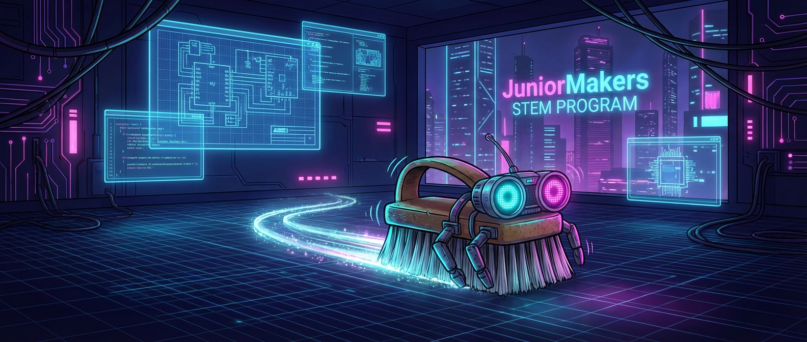

# 🤖 Zappel-Roboter: Wir bauen Bürsten-Bots

> **S T E A M - P R O F I L**
> [ ✅ ] 🧪 **S**cience (Wissenschaft)
> [ ✅ ] 💻 **T**echnology (Technologie)
> [ ✅ ] ⚙️ **E**ngineering (Ingenieurswesen)
> [ ❌ ] 🎨 **A**rts (Kunst)
> [ ❌ ] 📐 **M**ath (Mathematik)

**📋 Metadaten**
* **Autor:** ZWEIFEL Mike (mike.zweifel@zigerschlitzmakers.ch)
* **Version:** v1.0.0
* **Erstellt am:** 2026-03-13
* **Letzte Änderung:** 2026-03-13
* **Zielgruppe:** 9-12 Jahre
* **Format:** 🛠️ 100% Offline
* **Schwierigkeit:** Leicht
* **Sicherheitsstufe:** Gelb (Abisolieren, Kleinteile, schwacher Strom, Heißkleber)

---

## 📖 Kurzbeschreibung
Ein kleiner Roboter aus einer Spülbürste? Aber sicher! Durch die Kombination eines simplen Vibrationsmotors mit einer Handbürste bauen die Kids niedliche Wigglebots (Zappelroboter), die wild über den Tisch flitzen und sogar Kunstwerke malen können.

## ❓ Leitfragen (Essential Questions)
* Wie kann eine ungewollte Bewegung (Vibration) in eine Vorwärtsbewegung umgewandelt werden?
* Was ist eine Unwucht?

## 🎯 Lernziele (Was nehmen die Kids mit?)
* **Fachlich:** Aufbau eines einfachen elektrischen Stromkreises (Batterie, Motor, Kabel). Prinzip der Unwucht verstehen.
* **Methodisch:** Abisolieren von dünnen Kabeln und Verzwirbeln von Kontakten.
* **Sozial/Persönlich:** Eigene kreative Ideen beim Roboter-Design umsetzen (z.B. Wackelaugen, Farben).

## 🤝 Inklusion & Differenzierung
* **Für schwächere Kids / Motorische Einschränkungen:** Kabelenden vorher schon vom Mentor abisolieren lassen. Krokodilklemmen statt Verzwirbeln nutzen.
* **Für Fortgeschrittene / Hochbegabte:** Die Position der Batterie (Schwerpunkt) ändern und beobachten, wie sich die Laufrichtung des Bots dadurch ändert. Filzstifte anbauen für "Robot-Art".

## 🏢 Anforderungen an Räumlichkeiten
- Tische mit Begrenzungen (damit die Bots nicht herunterfallen) oder großer Boden.
- Unterlagen für die Mal-Option.

## 🛠️ Anforderungen ans Material vor Ort
**Pro Teilnehmer/Team (Einzelarbeit):**
- 1 Handwaschbürste / Nagelbürste
- 1 kleiner 3V DC-Motor
- 1 Unwucht (z.B. eine Lüsterklemme oder ein Heißkleber-Tropfen auf der Motorwelle)
- 1 Batteriehalter für 2x AA
- 2 AA Batterien
- Wackelaugen, Pfeifenputzer zur Dekoration
- (Optional: 3 Filzstifte und Klebeband)

**Für den Mentor (Allgemein):**
- Heißklebepistolen
- Abisolierzange

## ⏱️ Zeitaufwand
- **Vorbereitungszeit (Mentor):** 10 Minuten.
- **Nachbereitungszeit (Aufräumen):** 15 Minuten.
- **Kursdauer:** 100 Minuten

---

## 🚀 Detaillierter Ablauf (100 Minuten)

| Zeit | Phase | Beschreibung | Fokus / Mentor-Tipps |
|------|-------|--------------|----------------------|
| **16:40 - 16:50** | Einleitung | Vibrationsalarm eines Handys erwähnen. "Wie funktioniert der?" Einen offenen Vibrationsmotor zeigen. | Erklären der Unwucht am Motor (Gewicht ist nur auf einer Seite). |
| **16:50 - 17:30** | Praxis Level 1 | Stromkreis aufbauen (Batterie an Motor). Dann Motor und Batterie mit Heißkleber oder starkem Klebeband auf den Rücken der Bürste kleben. Erste Tests. | Darauf achten, dass die Motorwelle sich frei drehen kann und nicht gegen die Bürste stößt. |
| **17:30 - 17:40** | Pause | Hände waschen | Malunterlagen / Papierbögen auslegen. |
| **17:40 - 18:05** | Experten-Level | Design-Phase und Robot-Art! Pfeifenputzer und Wackelaugen anbringen. Filzstifte als "Beine" an die Bürste kleben und den Bot über das Papier tanzen lassen. | Durch Gewichtsverlagerung der Batterie kann der Bot gesteuert werden (dreht er sich nur im Kreis oder fährt er geradeaus?). |
| **18:05 - 18:20** | Reflexion | "Bot-Kämpfe" oder Kunstgalerie-Besichtigung. Wer hat das coolste Bild gemalt? Aufräumen. | Kabel bei Nichtnutzung trennen, sonst sind die Batterien schnell leer. |

---

## 💡 Weitere nützliche Informationen
* **Mögliche Fehlerquellen:** Kabel nicht richtig verbunden. Unwucht ist zu schwer (Motor dreht sich nicht) oder zu leicht (Bürste zappelt nicht).
* **Alltagsbezug:** Handys (Vibrationsalarm), Controller von Spielkonsolen, Rüttelplatten auf Baustellen.
* **Links & Quellen:** Keine.
