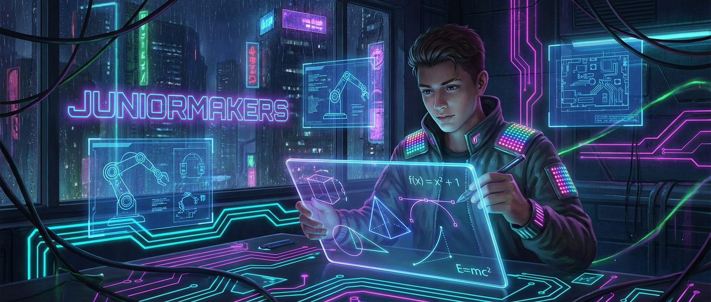

# Magie der Vektorgrafiken: Malen mit Mathematik

> **S T E A M - P R O F I L**
> [ ❌ ] 🧪 **S**cience (Wissenschaft)
> [ ✅ ] 💻 **T**echnology (Technologie)
> [ ❌ ] ⚙️ **E**ngineering (Ingenieurswesen)
> [ ✅ ] 🎨 **A**rts (Kunst)
> [ ✅ ] 📐 **M**ath (Mathematik)

**📋 Metadaten**
* **Autor:** ZWEIFEL Mike (mike.zweifel@zigerschlitzmakers.ch)
* **Version:** v1.0.0
* **Erstellt am:** 2023-09-14
* **Letzte Änderung:** 2026-03-12
* **Zielgruppe:** 9-12 Jahre
* **Format:** 🖥️ 100% PC
* **Schwierigkeit:** Mittel (Erfordert Maus-Geschicklichkeit am PC)
* **Sicherheitsstufe:** Grün (Unbedenklich - PC-Arbeit)

---

## 📖 Kurzbeschreibung
Ein Bild auf dem PC ist nicht immer gleich aufgebaut! Die Kids lernen den magischen Unterschied zwischen verpixelten Fotos (Raster) und unendlich skalierbaren Zeichnungen (Vektoren). Mit dem kostenlosen Programm Inkscape werden sie selbst zu digitalen Künstlern und zeichnen Formen, die aus reiner Mathematik bestehen.

## ❓ Leitfragen (Essential Questions)
* Warum wird ein normales Foto unscharf, wenn ich es stark vergrößere, aber ein Logo nicht?
* Wie kann ein Computer aus Zahlen ein Bild zeichnen?

## 🎯 Lernziele (Was nehmen die Kids mit?)
* **Fachlich:** Den fundamentalen Unterschied zwischen Rastergrafiken (Pixel) und Vektorgrafiken (Pfade/Koordinaten) verstehen.
* **Methodisch:** Umgang mit der Software Inkscape (Formenwerkzeuge, Knotenpunkte bearbeiten, Farben anpassen).
* **Sozial/Persönlich:** Kreativer Ausdruck am Computer jenseits von Spielen; Frustrationstoleranz beim Erlernen einer neuen Software-Oberfläche.

## 🤝 Inklusion & Differenzierung
* **Für schwächere Kids / Motorische Einschränkungen:** Die Maussteuerung kann anfangs schwer sein. Hier helfen fertige Grundformen (Kreise, Rechtecke), die nur noch verschoben und eingefärbt werden, statt komplexe Pfade selbst zu zeichnen.
* **Für Fortgeschrittene / Hochbegabte:** Boolean-Operationen in Inkscape nutzen (Formen voneinander abziehen, verschmelzen) um komplexe Logos (z.B. das Batman-Symbol) nachzubauen.

## 🏢 Anforderungen an Räumlichkeiten
- PC-Raum oder Laptops für alle Teilnehmer (MakerStation).
- Stromanschlüsse für alle Geräte.
- Beamer/Bildschirm für den Mentor.

## 🛠️ Anforderungen ans Material vor Ort
**Pro Teilnehmer/Team:**
- 1 PC/Laptop mit vorinstalliertem [Inkscape](https://inkscape.org/de/).
- Eine Computermaus (Zeichnen mit Touchpad ist extrem frustrierend!).

**Für den Mentor (Allgemein):**
- Präsentations-PC mit Inkscape.
- Internetverbindung für Youtube-Videos.

## ⏱️ Zeitaufwand
- **Vorbereitungszeit (Mentor):** 15 Minuten (PCs starten, Inkscape öffnen, testen ob Mäuse funktionieren).
- **Nachbereitungszeit (Aufräumen):** 5 Minuten (PCs herunterfahren).
- **Kursdauer:** 100 Minuten

---

## 🚀 Detaillierter Ablauf (100 Minuten)

| Zeit | Phase | Beschreibung | Fokus / Mentor-Tipps |
|------|-------|--------------|----------------------|
| **16:40 - 16:50** | Einleitung | **Pixel vs. Vektor:** Zeige auf dem Beamer ein Foto, das extrem herangezoomt wird (Pixel-Treppen sichtbar). Danach ein Vektor-Logo extrem zoomen (bleibt scharf!). | Anschauen: Youtube-Video "Raster und Vektorgrafiken" von Michael Seeholzer. |
| **16:50 - 17:30** | Praxis Level 1 | **Erste Schritte in Inkscape:** Programm öffnen. Werkzeuge erkunden: Rechteck, Kreis, Stern. Farbe ändern. Das Ziel: Einen einfachen Roboter oder ein Haus aus Grundformen bauen. | Hilfe bei der Navigation: Viele Kids verlieren ihr Bild auf der Arbeitsfläche. Zeige den Shortcut für "Alles einpassen". |
| **17:30 - 17:40** | Pause | Bildschirme aus, Augen schonen! | Lüften und Strecken. |
| **17:40 - 18:05** | Experten-Level | **Pfad-Magie:** Formen in Pfade umwandeln. Mit dem Knoten-Werkzeug an den "Anfassern" ziehen, um aus einem Kreis ein Ei oder ein Alien-Gesicht zu verformen. | Fortgeschrittene können versuchen, ihr Lieblingstier nur mit dem Kurven-Werkzeug (Bézier-Pfade) zu zeichnen. |
| **18:05 - 18:20** | Reflexion | **Digitale Kunstgalerie:** Die Kids gehen im Raum herum und schauen sich die Werke der anderen auf den Monitoren an. | Speichern nicht vergessen! (Als .SVG und als .PNG exportieren lassen, damit sie den Unterschied am echten File sehen). |

---

## 💡 Weitere nützliche Informationen
* **Mögliche Fehlerquellen:** Kinder zeichnen mit dem Touchpad statt der Maus (endet im Chaos). Sie klicken aus Versehen Optionen in Inkscape an, die Menüs ausblenden.
* **Alltagsbezug:** Jedes Logo auf T-Shirts, Autos oder Webseiten, sowie alle Schriften (Fonts) in Büchern sind Vektorgrafiken! Wer einen Laser-Cutter oder Vinyl-Cutter nutzen will (z.B. für Aufkleber), *muss* Vektorgrafiken verwenden, da die Maschine sonst nicht weiß, wo sie schneiden soll.
* **Links & Quellen:** 
  - [Inkscape Download](https://inkscape.org/de/)
  - Youtube: Raster und Vektorgrafiken (Michael Seeholzer)
  - [Inkscape Anfänger Tutorial Serie]
