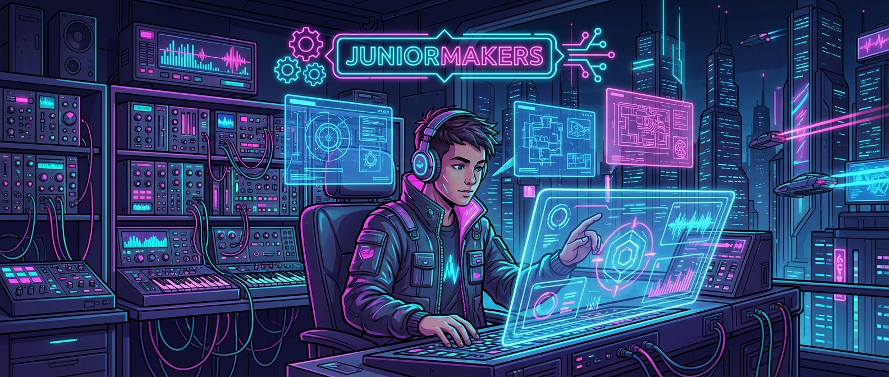

# 🎧 Neon-Sounds: Eigene Beats programmieren wie ein DJ

> **S T E A M - P R O F I L**
> [ ❌ ] 🧪 **S**cience (Wissenschaft)
> [ ✅ ] 💻 **T**echnology (Technologie)
> [ ❌ ] ⚙️ **E**ngineering (Ingenieurswesen)
> [ ✅ ] 🎨 **A**rts (Kunst)
> [ ❌ ] 📐 **M**ath (Mathematik)

**📋 Metadaten**
* **Autor:** ZWEIFEL Mike (mike.zweifel@zigerschlitzmakers.ch)
* **Version:** v1.0.0
* **Erstellt am:** 2026-03-13
* **Letzte Änderung:** 2026-03-13
* **Zielgruppe:** 9-12 Jahre
* **Format:** 🖥️ 100% PC
* **Schwierigkeit:** Mittel
* **Sicherheitsstufe:** Grün (Keine Verletzungsgefahr am PC)

---

## 📖 Kurzbeschreibung
Aus Code wird Musik! Mit dem Chrome Music Lab (oder Sonic Pi) programmieren die Kinder eigene Beats und elektronische Melodien. Sie lernen, wie Rhythmus funktioniert und wie man mit dem Computer als Instrument Songs komponiert.

## ❓ Leitfragen (Essential Questions)
* Wie kann ein Computer aus Zahlen und Klicks Musik machen?
* Was ist das Geheimnis eines guten Beats?

## 🎯 Lernziele (Was nehmen die Kids mit?)
* **Fachlich:** Verständnis von Rhythmus, Tempo (BPM) und Loops in der digitalen Musikproduktion.
* **Methodisch:** Visuelles Programmieren von Tonabfolgen und Mustern.
* **Sozial/Persönlich:** Kreativer Ausdruck durch Musik und gegenseitiges Wertschätzen der unterschiedlichen Kompositionen.

## 🤝 Inklusion & Differenzierung
* **Für schwächere Kids / Motorische Einschränkungen:** Chrome Music Lab (Song Maker) nutzen, da es sehr intuitiv und visuell ist.
* **Für Fortgeschrittene / Hochbegabte:** Sonic Pi nutzen, um Melodien und Beats mit echtem Code (Ruby) zu schreiben.

## 🏢 Anforderungen an Räumlichkeiten
- PC-Raum oder Laptops.
- Kopfhörer für jedes Kind zwingend erforderlich (sonst gibt es ohrenbetäubendes Chaos!).

## 🛠️ Anforderungen ans Material vor Ort
**Pro Teilnehmer/Team:**
- 1 PC oder Laptop
- 1 Paar Kopfhörer (wichtig!)

**Für den Mentor (Allgemein):**
- Beamer und Lautsprecher für die Abschluss-Disco

## ⏱️ Zeitaufwand
- **Vorbereitungszeit (Mentor):** 10 Minuten (Kopfhörer checken).
- **Nachbereitungszeit (Aufräumen):** 5 Minuten.
- **Kursdauer:** 100 Minuten

---

## 🚀 Detaillierter Ablauf (100 Minuten)

| Zeit | Phase | Beschreibung | Fokus / Mentor-Tipps |
|------|-------|--------------|----------------------|
| **16:40 - 16:50** | Einleitung | Was ist ein Beat? Klatschen eines einfachen 4/4 Takts. | Zeige ein kurzes Beispiel, wie schnell man einen Beat am PC zusammenklickt. |
| **16:50 - 17:30** | Praxis Level 1 | Die Kids bauen ihren ersten Drum-Loop (Bass Drum und Snare) und ergänzen eine einfache Melodie. | Darauf achten, dass alle Kinder ihre Kopfhörer aufhaben. Rhythmusgefühl unterstützen. |
| **17:30 - 17:40** | Pause | Ohren erholen, Bildschirmpause. Kopfhörer abnehmen. | Mentoren können Lieder als MP3 exportieren oder speichern. |
| **17:40 - 18:05** | Experten-Level | Songs werden komplexer: Mehrere Instrumente mischen, Tempo anpassen, Akkorde hinzufügen. | Hochbegabte können versuchen, bekannte Songs (z.B. Super Mario Theme) nachzubauen. |
| **18:05 - 18:20** | Reflexion | Kopfhörer ab, Beamer und Boxen an! Jeder präsentiert seinen besten Beat in einer Mini-Disco. | Applaus für jeden! Musikgeschmack ist verschieden. |

---

## 💡 Weitere nützliche Informationen
* **Mögliche Fehlerquellen:** Kinder drehen die Lautstärke zu laut auf. Songs klingen schief (Dissonanzen), wenn zu viele Töne gleichzeitig gespielt werden.
* **Alltagsbezug:** Fast die gesamte Pop- und elektronische Musik im Radio wird heute am PC produziert (DAWs).
* **Links & Quellen:** 
  - [Chrome Music Lab - Song Maker](https://musiclab.chromeexperiments.com/Song-Maker/)
  - [Sonic Pi](https://sonic-pi.net/)