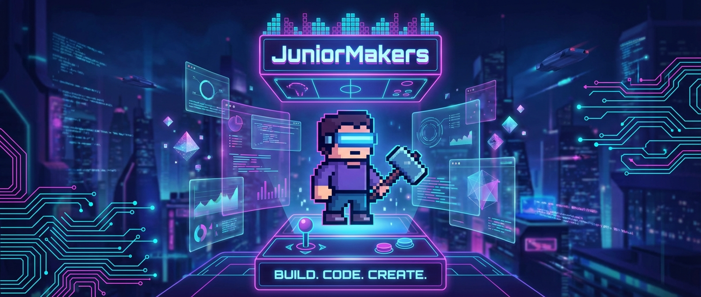

# 👾 Pixel-Helden: Dein erstes eigenes Game-Design

> **S T E A M - P R O F I L**
> [ ❌ ] 🧪 **S**cience (Wissenschaft)
> [ ✅ ] 💻 **T**echnology (Technologie)
> [ ❌ ] ⚙️ **E**ngineering (Ingenieurswesen)
> [ ✅ ] 🎨 **A**rts (Kunst)
> [ ❌ ] 📐 **M**ath (Mathematik)

**📋 Metadaten**
* **Autor:** ZWEIFEL Mike (mike.zweifel@zigerschlitzmakers.ch)
* **Version:** v1.0.0
* **Erstellt am:** 2026-03-13
* **Letzte Änderung:** 2026-03-13
* **Zielgruppe:** 9-12 Jahre
* **Format:** 🖥️ 100% PC
* **Schwierigkeit:** Leicht
* **Sicherheitsstufe:** Grün (Reine Bildschirmarbeit, keine Verletzungsgefahr)

---

## 📖 Kurzbeschreibung
Von der Idee zum spielbaren Charakter: In diesem Kurs erschaffen die Kids ihre eigenen 2D-Helden und Feinde im angesagten Retro-Look. Mit dem Tool "Piskel" lernen sie die Grundlagen von Pixel-Art, Animation und Charakterdesign kennen und erwecken ihre Figuren zum Leben.

## ❓ Leitfragen (Essential Questions)
* Wie entsteht aus einzelnen farbigen Quadraten eine flüssige Animation?
* Welche Merkmale machen einen Videospiel-Helden einzigartig und sofort erkennbar?

## 🎯 Lernziele (Was nehmen die Kids mit?)
* **Fachlich:** Verstehen von Pixel-Grids, Farbpaletten und Frame-by-Frame Animation (Spritesheets).
* **Methodisch:** Systematischer Aufbau eines digitalen Kunstwerks, Nutzung von Layers (Ebenen).
* **Sozial/Persönlich:** Kreativer Ausdruck, konstruktives Feedback zu Designs anderer geben.

## 🤝 Inklusion & Differenzierung
* **Für schwächere Kids / Motorische Einschränkungen:** Vorlagen und vorgegebene Farbpaletten nutzen. Einfachere Figuren (z.B. ein hüpfender Slime) statt komplexe humanoide Charaktere.
* **Für Fortgeschrittene / Hochbegabte:** Komplexe Walk-Cycles (Gehanimationen) oder Idle-Animationen mit mehreren Frames und Schattierungen erstellen.

## 🏢 Anforderungen an Räumlichkeiten
- PC-Raum oder Tische mit Laptops.
- Beamer/Bildschirm für die Einführung.

## 🛠️ Anforderungen ans Material vor Ort
**Pro Teilnehmer/Team:**
- 1 PC oder Laptop mit Internetzugang.
- Maus (Pflicht für Pixel-Art, Touchpad ist zu frustrierend).

**Für den Mentor (Allgemein):**
- Piskel-App (Web-Version) auf dem Mentor-PC geöffnet.
- Einige ausgedruckte Beispiele für 8-Bit Charaktere zur Inspiration.

## ⏱️ Zeitaufwand
- **Vorbereitungszeit (Mentor):** 10 Minuten (PCs starten, Browser öffnen).
- **Nachbereitungszeit (Aufräumen):** 5 Minuten (PCs herunterfahren).
- **Kursdauer:** 100 Minuten

---

## 🚀 Detaillierter Ablauf (100 Minuten)

| Zeit | Phase | Beschreibung | Fokus / Mentor-Tipps |
|------|-------|--------------|----------------------|
| **16:40 - 16:50** | Einleitung | Was ist Pixel-Art? Kurzer Blick auf klassische Spiele (Mario, Minecraft). Einführung in Piskel. | Zeigen, wie man Fehler rückgängig macht (Ctrl+Z) - extrem wichtig für den Frustabbau! |
| **16:50 - 17:30** | Praxis Level 1 | Den eigenen Helden entwerfen (Standbild). Symmetrie-Tool nutzen, Grundfarben festlegen. | Darauf achten, dass die Auflösung nicht zu hoch gewählt wird (am besten 32x32). Weniger ist mehr! |
| **17:30 - 17:40** | Pause | Bildschirmpause, Augen entspannen, lüften. | Designs abspeichern lassen, bevor die Pause startet. |
| **17:40 - 18:05** | Experten-Level | Animation! Den Helden atmen lassen (Idle) oder eine Attacke ausführen lassen. Frames duplizieren und leicht verändern. | Zwiebelschalen-Funktion (Onion Skinning) in Piskel zeigen, damit die Kids den vorherigen Frame sehen. |
| **18:05 - 18:20** | Reflexion | Export als GIF. Kurze "Galerie", bei der jeder sein GIF zeigt. Gemeinsames Herunterfahren der PCs. | Alle loben! Jeder Charakter ist einzigartig. Export-Einstellungen erklären (Upscaling), sonst wird das GIF winzig. |

---

## 💡 Weitere nützliche Informationen
* **Mögliche Fehlerquellen:** Auflösung zu hoch gewählt (endet in Gekritzel statt Pixel-Art). Browser versehentlich geschlossen (Auto-Save-Funktion vorher prüfen).
* **Alltagsbezug:** Indie-Games, App-Icons, Emotes auf Twitch/Discord nutzen alle Prinzipien der Pixel-Art.
* **Links & Quellen:** 
  - Tool: [Piskel - Free online sprite editor](https://www.piskelapp.com/)
