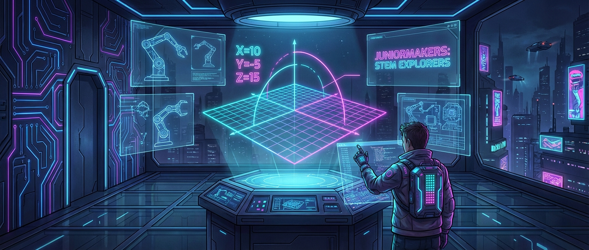

# 🗺️ Geometrie-Gamer: Der X-Y-Code

> **S T E A M - P R O F I L**
> [ ❌ ] 🧪 **S**cience (Wissenschaft)
> [ ✅ ] 💻 **T**echnology (Technologie)
> [ ❌ ] ⚙️ **E**ngineering (Ingenieurswesen)
> [ ❌ ] 🎨 **A**rts (Kunst)
> [ ✅ ] 📐 **M**ath (Mathematik)

**📋 Metadaten**
* **Autor:** ZWEIFEL Mike (mike.zweifel@zigerschlitzmakers.ch)
* **Version:** v1.0.0
* **Erstellt am:** 2026-03-13
* **Letzte Änderung:** 2026-03-13
* **Zielgruppe:** 9-13 Jahre
* **Format:** 🖥️ 100% PC
* **Schwierigkeit:** Mittel
* **Sicherheitsstufe:** 🟢 Grün (Vollständig digital)

---

## 📖 Kurzbeschreibung
Ohne Koordinaten weiß kein GPS, wo du bist, und kein Computerspiel, wo dein Charakter steht! Wir machen Geometrie lebendig und steuern Spielfiguren durch ein unsichtbares Raster, berechnen Abstände und knacken den X-Y-Code in interaktiven GeoGebra- und Scratch-Simulatoren.

## ❓ Leitfragen (Essential Questions)
* Wie finde ich jeden Punkt der Welt auf einer unsichtbaren Karte?
* Warum haben Koordinatensysteme auch Minus-Zahlen?

## 🎯 Lernziele (Was nehmen die Kids mit?)
* **Fachlich:** Verständnis des kartesischen Koordinatensystems (x- und y-Achse), Quadranten und positiver/negativer Werte.
* **Methodisch:** Punkte setzen, Entfernungen abschätzen und programmieren von einfachen Bewegungen auf einem Raster (Scratch oder GeoGebra).
* **Sozial/Persönlich:** Logisches und räumliches Vorstellungsvermögen, Konzentration bei exakten Zahlen.

## 🤝 Inklusion & Differenzierung
* **Für schwächere Kids / Motorische Einschränkungen:** Mentor bleibt beim ersten Quadranten (nur Plus-Zahlen). Große interaktive Klickfelder in der Simulation.
* **Für Fortgeschrittene / Hochbegabte:** Challenge: Spiele "Schiffe versenken" im 4-Quadranten-System oder programmiere eine Bewegung von Punkt (-5, 10) zu Punkt (3, -2) inklusive Berechnung des Abstands (Pythagoras-Ansatz).

## 🏢 Anforderungen an Räumlichkeiten
- PC-Raum oder Laptops für alle Teilnehmer.
- Gute Internetverbindung.
- Großer Monitor/Beamer.

## 🛠️ Anforderungen ans Material vor Ort
**Pro Teilnehmer/Team (1-2er Teams):**
- 1 PC / Laptop mit Maus.
- Webbrowser mit Zugang zu GeoGebra / Scratch.

**Für den Mentor (Allgemein):**
- Laptop, Beamer.

## ⏱️ Zeitaufwand
- **Vorbereitungszeit (Mentor):** 10 Minuten.
- **Nachbereitungszeit (Aufräumen):** 5 Minuten.
- **Kursdauer:** 100 Minuten

---

## 🚀 Detaillierter Ablauf (100 Minuten)

| Zeit | Phase | Beschreibung | Fokus / Mentor-Tipps |
|------|-------|--------------|----------------------|
| **16:40 - 16:50** | Einleitung | Hook: Wie findet uns Google Maps? Was passiert, wenn ich in Minecraft drücke F3? Erklärung des x-y-Geflechts auf der Weltkugel. | Merksatz für X/Y: "Zuerst auf dem Boden laufen (X), dann an der Leiter hochklettern (Y)!" |
| **16:50 - 17:30** | Praxis Level 1 | GeoGebra Interaktiv: Die Kids zeichnen Formen, indem sie Punkte im System eingeben. Aus (2,3), (4,5) und (6,3) wird ein Dreieck! | Bei Minuswerten oft Frust: Kläre "links vom Nullpunkt" vs "rechts vom Nullpunkt" deutlich. |
| **17:30 - 17:40** | Pause | Bildschirmpause. Aufstehen, bewegen, frische Luft. | Vorbereitung von Scratch für Level 2. |
| **17:40 - 18:05** | Experten-Level | Scratch-Blockprogrammierung: Die Kids programmieren eine Katze, die auf Kommando zu bestimmten Koordinaten `(Gehe zu x: [ ], y: [ ])` springt oder gleitet. | Fortgeschrittene können versuchen, aus der Katze einen Stift zu machen (`Stift absenken`), der durch Koordinaten ein Haus zeichnet. |
| **18:05 - 18:20** | Reflexion | Welche Koordinaten bräuchten wir, um die Katze genau in die Mitte (0,0) zu setzen? Zeigen der besten gezeichneten Formen in Scratch. | Betonen: Jeder Pixel auf eurem Bildschirm ist eine Koordinate! |

---

## 💡 Weitere nützliche Informationen
* **Mögliche Fehlerquellen:** Vertauschen von X und Y. Achte auf den "Leiter-Merkspruch".
* **Alltagsbezug:** GPS, Google Maps, 3D-Drucker (G-Code), Minecraft-Positionen.
* **Links & Quellen:** 
  - [GeoGebra Geometrie](https://www.geogebra.org/geometry)
  - [Scratch: Koordinaten-Projekt](https://scratch.mit.edu/)
