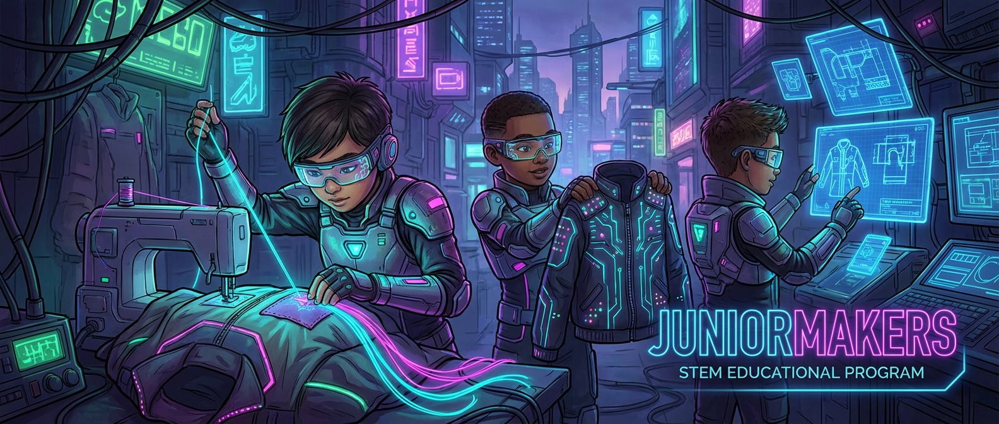

# ⚡ Leuchtende Mode: E-Textiles & Wearables

> **S T E A M - P R O F I L**
> [ ❌ ] 🧪 **S**cience (Wissenschaft)
> [ ❌ ] 💻 **T**echnology (Technologie)
> [ ✅ ] ⚙️ **E**ngineering (Ingenieurswesen)
> [ ✅ ] 🎨 **A**rts (Kunst)
> [ ❌ ] 📐 **M**ath (Mathematik)

**📋 Metadaten**
* **Autor:** ZWEIFEL Mike (mike.zweifel@zigerschlitzmakers.ch)
* **Version:** v1.0.0
* **Erstellt am:** 2026-03-13
* **Letzte Änderung:** 2026-03-13
* **Zielgruppe:** 9-12 Jahre
* **Format:** 🛠️ 100% Offline
* **Schwierigkeit:** Mittel
* **Sicherheitsstufe:** Gelb (Nähnadeln, Batterien/Knopfzellen, Vorsicht wegen Kurzschlüssen)

---

## 📖 Kurzbeschreibung
Kleidung, die leuchtet! In diesem Kurs lernen die JuniorMakers, wie man Mode und Elektronik verschmilzt. Mit leitfähigem Garn nähen sie LEDs direkt in Textilien ein und erschaffen so futuristische, leuchtende Accessoires oder Kleidungsstücke – ganz ohne klobige Kabel!

## ❓ Leitfragen (Essential Questions)
* Wie kann Faden plötzlich Strom leiten?
* Wie verbinden wir harte Elektronik (Batterien, LEDs) mit weichen Stoffen?

## 🎯 Lernziele (Was nehmen die Kids mit?)
* **Fachlich:** Verstehen eines Stromkreises (Plus/Minus, Batterie, Verbraucher) und wie man diesen mit leitfähigem Garn statt Draht aufbaut.
* **Methodisch:** Einfache Nähtechniken (Vorstich), Überprüfen auf Kurzschlüsse.
* **Sozial/Persönlich:** Geduld und Fingerfertigkeit beim Nähen, Problemlösung (Fehlersuche im Stromkreis).

## 🤝 Inklusion & Differenzierung
* **Für schwächere Kids / Motorische Einschränkungen:** Größere Nadeln mit dickerem Öhr verwenden. Vorab gelochten Filz nutzen oder den Pfad auf dem Stoff mit Kreide dick vorzeichnen.
* **Für Fortgeschrittene / Hochbegabte:** Parallelschaltung mehrerer LEDs nähen. Einen genähten Schalter (z.B. aus Druckknöpfen) integrieren, um das Licht an- und auszuschalten.

## 🏢 Anforderungen an Räumlichkeiten
- Helle Arbeitsplätze mit guter Beleuchtung (fürs Nähen wichtig).
- Bequeme Tische.

## 🛠️ Anforderungen ans Material vor Ort
**Pro Teilnehmer/Team:**
- 1 Stück Filz oder ein eigenes, mitgebrachtes Kleidungsstück
- 2-3 nähbare LEDs (Sewable LEDs)
- Leitfähiges Garn (Conductive Thread)
- 1 nähbarer Batteriehalter (für CR2032)
- 1 Knopfzelle (CR2032, 3V)
- Normale Nähnadel

**Für den Mentor (Allgemein):**
- Nähschere
- Multimeter (zum Testen von Verbindungen)
- Isolierband/Textilkleber (zum Sichern von Knoten)

## ⏱️ Zeitaufwand
- **Vorbereitungszeit (Mentor):** 15 Minuten (Materialsets richten).
- **Nachbereitungszeit (Aufräumen):** 10 Minuten.
- **Kursdauer:** 100 Minuten

---

## 🚀 Detaillierter Ablauf (100 Minuten)

| Zeit | Phase | Beschreibung | Fokus / Mentor-Tipps |
|------|-------|--------------|----------------------|
| **16:40 - 16:50** | Einleitung | Was sind Wearables? Zeigen von leitfähigem Garn. Kurz erklären: Strom fließt vom Pluspol durch die LED zum Minuspol. | Warnen vor Kurzschlüssen: Plus- und Minus-Garn dürfen sich niemals kreuzen oder berühren! |
| **16:50 - 17:30** | Praxis Level 1 | Das Design planen: Batteriehalter und erste LED auf den Filz aufzeichnen. Garn einfädeln und die Plus-Leitung zur LED nähen. | Helfen beim Einfädeln und Knotenmachen. Eng wickeln bei den Kontakten der LED/Batterie! |
| **17:30 - 17:40** | Pause | Hände ausschütteln, Augen entspannen. | Wer schnell ist, kann schon die Minus-Leitung vorbereiten. |
| **17:40 - 18:05** | Experten-Level | Minus-Leitung fertig nähen. Knopfzelle einlegen -> Leuchtet es? Wenn ja: Weitere LED parallel dazu nähen oder einen Schalter aus Metall-Druckknöpfen basteln. | Troubleshooting! Wenn es nicht leuchtet: Garn berührt sich? Knoten zu locker an den Kontakten? Batterie falsch herum? |
| **18:05 - 18:20** | Reflexion | Raum abdunkeln, Wearables präsentieren! Wie war das Nähen? Was war am schwierigsten? | Kurzer Hinweis, dass E-Textiles vor dem Waschen die Batterie entnommen werden muss. |

---

## 💡 Weitere nützliche Informationen
* **Mögliche Fehlerquellen:** Das leitfähige Garn ribbelt leicht auf, Knoten können sich lösen (mit etwas Textilkleber sichern). Kurzschluss durch kreuzende Fäden.
* **Alltagsbezug:** Smarte Sportkleidung (Herzfrequenzmessung im Stoff), beheizbare Jacken, leuchtende Sicherheitswesten für den Verkehr.
