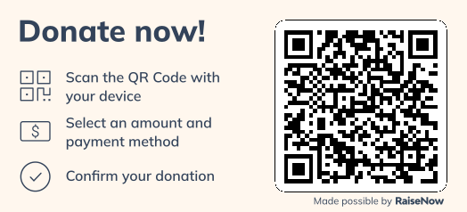

# 🚀 JuniorMakers STEAM Curriculum

**Code. Build. Hack. Create.**

An open-source STEAM curriculum for kids ages 9-12. Features dozens of detailed 100-minute lesson plans (PC & offline) in an epic cyberpunk design. From coding & cryptography to aerodynamics & e-textiles. Fully structured in Markdown incl. mentor tips, differentiation & learning tracks.

## 🌟 What's inside?
* **100-Minute Lesson Plans:** Ready-to-use Markdown templates requiring zero to minimal prep time.
* **Full STEAM Spectrum:** Covering Science, Technology, Engineering, Arts, and Math.
* **Offline & PC Tracks:** Clearly separated activities (no messy switching during a session).
* **Epic Cyberpunk CI:** Engaging neon sci-fi visuals to hook the kids from minute one.
* **Mentor Guides:** Essential questions, learning objectives, troubleshooting, and inclusivity tips for every single lesson.

## 🗺️ Navigation
- 📚 **[Course Index (INDEX.md)](Kursinhalte/INDEX.md):** The complete list and table of all available modules, sorted by STEAM discipline and difficulty.
- 🧵 **[Learning Tracks (Curriculum_Roter_Faden.md)](Kursinhalte/Curriculum_Roter_Faden.md):** Thematic blocks designed for 10-week quarters (e.g., "The Digital Artists", "The Engineering Guild").
- 📋 **[Master Template & CI (00_Mastervorlage_und_Richtlinien.md)](Kursinhalte/00_Mastervorlage_und_Richtlinien.md):** Our strict Corporate Identity guidelines, AI image prompts, and the blank Markdown template for creating new courses.

## 🌍 Language
Currently, all lesson plans and materials are written in **German**, optimized for local MakerSpaces. The Markdown structure makes it incredibly easy to translate or adapt them for your local community!

## 🤝 Contributing
Want to add a course? Awesome! 
1. Grab the Master Template.
2. Formulate your 100-minute plan.
3. Run the provided Cyberpunk prompt through an AI image generator (like Gemini or Midjourney) to get your 21:9 banner.
4. Submit a Pull Request.

## ❤️ Support the JuniorMakers

If these free courses save you time and help your kids discover the magic of STEAM, we'd be thrilled to receive a small donation. Your support pays for our servers, buys new hardware for experiments, and fuels the next epic course updates!

**[👉 Support us via RaiseNow / TWINT](https://donate.raisenow.io/ycjjp)**

---
*Created with 🦾 by Mike Zweifel ([@royassas](https://github.com/royassas)) & the [Zigerschlitzmakers](https://www.zigerschlitzmakers.ch).*