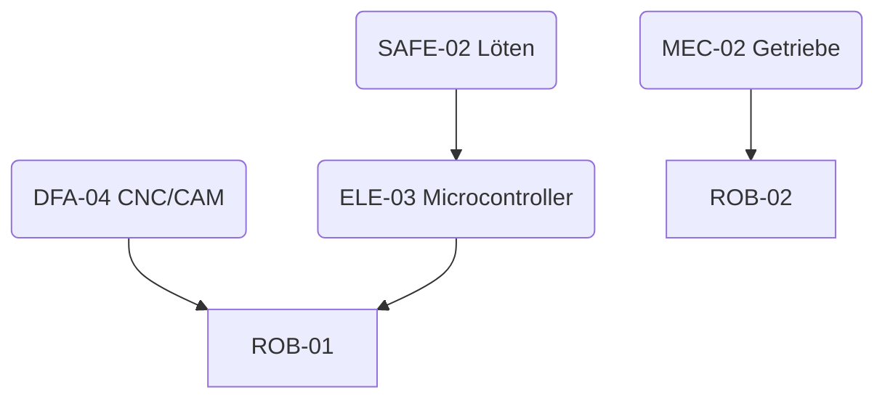

# 🧩 JuniorMakers Skills Matrix

_Status: Draft 2026-03-31_

Die JuniorMakers Experiences (unsere projektbasierten STEAM-Kurse) bleiben bestehen, erhalten aber ab sofort ein komplementäres Gegenstück: **JuniorMakers Skills**. Diese Matrix beschreibt alle Skill-Familien, Level-Definitionen und Kern-Prüfungen, die später in der JuniorMakers HUD verwaltet werden.

## 1. Skill-Familien & Levelpfade
| Familie | Beschreibung | Level 1 | Level 2 | Level 3 | Level 4 | Level 5 |
| --- | --- | --- | --- | --- | --- | --- |
| **ELE** (Elektronik & Embedded) | Stromkreise, Microcontroller, PCB | ELE-01 Stromkreis Basics | ELE-02 Sensoren & Shields | ELE-03 Microcontroller I/O | ELE-04 PCB Design | ELE-05 Debugging & Firmware |
| **MEC** (Mechanik & Konstruktion) | Handwerk, Statik, Bewegungen | MEC-01 Werkstatt Basics | MEC-02 Getriebe | MEC-03 Kinematik & Mechanismen | MEC-04 Struktur-Optimierung | MEC-05 Hydraulik/Pneumatik |
| **DFA** (Digital Fabrication) | 3D-Druck, Laser, CNC | DFA-01 3D-Druck Intro | DFA-02 CAD Aufbau | DFA-03 Laser Cutting | DFA-04 CNC / CAM | DFA-05 Multimaterial & Composite |
| **ROB** (Robotik & Aktoren) | Mobile Robotics, Sensorfusion | ROB-01 Aktoren Basics | ROB-02 Autonomous Driving | ROB-03 Sensor Fusion | ROB-04 Kinematics Control | ROB-05 Swarm/AI Robots |
| **SAFE** (Safety & Tools) | Werkstattsicherheit, Maschinen | SAFE-01 Werkstattregeln | SAFE-02 Löten & ESD | SAFE-03 Elektrowerkzeuge | SAFE-04 Chemie/CNC Safety | SAFE-05 Maschinenpark Lead |
| **SOFT** (Soft Skills) | Teamwork, Leadership, Community | SOFT-01 Teamkommunikation | SOFT-02 Agile Basics | SOFT-03 Mentoring | SOFT-04 Projektleitung | SOFT-05 Community Contribution |

> 💡 **HUD-Integration:** Jede Skill Card verweist auf diese Matrix via `family` + `level`. Die Web-App zeigt automatisch, welche Nachweise fehlen und welche Prüfungen fällig sind.

## 2. Prerequisite-Geflechte (Beispiel)

- **ROB-01 Aktoren Basics** erfordert `ELE-03` + `DFA-02`.
- **ROB-02 Autonomous Driving** erfordert ROB-01 + `MEC-02`.

## 3. Bewertungssystem
| Stufe | Nachweis | Bewertet durch | Dokumentation |
| --- | --- | --- | --- |
| Level 1–2 | Checkliste (2 Punkte je Kriterium) | Mentor oder Senior-Schüler | Foto + Kurzreflexion (HUD Upload) |
| Level 3 | Live Assessment (max 30 Min) | Mentor | Video oder Messdaten |
| Level 4 | Projektteil in Experience oder Mini-Mentoring | Mentor + Peer | Repo/Logbuch |
| Level 5 | Eigenständiges Projekt + Community Impact | Mentorboard | Veröffentlichung im HUD |

## 4. Skillfamilien – Detailnotizen
- **Elektronik:** Ab Level 4 verpflichtend PCB-Design (KiCad) + Reflow-Ofen-Nachweis.
- **Mechanik:** Level 5 beinhaltet Pneumatik ODER Hydraulik. HUD sollte Alternative zulassen.
- **Digital Fabrication:** Level 3 Laser: Sicherheitsfreigabe SAFE-04 als Co-Prerequisite.
- **Robotik:** Level 4+ können nur abgeschlossen werden, wenn Soft-Skill-Level 3 (Mentoring) erreicht wurde → Ziel: Kids erklären ihre Lösung einem jüngeren Team.
- **Safety:** SAFE-05 gibt Keycard-Freigabe für Maschinenpark (in HUD als Flag).

## 5. NextMakers Threshold
Um in die NextMakers-Altersstufe aufzusteigen, müssen folgende Skills bestanden sein:
- `SAFE-04`, `ELE-05`, `DFA-04`, `ROB-04`, `SOFT-03`
- Mindestens zwei Wahlpflicht-Level aus MEC oder Zusatz-Skills (z. B. BioLab)

## 6. Backlog / Offene Punkte
- [ ] Skillfamilien „BioLab“ und „Data/AI“ definieren.
- [ ] Assessment-Rubriken als separate JSON-Schemas hinterlegen.
- [ ] H5P-Module für digitale Prüfungen evaluieren/einbinden.
- [ ] Anbindung an JuniorMakers HUD (API-Entwurf) vorbereiten.

> Bitte ergänze/änder die Matrix nach Bedarf – sobald wir uns auf die finale Struktur geeinigt haben, generiere ich daraus YAML/JSON-Dateien für die HUD.
